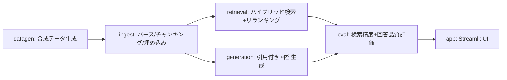

# CAE解析ナレッジ検索アシスタント

製造業（自動車部品）の構造解析（FEM）分野を対象にした、**社内ナレッジ検索RAG**のポートフォリオ実装です。過去の解析レポートを部署をまたいで検索・再利用できるようにすることを目的としています。

## 背景・課題設定

CAE部門では新規解析の着手時に「過去に似た解析はなかったか」「その時の境界条件・メッシュ設定・トラブルはどうだったか」を探す作業が頻繁に発生します。しかし部署間で用語や報告フォーマット、情報共有が完全には統一されていないことも多く、他部署の有用な過去事例が埋もれがちです。

本プロジェクトは、**資料さえ所定の場所に残しておけば、部署間の情報共有が不十分でもRAGが横断的に検索・再引用できる**、という価値提案をデモします。

- 実データは使えないため、自動車部品（ボディ／シャシー／パワートレイン／ブレーキ・サスペンション等）の構造解析を想定した**合成データ**（ダミーの社内解析レポート）を使用しています。
- **実在・架空を問わず企業名は一切登場しません**。「ある1社内の複数部署」という匿名設定です。
- **ファイル形式もMarkdown/Word/Excel/PowerPoint/PDFの5種類が混在**します（現場ではファイル形式が統一されていないことが多いという前提の反映）。部署間の非統一性は用語（見出しの言い回し）側で表現し、ファイル形式は部署に固定せずレポートごとにランダムです。
- 各レポートの「結果サマリー」セクションには**結果画像（コンター図/グラフをmatplotlibで合成）が1枚添付**されています。ingest時にローカルのVLM（vision対応モデル）でキャプション化し、画像の内容も検索対象にしています。
- 全処理は**ローカルLLM（LM Studio等、OpenAI互換API）**で完結し、外部への送信は行いません。機密設計情報を扱う製造業の現実的なアーキテクチャ選択として設計しています。

## アーキテクチャ（DAG）

処理をモジュール間の依存関係が明確なDAG（有向非巡回グラフ）として設計しています。依存のないノード（retrieval / generation）は独立に実装できます。



| ノード | モジュール | 役割 |
| --- | --- | --- |
| A | `src/cae_rag/datagen.py` | 自動車部品の構造解析ダミーレポート（部署ごとにハウススタイルが微妙に異なり、Markdown/Word/Excel/PowerPoint/PDFのいずれかにランダムに書き出す。結果画像も1枚合成して埋め込む）と評価用QAペアを生成 |
| B | `src/cae_rag/ingest.py` | 5形式それぞれの読み取りロジックで見出し単位にチャンキングし、埋め込み画像をVLMでキャプション化してから、ローカル埋め込みモデルでベクトル化しChromaDBに格納 |
| C | `src/cae_rag/retrieval.py` | BM25（キーワード）＋ベクトル類似度のハイブリッド検索 → LLMによるリランキング |
| D | `src/cae_rag/generation.py` | 検索済みチャンクを根拠に、出典（レポートID・セクション・**部署**）付きの回答を生成 |
| E | `src/cae_rag/eval.py` | gold-standard QAペアに対する検索精度（Recall@k, MRR）と回答品質（簡易LLM-as-judge, 引用網羅率）を測定 |
| F | `src/cae_rag/app.py` | Streamlitチャット UI（部署・解析種別での絞り込み、引用元の展開表示） |

retrieval（C）とgeneration（D）は互いに依存せず、どちらも `ingest.Chunk` のみに依存する設計です。両者を初めて組み合わせる場所は `app.py` / `eval.py` です。

## セットアップ

### 前提

- Python 3.11 以上
- [LM Studio](https://lmstudio.ai/) 等、OpenAI互換APIを話すローカルLLMサーバー
  - チャット用モデル・埋め込み用モデル・**画像説明用のvisionモデル（VLM）**の3種類をロードしてください（例: Qwen2.5-VL/Qwen3-VL系）
  - VLMが未ロードでも他の機能は動きます（画像キャプション取得だけスキップされ、警告が出ます）
  - 既定では `http://localhost:1234/v1` に接続します

### インストール

```bash
pip install -e .
# 開発（テスト・lint）も行う場合
pip install -e ".[dev]"
```

### 設定

```bash
cp config.example.toml config.toml
```

`config.toml` でLM StudioのベースURL・モデル名を調整してください（環境変数 `CAERAG_LLM_MODEL` 等でも上書き可能。詳細は `src/cae_rag/config.py` 参照）。

## 使い方

DAGの順番通りに実行します。

```bash
# A: 合成データ生成（デフォルト60件のレポート + 15件の評価QAペア）
python -m cae_rag.datagen

# B: チャンキング + 埋め込み + ChromaDBへの格納
python -m cae_rag.ingest

# E: 評価（検索精度・回答品質をまとめてレポート）
python -m cae_rag.eval

# F: Streamlit UIの起動
streamlit run src/cae_rag/app.py
```

`python -m cae_rag.eval` の実行結果は `data/eval/eval_results.json` に書き出されます（overall / cross_dept / same_dept の内訳付き）。実際の数値はLM Studioにロードしたモデルに依存するため、このリポジトリには含めていません。手元で実行して確認してください。

## 開発プロセス（グラフエンジニアリング + 独立レビュー）

本プロジェクトは開発プロセス自体も設計対象にしました。

- 上記DAGのノード単位で実装を区切り、依存のないノード（C・D）は並列にAgent（サブエージェント）で実装しました。
- 各ノードの実装完了ごとに、ローカルの `codex` CLI（別ベンダーのAI）による独立コードレビューを必須ゲートとして通し、指摘があれば修正→再レビューを繰り返してから次のノードに進みました。
- 例えば `retrieval.py` は、小規模コーパス＋文字bigramトークナイザという本プロジェクト特有の条件下で `BM25Okapi` のIDFが負に転びランキングが逆転するバグをこのレビューで検出し、`BM25Plus` へ切り替えて解消しています。`datagen.py` の評価QA生成でも、部署をまたいだ設問の正解に質問者自身の部署のレポートが混入するバグを検出・修正しました（`tests/test_datagen.py` に回帰テストとして残しています）。

## 制約・スコープ

- 対象は構造解析（FEM）のみ（熱解析・CFD等は対象外）
- 合成データのため、実務の数値・トラブル事例そのものではありません
- 企業名（実在・架空問わず）は一切使用していません
