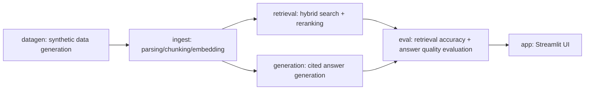

# CAE Analysis Knowledge Search Assistant

[日本語](README_ja.md) | English

**A portfolio implementation of an internal knowledge-search RAG for structural analysis (FEM) in manufacturing (automotive parts). It lets engineers search and reuse past analysis reports across departments. All processing runs on a local LLM, with nothing sent externally.**

> 🧭 **The requirements and design decisions here are the author's own.** The main ones:
>
> - The retrieval pipeline design: hybrid search (BM25 + vector similarity) followed by LLM reranking. Caught and fixed a real bug where `BM25Okapi`'s IDF went negative and inverted the ranking under this project's specific conditions (a small corpus plus a character-bigram tokenizer) — switched to `BM25Plus` to fix it
> - Always attaching citations (report ID, section, **department**) to generated answers, so that "does cross-department search and reuse actually work" can be verified rather than assumed
> - The evaluation design: scoring cross-department and same-department questions separately, so the cross-department search claim can be checked numerically rather than asserted
> - Also captioning result images with a VLM at ingest time so they're searchable too — a multimodal ingest design
> - The architecture choice to run everything on a local LLM with zero external transmission — a realistic constraint for manufacturing, where confidential design information is at stake
> - The development-process design: splitting implementation along DAG nodes, implementing independent nodes in parallel, and making an independent review from a different vendor's AI (the `codex` CLI) a required gate after each node

> The reasoning behind each decision is in [Development process](#development-process-graph-engineering--independent-review) below. Implementation used AI (Claude Code) as a pair-programming partner, credited via `Co-Authored-By` on commits.

---

## Background and problem

In CAE departments, starting a new analysis almost always means digging up questions like "has something similar been analyzed before?" or "what were the boundary conditions, mesh settings, and issues that came up back then?" But terminology, report formats, and information sharing often aren't fully standardized across departments, so useful past cases from other departments tend to get buried.

This project demonstrates a value proposition: **as long as documents are kept in the right place, a RAG system can search and reuse them across departments even when information sharing between those departments is imperfect.**

- Since real data isn't available, the project uses **synthetic data** — dummy internal analysis reports modeling structural analysis of automotive parts (body / chassis / powertrain / brakes & suspension, etc.).
- **No company names appear anywhere, real or fictional.** The setting is anonymized as "multiple departments within a single company."
- **File formats are deliberately mixed across Markdown, Word, Excel, PowerPoint, and PDF** (reflecting how file formats are often inconsistent in the real world).
- Each report's "Results Summary" section has **one result image attached** (a contour plot / graph synthesized with matplotlib). At ingest time, a local VLM (vision-capable model) captions it so the image content is also searchable.

## Setup

### Prerequisites

- Python 3.11 or later
- A local LLM server speaking an OpenAI-compatible API, such as [LM Studio](https://lmstudio.ai/)
  - Load three kinds of models: a chat model, an embedding model, and a **vision model (VLM) for image captioning** (e.g., something in the Qwen2.5-VL / Qwen3-VL family)
  - Everything else works even without the VLM loaded — only image captioning is skipped, with a warning
  - Connects to `http://localhost:1234/v1` by default

### Install

```bash
pip install -e .
# If you're also doing development (tests, lint):
pip install -e ".[dev]"
```

### Configure

```bash
cp config.example.toml config.toml
```

Adjust LM Studio's base URL and model names in `config.toml` (these can also be overridden via environment variables such as `FEMRAG_AI_LLM_MODEL` — see `src/fem_rag/config.py` for details).

## Usage

Run the following in order (see [Architecture](#architecture-dag) below for how each step is designed internally).

```bash
# Generate synthetic data (60 reports + 15 evaluation QA pairs by default)
python -m fem_rag.datagen

# Chunk + embed + store in ChromaDB
python -m fem_rag.ingest

# Evaluate (retrieval accuracy + answer quality, combined into one report)
python -m fem_rag.eval

# Launch the Streamlit UI
streamlit run src/fem_rag/app.py
```

`python -m fem_rag.eval` writes its results to `data/eval/eval_results.json` (broken down into overall / cross_dept / same_dept). The actual numbers depend on whichever models are loaded in LM Studio, so treat them as a reference point — here's what came out of a local run (`qwen2.5-7b-instruct` / `text-embedding-nomic-embed-text-v1.5`):

| Segment | n | hit_rate | recall@k | MRR | citation_rate | avg_judge_score |
| --- | --- | --- | --- | --- | --- | --- |
| Overall | 15 | 1.00 | 0.93 | 0.87 | 0.93 | 3.2 |
| Cross-department questions | 5 | 1.00 | 0.90 | 0.77 | 1.00 | 3.4 |
| Same-department questions | 10 | 1.00 | 0.95 | 0.92 | 0.90 | 3.1 |

Even for cross-department questions, hit_rate is 1.00 (every question retrieved at least one correct report), and citation_rate is actually higher than for same-department questions. These numbers back up the project's core claim: cross-department search still works even when information sharing between departments is imperfect.

## Constraints and scope

- Structural analysis (FEM) only — thermal analysis, CFD, etc. are out of scope
- Since the data is synthetic, the numbers and troubleshooting cases aren't drawn from real practice
- No company names are used, real or fictional

> 💡 **If you just want to run it, this is all you need.** From here on it's the internals of the DAG and the development process (graph engineering + independent review).

---

## Architecture (DAG)

The pipeline is designed as a DAG (directed acyclic graph) with clear dependencies between modules. Nodes with no dependency on each other (retrieval / generation) can be implemented independently.



| Node | Module | Role | Model used (`[ai]` in `config.toml`) |
| --- | --- | --- | --- |
| A | `src/fem_rag/datagen.py` | Generates dummy structural-analysis reports for automotive parts (house style varies slightly by department, randomly written out as Markdown/Word/Excel/PowerPoint/PDF, each with one synthesized result image embedded) plus gold-standard QA pairs for evaluation | `llm_model` (report body generation) |
| B | `src/fem_rag/ingest.py` | Chunks each of the 5 formats section-by-section using format-specific parsing logic, captions embedded images with a VLM, then vectorizes chunks with a local embedding model and stores them in ChromaDB | `embed_model` (chunk vectorization) / `vlm_model` (result-image captioning) |
| C | `src/fem_rag/retrieval.py` | Hybrid search combining BM25 (keyword) and vector similarity, followed by LLM-based reranking | `embed_model` (query vectorization) / `llm_model` (reranking) |
| D | `src/fem_rag/generation.py` | Generates answers grounded in retrieved chunks, with citations (report ID, section, **department**) | `llm_model` (answer generation) |
| E | `src/fem_rag/eval.py` | Measures retrieval accuracy (Recall@k, MRR) and answer quality (a simple LLM-as-judge score, citation coverage) against gold-standard QA pairs | Every model used by C and D, plus `llm_model` (LLM-as-judge scoring) |
| F | `src/fem_rag/app.py` | Streamlit chat UI (filter by department/analysis type, expandable citation sources) | Every model used by C and D (invoked on every question) |

If `vlm_model` isn't loaded, only B's image captioning is skipped (a warning is logged); every other node is unaffected.

Retrieval (C) and generation (D) don't depend on each other — both depend only on `ingest.Chunk`. The first place they're combined is `app.py` / `eval.py`.

## Development process (graph engineering + independent review)

The development process itself was also a design target for this project.

- Implementation was split along the DAG nodes above; independent nodes (C and D) were implemented in parallel by separate Agents (subagents).
- After finishing each node, an independent code review from a local `codex` CLI (a different vendor's AI) was a required gate before moving on to the next node — any findings were fixed and re-reviewed until clear.
- For example, this review caught a real bug in `retrieval.py`: under this project's specific conditions (a small corpus plus a character-bigram tokenizer), `BM25Okapi`'s IDF went negative and inverted the ranking — fixed by switching to `BM25Plus`. It also caught a bug in `datagen.py`'s evaluation-QA generation, where the questioner's own department report leaked into the gold answer for cross-department questions (kept as a regression test in `tests/test_datagen.py`).
