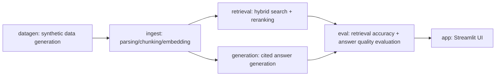

# Cross-Department Knowledge Search Assistant

[日本語](README_ja.md) | English

**A portfolio implementation of an internal knowledge-search RAG for cross-department project lessons and know-how, industry- and role-agnostic by design. All processing runs on a local LLM, with nothing sent externally.**

> 🧭 **The requirements here are the author's own. Most of the technical implementation was proposed by AI, which the author reviewed and approved.**
>
> - The theme: cross-department search for project lessons and know-how, industry- and role-agnostic. The motivation is a pattern the author has repeatedly seen across their career — weak cross-department collaboration and knowledge that never gets shared, which stalls innovation
> - The requirement to mix file formats (Markdown/Word/Excel/PowerPoint/PDF), reflecting how file formats are often inconsistent in the real world
> - The requirement to run everything on a local LLM with zero external transmission — a realistic constraint for business data that can be confidential
> - The requirement to bring "graph engineering" into the development process. The concrete realization of that — decomposing work into DAG nodes, implementing independent nodes in parallel, and making an independent review from a different vendor's AI (the `codex` CLI) a required gate after each node — was AI's proposal
>
> Individual technical decisions — the hybrid retrieval pipeline design, the `BM25Okapi` → `BM25Plus` bug fix, citation-based verifiability, the eval split design — were likewise proposed by AI (Claude Code) and approved by the author after an independent review (codex). AI was used as a pair-programming partner throughout, credited via `Co-Authored-By` on commits.

---

## Background and problem

In any industry or role, starting a new project almost always means digging up questions like "has something similar been tried before?" or "what worked, and what went wrong?" But terminology, report formats, and information sharing often aren't fully standardized across departments, so useful lessons from other departments tend to get buried.

This project demonstrates a value proposition: **as long as documents are kept in the right place, a RAG system can search and reuse them across departments even when information sharing between those departments is imperfect.**

- Since real data isn't available, the project uses **synthetic data** — dummy internal project-retrospective reports modeling a general business setting (marketing / sales / product development / customer support / corporate planning), industry-agnostic.
- **No company names appear anywhere, real or fictional.** The setting is anonymized as "multiple departments within a single company."
- **File formats are deliberately mixed across Markdown, Word, Excel, PowerPoint, and PDF** (reflecting how file formats are often inconsistent in the real world).
- Each report's "Outcome Summary" section has **one outcome chart attached** (a KPI trend or similar, synthesized with matplotlib). At ingest time, a local VLM (vision-capable model) captions it so the image content is also searchable.
- Weak cross-department collaboration where knowledge never spreads is a common pattern. Even SPDM (Simulation Process and Data Management) adoption in engineering organizations often stalls for the same reason — reluctance to collaborate across departments, more than any technical barrier.

## Setup

### Prerequisites

- Python 3.11 or later
- A local LLM server speaking an OpenAI-compatible API, such as [LM Studio](https://lmstudio.ai/)
  - Load three kinds of models: a chat model, an embedding model, and a **vision model (VLM) for image captioning** (e.g., something in the Qwen2.5-VL / Qwen3-VL family)
  - Everything else works even without the VLM loaded — only image captioning is skipped, with a warning
  - Connects to `http://localhost:1234/v1` by default — that's LM Studio's default port
  - To use a different OpenAI-compatible server (e.g. Ollama), change `[ai] base_url`
    in `config.toml` (Ollama's default is `http://localhost:11434/v1`), or override it
    with the `SILORAG_AI_BASE_URL` environment variable (priority: env var >
    `config.toml` > the code's built-in default)

### Install

```bash
python3 -m venv .venv
source .venv/bin/activate
pip install -e .
# If you're also doing development (tests, lint):
pip install -e ".[dev]"
```

This installs Streamlit, ChromaDB, and every other dependency in one go — no need to `pip install streamlit` separately. Run every command below with this virtual environment activated (`source .venv/bin/activate`).

### Configure

```bash
cp config.example.toml config.toml
```

Adjust LM Studio's base URL and model names in `config.toml` (these can also be overridden via environment variables such as `SILORAG_AI_LLM_MODEL` — see `src/silo_rag/config.py` for details).

## Usage

Run the following in order (see [Architecture](#architecture-dag) below for how each step is designed internally).

```bash
# Generate synthetic data (60 reports + 15 evaluation QA pairs by default)
python -m silo_rag.datagen

# Chunk + embed + store in ChromaDB
python -m silo_rag.ingest

# Evaluate (retrieval accuracy + answer quality, combined into one report)
python -m silo_rag.eval

# Launch the Streamlit UI
streamlit run src/silo_rag/app.py
```

While `datagen` runs, you may see a "generation failed" warning — a small local LLM doesn't always follow the required heading structure exactly. It retries automatically, both per-report and for the whole batch, so just let it run and it'll usually succeed. If it still fails, try a different model or re-run `python -m silo_rag.datagen` after a bit.

`python -m silo_rag.eval` writes its results to `data/eval/eval_results.json` (broken down into overall / cross_dept / same_dept, each with hit_rate, recall@k, MRR, citation_rate, and avg_judge_score). The actual numbers depend on whichever models — and dataset — are loaded in LM Studio.

## Constraints and scope

- Since the data is synthetic, the numbers and cases aren't drawn from real practice
- No company names are used, real or fictional
- Designed to be industry- and role-agnostic rather than tied to one specific domain
- **The application itself (UI, generated data, LLM prompts) is Japanese-only.** It hasn't been localized to English — this README being bilingual is purely for portfolio readability, separate from the app's own language support. A half-translated UI (English labels next to Japanese dropdown values and answer text) was deliberately avoided

> 💡 **If you just want to run it, this is all you need.** From here on it's the internals of the DAG and the development process (graph engineering + independent review).

---

## Architecture (DAG)

The pipeline is designed as a DAG (directed acyclic graph) with clear dependencies between modules. Nodes with no dependency on each other (retrieval / generation) can be implemented independently.



| Node | Module | Role | Model used (`[ai]` in `config.toml`) |
| --- | --- | --- | --- |
| A | `src/silo_rag/datagen.py` | Generates dummy project-retrospective reports for a general business setting (house style varies slightly by department, randomly written out as Markdown/Word/Excel/PowerPoint/PDF, each with one synthesized outcome chart embedded) plus gold-standard QA pairs for evaluation | `llm_model` (report body generation) |
| B | `src/silo_rag/ingest.py` | Chunks each of the 5 formats section-by-section using format-specific parsing logic, captions embedded images with a VLM, then vectorizes chunks with a local embedding model and stores them in ChromaDB | `embed_model` (chunk vectorization) / `vlm_model` (outcome-chart captioning) |
| C | `src/silo_rag/retrieval.py` | Hybrid search combining BM25 (keyword) and vector similarity, followed by LLM-based reranking | `embed_model` (query vectorization) / `llm_model` (reranking) |
| D | `src/silo_rag/generation.py` | Generates answers grounded in retrieved chunks, with citations (report ID, section, **department**) | `llm_model` (answer generation) |
| E | `src/silo_rag/eval.py` | Measures retrieval accuracy (Recall@k, MRR) and answer quality (a simple LLM-as-judge score, citation coverage) against gold-standard QA pairs | Every model used by C and D, plus `llm_model` (LLM-as-judge scoring) |
| F | `src/silo_rag/app.py` | Streamlit chat UI (filter by department/project type, expandable citation sources) | Every model used by C and D (invoked on every question) |

If `vlm_model` isn't loaded, only B's image captioning is skipped (a warning is logged); every other node is unaffected.

Retrieval (C) and generation (D) don't depend on each other — both depend only on `ingest.Chunk`. The first place they're combined is `app.py` / `eval.py`.

## Development process (graph engineering + independent review)

The development process itself was also a design target. The requirement to "bring graph engineering into the development process" (see 🧭 above) was concretized by AI as follows:

- **Split implementation along DAG nodes**: the six nodes (A–F) above are each an independent unit of work. Nodes with no dependency on each other (C: retrieval, D: generation) can be **implemented in parallel, neither waiting on the other**.
- **Parallel implementation**: independent nodes were handed to multiple Agents (subagents) running at the same time, rather than one session writing everything in sequence — the dependency graph's shape was carried straight into the development process itself.
- **A per-node independent review gate**: after each node's implementation finished, an independent code review from a local `codex` CLI (a different vendor's AI) was a required gate — any findings were fixed and re-reviewed before moving to the next node (the same model doing both implementation and review tends to share the same blind spots, so a different vendor's perspective was forced in deliberately).
- For example, this review caught a real bug in `retrieval.py`: under this project's specific conditions (a small corpus plus a character-bigram tokenizer), `BM25Okapi`'s IDF went negative and inverted the ranking — fixed by switching to `BM25Plus`. It also caught a bug in `datagen.py`'s evaluation-QA generation, where the questioner's own department report leaked into the gold answer for cross-department questions (kept as a regression test in `tests/test_datagen.py`).
- The domain pivot itself (structural analysis → cross-department project lessons) followed the same approach: swapping the system prompts, the test vocabulary, and the README were independent tasks, split across parallel Agents.

## License

MIT License. See [LICENSE](LICENSE) for the full text.
