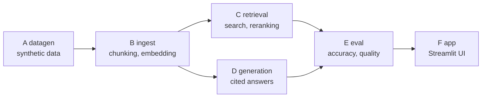
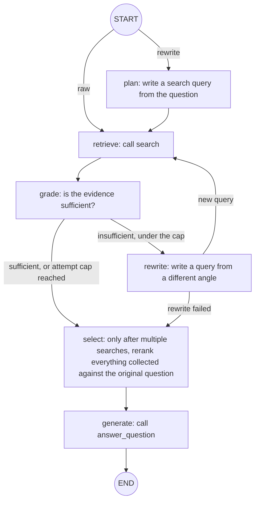

# Cross-Department Knowledge Search Assistant

[日本語](README_ja.md) | English

**A portfolio implementation of an internal knowledge-search RAG for cross-department project lessons and know-how. Everything runs on a local LLM, and nothing is sent externally.**

> 🧭 **The requirements are the author's own. Most of the technical implementation was proposed by AI, then reviewed and approved by the author.**
>
> - **The author's requirements**
>   - Cross-department search for project lessons and know-how (industry- and role-agnostic). The motivation: weak collaboration between departments means knowledge never gets shared
>   - Mixed file formats (Markdown/Word/Excel/PowerPoint/PDF), since real workplaces rarely standardize on one
>   - All processing on a local LLM with zero external transmission (the data could be confidential)
>   - "Graph engineering" in the development process
> - **What AI turned those into**: decomposing the work into DAG nodes, implementing independent nodes in parallel, and making an independent review by a different vendor's AI (the `codex` CLI) a required gate after each node
> - **Proposed by AI (Claude Code), approved by the author after independent review**: the hybrid retrieval design, the `BM25Okapi` → `BM25Plus` bug fix ([what BM25 is](#terms-bm25-and-vector-search)), citations, and the eval split design
> - AI was used as a pair-programming partner throughout, credited via `Co-Authored-By` on commits
> - The author ran the UI and reported the bugs and rough edges they found (chat ordering, title wrapping, over-eager answers to small talk, no conversation-aware search, etc.); the AI diagnosed and fixed them

---

## Background and problem

- **Problem**: when starting a project, you want to find "what similar work was done before, what worked, and what went wrong." But terminology and formats differ between departments, so other departments' lessons get buried
- **Value proposition**: as long as documents are kept in the right place, RAG can search and reuse them across departments, even when sharing between departments is imperfect
- **The data is synthetic**: real data isn't available, so the reports are synthetic retrospectives for five generic business departments (marketing / sales / product development / customer support / corporate planning)
  - No company names appear, real or fictional
  - Five file formats are mixed
  - Each report has one outcome chart (a KPI trend or similar); at ingest time a local VLM captions it so the image content is searchable too
- Weak cross-department collaboration is usually a people problem more than a technical one (for example, adoption of a shared data-management platform stalling). This project is a small instance of the same structure

## Setup

### Prerequisites

- Python 3.11 or later
- A local LLM server with an OpenAI-compatible API, such as [LM Studio](https://lmstudio.ai/)
  - Load three kinds of models: a chat model, an embedding model, and a **vision model (VLM) for image captioning** (e.g., the Qwen2.5-VL / Qwen3-VL family)
  - Without the VLM everything else still works (only image captioning is skipped, with a warning)
  - The default endpoint is `http://localhost:1234/v1`. For another server (e.g., Ollama at `http://localhost:11434/v1`), set `[ai] base_url` in `config.toml` or the `SILORAG_AI_BASE_URL` environment variable (priority: env var > `config.toml` > built-in default)

### Install

```bash
python3 -m venv .venv
source .venv/bin/activate
pip install -e .
# If you're also doing development (tests, lint):
pip install -e ".[dev]"
```

- Streamlit, ChromaDB, and the other dependencies are installed together
- Run every command below with the virtual environment activated

### Configure

```bash
cp config.example.toml config.toml
```

- Adjust the base URL and model names in `config.toml` (environment variables such as `SILORAG_AI_LLM_MODEL` also work; see `src/silo_rag/config.py`)

## Usage

There are two ways to prepare data. Do one of them, then launch the UI.

### Using the demo data

```bash
bash scripts/prepare_demo_data.sh
```

It runs these three steps in order. To redo one step, run it directly.

```bash
python -m silo_rag.datagen   # generate synthetic data (60 reports + 15 evaluation QA pairs by default)
python -m silo_rag.ingest    # chunk, embed, and store in ChromaDB
python -m silo_rag.eval      # evaluate retrieval accuracy and answer quality
```

- `datagen` may print "generation failed" (a small local LLM doesn't always follow the required heading structure). It retries automatically, so it usually succeeds if you wait. If it keeps failing, try another model or re-run later
- `eval` writes `data/eval/eval_results.json` (broken down into overall / cross_dept / same_dept, with hit_rate, recall@k, MRR, citation_rate, and avg_judge_score). The numbers depend on the models and data

### Using your own reports

- Skip `datagen` and `eval` (`eval` needs the synthetic QA pairs) and run only `ingest`

```bash
python -m silo_rag.ingest --reports-dir <directory containing your reports>
```

- The parser is generic: any Markdown/Word/Excel/PowerPoint/PDF split into a `---` frontmatter block plus `## heading` sections loads, whatever the field and heading names
- The UI's sidebar filters (department / project type) use the demo's fixed vocabulary (`DEPARTMENTS` / `PROJECT_TYPES` in `datagen.py`), so they may not match your categories (cross-department search itself works without the filters)

### Using the agent version (optional)

On top of plain mode (search once, then answer), there are agents where the LLM writes the search query and, if needed, searches again (design and evaluation: [Node G](#node-g-the-langgraph-agent), [Node H](#node-h-langchain-integration)). LangGraph and LangChain are optional dependencies; plain mode works without them.

```bash
pip install -e ".[agent]"        # LangGraph agent (node G)
pip install -e ".[langchain]"    # LangChain integration (node H); also installs langgraph
```

- **UI**: pick "agent" under "answer mode" in the sidebar. A record of what the agent did (search, grade, rewrite) appears under each answer
- **Evaluation**: `python -m silo_rag.eval --pipeline agent` (`--grade-mode strict|lenient`, `--first-query raw|rewrite`); `--pipeline langchain` for the stock LangChain agent
  - To compare plain mode and the agents at once: `bash scripts/compare_pipelines.sh <model name> [--rewrite-first]` (3 variants; 6 with `--rewrite-first`)
- **Config**: `[agent]` in `config.toml` (`max_attempts`, `grade_mode`, `first_query`). The defaults are `first_query = "rewrite"` and `max_attempts = 1` (write the query, search once), the combination that measured best on a 7B model

### Launching the UI

- It's a foreground process that keeps a browser tab open, so run it separately from data preparation

```bash
streamlit run src/silo_rag/app.py
```

## Constraints and scope

- The data is synthetic, so the numbers and cases aren't from real practice
- No company names are used, real or fictional. The design assumes a generic business domain, not one industry or role
- **The application itself (UI, generated data, LLM prompts) is Japanese-only.** The bilingual README is for portfolio readability, separate from the app's language support
- **Conversation history is used only to interpret follow-up search questions** (e.g., "tell me more about that"). Meta-questions about the conversation itself ("what did I just say?") are intentionally answered with "no matching case found"

> [!TIP]
> **If you just want to run it, this is enough.**
> The rest covers the design and the development process. Read only what interests you.
>
> - How the system is organized: [Architecture (DAG)](#architecture-dag)
> - How one question becomes an answer: [Worked example](#worked-example-how-one-question-becomes-an-answer)
> - How it was developed: [Development process](#development-process-graph-engineering--independent-review)
> - The agent's design and measured results: [Node G](#node-g-the-langgraph-agent) and [Node H](#node-h-langchain-integration)

---

## Architecture (DAG)

The pipeline is designed as a DAG (directed acyclic graph) with clear dependencies between modules.


```mermaid
graph LR
    A["A datagen<br/>synthetic data"] --> B["B ingest<br/>chunking, embedding"]
    B --> C["C retrieval<br/>search, reranking"]
    B --> D["D generation<br/>cited answers"]
    C --> E["E eval<br/>accuracy, quality"]
    D --> E
    E --> F["F app<br/>Streamlit UI"]
```

The optional nodes G and H sit outside the main flow, so they are not in the diagram.

- **G** (`agent.py`): calls functions from C and D (`search`, `rerank`, `answer_question`). E (`--pipeline agent`) and F (the "agent" answer mode) call it only when selected
- **H** (`langchain_adapter.py`): calls C's `search` and D's `Answer` and `_build_citations` (a private function). E calls it only with `--pipeline langchain`
- Both are imported only when used. Plain mode works without LangGraph or LangChain installed

| Node | Module | Role | Model used (`[ai]` in `config.toml`) |
| --- | --- | --- | --- |
| A | `src/silo_rag/datagen.py` | - Generates dummy retrospective reports (house style and file format randomized per department; embeds an outcome chart)<br>- Generates gold-standard QA pairs | `llm_model` (report body generation) |
| B | `src/silo_rag/ingest.py` | - Chunks by heading (5 formats supported)<br>- Captions embedded images with a VLM<br>- Vectorizes and stores in ChromaDB | - `embed_model` (chunk vectorization)<br>- `vlm_model` (outcome-chart captioning) |
| C | `src/silo_rag/retrieval.py` | - [BM25](#terms-bm25-and-vector-search) + vector-similarity hybrid search<br>- LLM-based reranking<br>- Rewrites the query using conversation history | - `embed_model` (query vectorization)<br>- `llm_model` (reranking, query rewriting) |
| D | `src/silo_rag/generation.py` | - Generates answers grounded in retrieved chunks<br>- Attaches citations (report ID, section, **department**)<br>- Resolves references using conversation history | `llm_model` (answer generation) |
| E | `src/silo_rag/eval.py` | - Measures retrieval accuracy (Recall@k, MRR)<br>- Measures answer quality (LLM-as-judge, citation coverage) | - Every model used by C and D<br>- `llm_model` (LLM-as-judge scoring) |
| F | `src/silo_rag/app.py` | - Streamlit chat UI<br>- Filter by department/type, citation display | Every model used by C and D (invoked on every question) |
| G (optional) | `src/silo_rag/agent.py` | - Runs "write a search query → search → grade → rewrite → search again" with LangGraph<br>- Details: [Node G](#node-g-the-langgraph-agent) | Every model used by C and D |
| H (optional) | `src/silo_rag/langchain_adapter.py` | - Exposes the existing search as a LangChain Retriever<br>- Comparison against LangChain's stock agent<br>- Details: [Node H](#node-h-langchain-integration) | Every model used by C and D |

If `vlm_model` isn't loaded, only B's image captioning is skipped (a warning is logged); every other node is unaffected.

### Terms: BM25 and vector search

C combines two searches of different kinds.

- **BM25 (keyword search)**: a **formula** that scores each document by how often, and how distinctively, the question's words appear in it. It is not an AI model and involves no training
  - The more often a question word appears in a document, the higher the score (with diminishing returns)
  - A word found in almost every document (the Japanese equivalents of "is", "please") barely counts; a rare word (say, "budget planning") counts a lot
  - Long documents are discounted a little, since words turn up in them more easily
  - Good at: searches where **the words themselves match** (part numbers, proper nouns, technical terms)
  - Weak at: treating a paraphrase ("budget" vs. "cost estimate") as the same thing. Words unrelated to the search raise the score of any document that happens to contain them, which can shift the ranking (a word absent from the index scores zero and changes nothing)
- **Vector search (semantic search)**: an embedding model (an AI model) turns each sentence into a list of numbers, and distance measures whether the **meaning is close**. Handles paraphrases well
- **Combining the scores**: each score is **normalized** to 0–1, then the two are added using `vector_weight` (0.5 by default). An LLM then reranks the top candidates
  - Normalization: the best score becomes 1, the worst 0, and the rest are rescaled proportionally
  - Exceptions: if the highest and lowest scores are almost equal, all become 1; for keyword search, if the highest score is 0 or below, all become 0 (checked first)
  - A calculation example is in the [worked example](docs/worked_example_en.md)
- **In this project**
  - BM25's preprocessing is deliberately simple (no morphological analyzer)
  - Japanese text is cut into overlapping **two-character pieces** (e.g., "予算策定" → "予算", "算策", "策定")
  - ASCII words and IDs (such as `RPT-014`) are **kept whole and lowercased** (`rpt-014`)
  - It uses `BM25Plus` from `rank_bm25`. `BM25Okapi` can give a negative weight (IDF) to a word found in more than half the documents, which genuinely happens on a small corpus, so it was replaced (under `BM25Plus`, the weight of any indexed word stays positive)

### Worked example: how one question becomes an answer

[docs/worked_example_en.md](docs/worked_example_en.md) follows a question through every stage (ingestion, query writing, BM25, vector search, combining scores, reranking, answer generation) with real values.

- Two examples: one that works, and one that doesn't (the gold report was among the candidates but dropped in reranking)
- A step-by-step breakdown of where the query rewrite helps

### What a "node" is

- **Node**: a unit of work with a clear input/output boundary. Nodes A–F each correspond to one file
- **Internals stay hidden**: `retrieval.py` exposes only `search()`, and `generation.py` only `answer_question()`. Callers don't need to know whether BM25, vector search, or reranking is used inside

### How nodes connect

- **A → B**: through files (`data/synth_reports/`). Zero import coupling
- **B → C/D**: through ChromaDB. C and D import only the `Chunk` type (`from .ingest import Chunk`)
- **C/D → E/F**: direct function calls (`eval.py` and `app.py` call `search()` / `answer_question()`)
- **C/D → G → E/F**: G also just calls `search()` / `answer_question()` (and `rerank()`). E and F can switch between plain mode and G
- **C/D → H → E**: besides `search()`, H uses D's `Answer` and `_build_citations` (a private function). E calls it via `--pipeline langchain` (for comparison)
- The stronger the dependency, the tighter the coupling (direct calls are tight; files and the DB are loose)

### Which nodes are independent

- The only independent pair is **C and D**: both depend on B, not on each other
- Every other pair (A-B, B-C, B-D, C-E, D-E, E-F) has a dependency and has to wait for it, so they can't be built in parallel
- **C and D were actually implemented in parallel by two Agents**
- "Acyclic" only guarantees a valid build order exists; it's separate from independence. A single straight chain (A→B→C→D→E→F) is acyclic yet offers zero parallelism. The payoff here came from the graph's shape: no arrow happens to connect C and D

> ⚠️ **"Parallel" here means parallel development (writing the code), not parallel execution at runtime.**
> The DAG's arrows show which module depends on which; they are not the runtime order of operations.
> At runtime, each question runs C (retrieval) then D (generation) sequentially — D takes the chunks C returned as its input, handed over by E/F. Because C and D don't depend on each other, two Agents **could write them at the same time**; that is all the claim means.

## Development process (graph engineering + independent review)

The development process itself was a design target. The requirement to "bring graph engineering into the development process" (see 🧭) was concretized by AI as follows.

Graph engineering means designing the pipeline as a DAG and making dependencies between modules explicit. What this project actually got from it:

- **Parallel implementation**: nodes with no dependency on each other (C and D) were handed to two Agents (subagents) at the same time
- **Independent testing**: fakes such as `_FakeVLMClient` and `_ScriptedClient` stand in for dependencies, so every node can be tested on its own with no live LLM
- **Bug localization**: after each node, an independent review by the local `codex` CLI (a different vendor's AI) was a required gate. Findings were fixed and re-reviewed before moving on
  - It caught `BM25Okapi`'s negative-IDF bug in `retrieval.py`
  - It also caught a data-leak bug in `datagen.py`'s evaluation-QA generation (kept as a regression test in `tests/test_datagen.py`)
- **Reusability**: since each node is independent, rewriting one later doesn't touch the others. Follow-up work (prompt tweaks, test vocabulary changes, README updates) was likewise split across parallel Agents as independent tasks
- Being able to decide a build order isn't unique to graph engineering. What paid off was what the explicit graph revealed: "the part that can be parallelized (C and D)" and "boundaries narrow enough to review in isolation"

## Node G: the LangGraph agent

A new node (`src/silo_rag/agent.py`) that **only calls the public functions** of nodes C and D.

- It doesn't touch the insides of C or D, and C and D stay independent of each other (only G knows both)
- So the **module dependencies are still a DAG**. The loop exists only inside this node, as part of the runtime flow


```mermaid
graph TD
    S((START)) -->|raw| R[retrieve: call search]
    S -->|rewrite| P[plan: write a search query from the question]
    P --> R
    R --> J[grade: is the evidence sufficient?]
    J -->|sufficient, or attempt cap reached| SEL[select: only after multiple searches, rerank everything collected against the original question]
    J -->|insufficient, under the cap| W[rewrite: write a query from a different angle]
    W -->|new query| R
    W -->|rewrite failed| SEL
    SEL --> G[generate: call answer_question]
    G --> X((END))
```

- The LLM decides "is the evidence sufficient?" and "what query next"
- The code decides "how many times at most" via `[agent] max_attempts` (1 by default, i.e., no re-search)
- The first query is chosen by `[agent] first_query` (`raw` = the question as is; `rewrite` = a query the LLM writes from the question; `rewrite` by default)

### Design decisions

- **LangGraph used directly, not LangChain's `create_agent`**
  - `create_agent` is a fixed loop built on the LLM's tool calling (function calling)
  - Tool calling is often unreliable on ~7B local models
  - So I built the "search → grade → rewrite" graph myself in LangGraph (`create_agent` was run as a comparison target in [node H](#node-h-langchain-integration))
- **The LLM answers only in fixed formats**
  - Grading is the single word `SUFFICIENT` / `INSUFFICIENT`; rewriting is one query line. The code parses them strictly (no substring matching)
  - In manual runs on a 7B model (4 questions, twice), every response came back in the expected format
- **Auxiliary decisions never stop the run**: a connection error, malformed output, or repeated query in grading or rewriting moves on to generation with the chunks in hand. A failure in generation itself still propagates to the caller
- **Zero external transmission is unchanged**: every LLM call goes through the existing `LLMClient` (local LM Studio, etc.). LangGraph sends nothing externally unless you set LangSmith environment variables (`LANGSMITH_TRACING`, etc.)
- **Grading strictness has two levels (`strict` / `lenient`)**
  - The grading LLM can't know whether a better document exists that it hasn't seen, so prompt wording alone doesn't settle which level is better
  - `strict` retried up to the cap on most questions (8 of 9 gradings said "insufficient"); `lenient` says "sufficient" quickly. I kept both and compared them
- **You can choose whether the first query is written from the question (`first_query`)**
  - A question contains a lot unrelated to search: a self-introduction ("This is the planning department."), request phrasing ("please tell me"). I expected that to scatter the search ([BM25](#terms-bm25-and-vector-search)), so I added a `plan` node that has the LLM write a search query from the question (falling back to the question itself on failure)
  - In the evaluation this mattered most. Where it helps is broken down step by step in the [worked example](docs/worked_example_en.md)
- **Grading is skipped once the search cap is reached**: no further search is possible, so the verdict can't change anything

### Evaluation

- The same evaluation set (15 questions, 5 of them cross-department) was run once per variant
- Models: 7B = `qwen2.5-7b-instruct`, 32B = `qwen2.5-coder-32b-instruct-mlx` (both in LM Studio, 4-bit)
- In the tables, "query writing" is `first_query = "rewrite"` and "1 search" is `max_attempts = 1`
- "LLM calls" are the chat calls up to the answer (embeddings and judge excluded). Measured before "skip grading at the cap", so each question that reached the cap actually costs one call fewer
- The judge uses the same model as the answerer, so **judge scores are only comparable between rows of the same model**

**7B**

| Variant | hit_rate | Cross-dept | Same-dept | MRR | Citation rate | judge | Searches | LLM calls | Sec/question |
| --- | --- | --- | --- | --- | --- | --- | --- | --- | --- |
| Plain | 0.60 | 0.40 | 0.70 | 0.49 | 0.60 | 3.67 | 1.0 | 2.0 | 10.8 |
| G strict | 0.73 | 0.40 | 0.90 | 0.61 | 0.60 | 3.73 | 1.9 | 6.4 | 17.8 |
| G lenient | 0.67 | 0.40 | 0.80 | 0.54 | 0.60 | 3.80 | 1.4 | 4.5 | 14.6 |
| G strict + query writing | 0.80 | 0.60 | 0.90 | 0.66 | 0.80 | 3.73 | 2.4 | 9.0 | 19.5 |
| G lenient + query writing | 0.87 | 0.60 | 1.00 | 0.69 | 0.80 | 3.60 | 1.6 | 6.2 | 14.9 |
| **G lenient + query writing + 1 search** | **0.93** | **0.80** | 1.00 | 0.72 | **0.87** | 3.53 | 1.0 | 4.0 | **12.0** |
| LangChain stock ([node H](#node-h-langchain-integration)) | **0.93** | **0.80** | 1.00 | 0.54 | **0.87** | 3.73 | 1.3 | 3.3 | 18.6 |

**32B**

| Variant | hit_rate | Cross-dept | Same-dept | MRR | Citation rate | judge | Searches | LLM calls | Sec/question |
| --- | --- | --- | --- | --- | --- | --- | --- | --- | --- |
| Plain | 0.87 | 1.00 | 0.80 | 0.71 | 0.87 | 3.60 | 1.0 | 2.0 | 50.4 |
| G strict | 0.87 | 1.00 | 0.80 | 0.72 | 0.80 | 3.33 | 2.5 | 8.2 | 88.9 |
| G lenient | 0.87 | 1.00 | 0.80 | 0.74 | 0.73 | 3.27 | 1.1 | 3.5 | 55.8 |
| G lenient + query writing | 0.87 | 0.60 | 1.00 | 0.73 | 0.80 | 3.00 | 1.2 | 4.8 | 63.8 |
| G lenient + query writing + 1 search | 0.93 | 0.80 | 1.00 | 0.72 | 0.87 | 3.33 | 1.0 | 4.0 | 57.2 |

I didn't measure the 32B model with the stock LangChain agent (LM Studio's model list shows no tool-support icon for it).

**What the results show**

- **What helped was not "searching again" but "rewriting the question into a search query" (7B)**
  - With the question used as is, adding re-search only moved hit_rate from 0.60 to 0.67–0.73
  - Having the LLM write the first query took it to 0.80–0.93, and **limiting it to a single search (0.93) did no worse**. Cross-department questions also rose from 0.40 to 0.80
  - Where it helps, step by step (7B; details in the [worked example](docs/worked_example_en.md))
    - Questions with the gold report in BM25's top 5: 11 → 15
    - Vector search alone: 5 → 5 in total (four questions swapped in and out)
    - The rewritten query goes to both searches at once, so the final gain can't be credited to BM25 alone
    - The 20 reranking candidates already contained the gold report for all 15 questions before rewriting
    - The final gain (9 → 14–15) came from both how candidates were collected (9 → 15) and which query was used to rerank (9 → 12)
    - Explanations such as "a short query is easier for the reranking LLM to judge" are unconfirmed
- **This breakdown was prompted by losing to the stock LangChain agent**
  - It reached 0.93 without searching more
  - Looking into it, the LLM rewrote the question into a keyword-style query before every search, while my G used the question as is on the first search
  - My original hypothesis ("re-search makes up for it") was only half right
- **With 32B, none of the tweaks shows a clear effect**
  - Plain mode was already at 0.87; query writing + 1 search reached 0.93 (one question)
  - Cross-department dropped from 1.00 to 0.80 (one question), and to 0.60 once re-search was added
- **Conclusion: plain mode stays the default answer mode; the agent is an option for when you have to use a small model**
  - The agent's defaults are the best-measured `first_query = "rewrite"` with `max_attempts = 1` (the "query writing + 1 search" rows)
  - The re-search loop is available by raising `max_attempts`, but it showed no benefit on top of query writing with either model
  - With larger models there was no difference from plain mode and cross-department questions tended to drop, so use plain mode
  - After making these the defaults, I re-ran both models; per-question hit/miss and metrics such as hit_rate matched. LLM calls dropped from the 4.0 in the table to 3.0 because grading is skipped at the cap

> ⚠️ **This is 15 questions, one run per variant. A one-question difference (0.07) can't be called real; read the results as a trend on these 15 questions.**
>
> - Plain mode and the hand-built agent run query writing and reranking at temperature 0. Re-running both models with the new defaults gave matching per-question hit/miss and retrieval metrics
> - The retrieved reports themselves also matched, except for one 7B agent question (QA-001, a miss both times). Temperature 0 does not guarantee an exact repeat
> - What does vary: answer generation (citation rate, judge) and the stock LangChain agent's search
>   - Its tool query is written by the LLM at temperature 0.2 each time, so the same question (QA-001) sometimes found the gold report and sometimes didn't
>   - I observed this across several runs I stopped partway; only the last run's result is saved, so the numbers don't back this point up
> - That retrieval reproduces doesn't mean a different question set would give the same result
> - I also tried Gemma 4 26B (MoE, a thinking model), but thinking inflated output to about 174 s per question, so I cut it off midway and left it out of the comparison

### Problems found along the way

- **Three findings from the independent review (codex)**: (1) CI didn't install the optional dependency, so the new tests couldn't be collected; (2) a retry returning `top_k` chunks pushed out all earlier evidence; (3) the grading prompt had no conversation history, so follow-up questions couldn't be graded. Each was reproduced with a mock, fixed, and given a regression test
- **Three findings from running a real LLM (7B)** (mock-based tests alone didn't surface these)
  - Grading was so strict it retried up to the cap every time
  - Rewritten queries included the asker's own department, biasing search toward it
  - Interleaving the retries' results pushed out a gold report the original query had found (fixed by the `select` node, which reranks everything collected against the original question)
- **A design mistake found by the evaluation**: the original hypothesis that "re-search helps" was only half right. What helped was how the first query was written

## Node H: LangChain integration

`src/silo_rag/langchain_adapter.py` (optional; `pip install -e ".[langchain]"`). It calls functions from C and D (unlike G, it also uses D's private `_build_citations`).

- **`SiloRetriever`**: exposes the existing hybrid search (`search()`) as a LangChain Retriever (`BaseRetriever` from `langchain_core`)
  - The search internals (BM25 + vectors + LLM reranking) are unchanged
  - It can be used as a component in LangChain chains and agents
- **`run_langchain_agent`**: uses that Retriever as a search tool for LangChain's stock `create_agent` (the LLM searches through tool calling). It is the comparison target for the hand-built node G
  - The search cap is 3, a constant independent of G's `max_attempts`; making G's default 1 doesn't limit the stock agent to one search
- LLM calls use the existing `LLMClient` (reranking and other in-search work) and `ChatOpenAI` (the agent's own decisions), both pointed at the local LM Studio (`config.ai.base_url`). Zero external transmission is unchanged
- Evaluate it with `python -m silo_rag.eval --pipeline langchain`. The result is in the 7B table above (hit_rate 0.93, citation rate 0.87)
  - Its retrieval metrics are computed over every chunk the tool returned, so more searches favor it (4.5 reports on average versus 4.0 for plain mode, a small gap)
  - Citation rate and judge compare fairly

### What running the stock agent on a small model showed

Neither problem appeared in mock-based tests; both showed up only when I ran a real 7B model.

- **Parallel tool calls broke search**
  - When the LLM calls the search tool several times in one response, LangGraph runs them concurrently on threads
  - `search()` assumes a single thread, and failed on both ChromaDB (the same folder opened concurrently) and LM Studio (concurrent embedding requests → HTTP 500)
  - `SiloRetriever` now runs searches one at a time
- **One response tried to call the search tool about 50 times at once (282 s)**
  - LangGraph's step limit (`recursion_limit`) only counts how many times the model re-thinks, not parallel calls within one response
  - `SiloRetriever` now caps how many searches it actually runs

## License

MIT License. See [LICENSE](LICENSE) for the full text.
