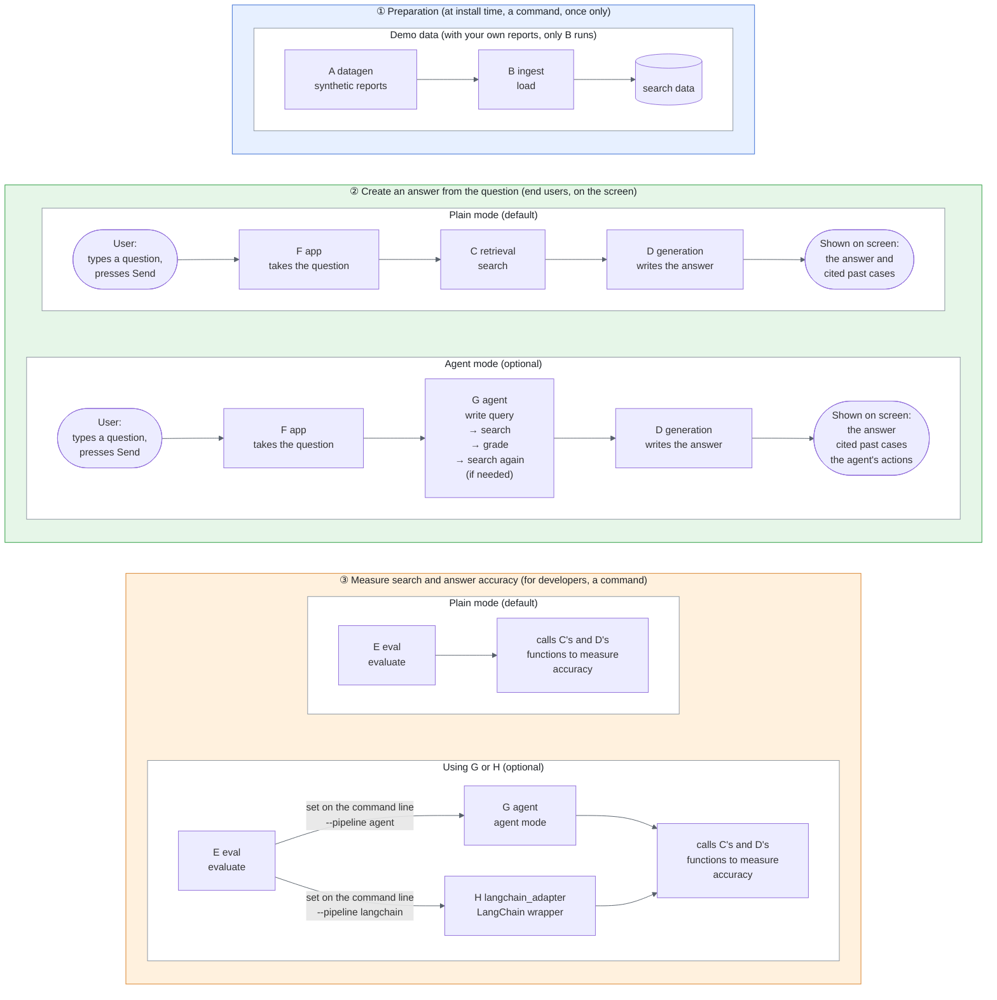

# Cross-Department Knowledge Search Assistant

[日本語](README_ja.md) | English

**A search assistant for finding lessons and know-how from past projects across the departments of a company. Ask a question, and it searches the company's documents and answers from what it finds, with citations (this approach is called RAG, retrieval-augmented generation). Everything runs on AI that works on your own computer (a local LLM), and nothing is sent outside.**

> 🧭 **The requirements are the author's own. Most of the technical implementation was proposed by AI (Claude Code), then reviewed and approved by the author.**
>
> - **The author's requirements**: cross-department knowledge search (motivated by weak collaboration between departments, so knowledge never gets shared) / five mixed file formats (Markdown/Word/Excel/PowerPoint/PDF) / all processing on a local LLM with zero external transmission / "graph engineering" in the development process (splitting the work into nodes and designing with a diagram of how they depend on each other)
> - **What AI turned those into**: a design map that splits the work into nodes (units of work), called a DAG; implementing nodes that don't depend on each other in parallel; and making an independent review by a different vendor's AI (the `codex` CLI) a required gate after each node
> - **Proposed by AI, approved by the author after independent review**: the hybrid retrieval design (keyword search combined with semantic search), the `BM25Okapi` → `BM25Plus` bug fix ([what BM25 is](docs/architecture_en.md#how-the-search-works-bm25-and-vector-search)), how citations are attached, and the evaluation split (measuring cross-department and same-department questions separately)
> - AI was used as a pair-programming partner throughout, credited via `Co-Authored-By` on commits
> - The author ran the UI and found the bugs and rough edges; the AI diagnosed and fixed them
>
> How it was developed (graph engineering and independent review) is detailed in [how it was developed](docs/development_process_en.md).

## Background and problem

- **Problem**: when starting a new project, you want to find similar past work, but each department uses its own terms and document formats, so other departments' lessons get buried
- **Solution**: once each department's documents are loaded into the assistant, it searches across departments and answers with citations, even when sharing between departments is imperfect
- **The data is synthetic**: 60 retrospective reports for five generic business departments (marketing / sales / product development / customer support / corporate planning), written by an LLM. Five file formats are mixed: Markdown, Word, Excel, PowerPoint and PDF. Images inside the reports (such as KPI trend charts) are turned into text by an AI that can read images (a VLM), so they can be searched too

## Screenshots

The "answer mode" in the sidebar switches between the plain mode and the agent mode, question by question (the agent mode is available only after installing the extra libraries in [step 4](#step-4-optional-install-the-agent-mode)). Both screenshots are the same question asked of the synthetic data; the UI itself is in Japanese.

<table>
<tr>
<td width="50%"><br><b>Plain mode</b>: searches the documents with the question as typed, and shows the answer and the past cases it drew on (citations)</td>
<td width="50%"><br><b>Agent mode</b> (optional): writes a search query, then searches. A record of what the agent did appears under the answer</td>
</tr>
</table>

## Setup

### Prerequisites

- Python 3.11 or later
- Software that runs AI models on your own computer, such as [LM Studio](https://lmstudio.ai/) (anything that can be called the same way as OpenAI's API)
  - Models to load: a chat model that writes text, an embedding model that turns sentences into lists of numbers, and a **model that can read images (VLM)** (e.g., the Qwen2.5-VL / Qwen3-VL family). Without the VLM, only the image descriptions are skipped; everything else works
  - The default endpoint is `http://localhost:1234/v1`. For another server (e.g., Ollama at `http://localhost:11434/v1`), set `[ai] base_url` in `config.toml` or the `SILORAG_AI_BASE_URL` environment variable (priority: env var > `config.toml` > built-in default)

### Install

```bash
python3 -m venv .venv
source .venv/bin/activate
pip install -e .
# If you're also doing development (tests, lint):
pip install -e ".[dev]"
```

Run every command below with the virtual environment activated.

### Configure

```bash
cp config.example.toml config.toml
```

Adjust the base URL and model names in `config.toml` (environment variables such as `SILORAG_AI_LLM_MODEL` also work; see `src/silo_rag/config.py`).

## Usage

Usage has four steps. In **step 1** you prepare the data, in **step 2** you launch the screen (UI), and in **step 3** you ask questions on the screen. **Step 4** is only for when you want the agent mode.

> [!IMPORTANT]
> **Run the commands with the virtual environment activated.** Every time you open a new terminal, go to this repository's folder and run:
>
> ```bash
> source .venv/bin/activate
> ```
>
> If `(.venv)` appears at the start of the prompt, it is active. If not, commands stop with errors such as `zsh: command not found: python`.

### Step 1: Prepare the data (either A or B)

There is only one set of search data: whichever of A and B you run last replaces it (you cannot use both at once).

#### A. Using the demo data

```bash
bash scripts/prepare_demo_data.sh
```

It runs these three steps in order. To redo one step, run it directly.

```bash
python -m silo_rag.datagen   # write 60 synthetic reports and 15 evaluation questions with their correct answers
python -m silo_rag.ingest    # split the reports by heading, turn them into lists of numbers, and store them in the search database (ChromaDB)
python -m silo_rag.eval      # measure search and answer accuracy (results in data/eval/eval_results.json)
```

- The third one, `eval`, is ③ in the [architecture](#architecture) (the accuracy measurement for developers). You don't need it just to ask questions on the screen, but the script runs it last as a check that everything works. To save time, run only the first two directly
- A "generation failed" message during `datagen` appears because a small local LLM doesn't always follow the required heading structure. It retries automatically, so it usually succeeds if you wait. If it keeps failing, try another model or re-run later

#### B. Using your own reports

- Skip `datagen` and `eval` (`eval` needs the synthetic data's own questions and correct answers) and run only `ingest`

```bash
python -m silo_rag.ingest --reports-dir <directory containing your reports>
```

- It reads Markdown/Word/Excel/PowerPoint/PDF files that start with fields enclosed in `---` (frontmatter, such as department and date) and whose body is split by `## heading` lines. Field and heading names are up to you

> [!WARNING]
> **Things to know before using your own reports** (every number in this README comes from the synthetic data)
>
> - **`ingest` replaces the search data.** If you loaded the demo data with A first, its search data (ChromaDB) is removed. The synthetic report files (`data/synth_reports/`) stay, so to go back to the demo, run `python -m silo_rag.ingest` without a folder. If `ingest` fails partway, nothing is replaced and the existing data is not damaged
> - **You cannot measure accuracy as is.** `eval` (which measures retrieval accuracy and answer quality) needs the synthetic data's own questions and correct answers. To measure on your reports, you have to prepare questions with known correct answers yourself
> - **The accuracy figures in this README may not carry over.** The share of questions whose correct document was found (hit_rate) and the other figures are results on the synthetic data (60 reports). The same accuracy is not guaranteed on your reports
> - **The UI's filters (department / project type) use the demo's fixed vocabulary.** They may not match your categories. Cross-department search itself works without the filters
> - **What has not been tried.** I tried only the 60 synthetic reports. Large volumes of data, materials with very uneven formatting, badly laid-out PDFs, and real documents with a small local model (such as 7B, i.e. 7 billion parameters) have not been checked

### Step 2: Launch the screen (UI)

Run it after step 1. It opens a chat-style page in your browser (what it looks like is in [Screenshots](#screenshots)); how to ask questions is step 3. The command keeps running while you use the screen (stop it with `Ctrl+C` in the terminal). To run other commands while the screen is open, use another terminal.

```bash
streamlit run src/silo_rag/app.py --server.address localhost
```

`--server.address localhost` makes the page reachable only from the browser on this computer. Without it, the page can also be opened from other devices on the same network.

### Step 3: Ask questions on the screen

The sidebar (settings) is on the left; the questions and answers are on the right (see the [Screenshots](#screenshots) for what it looks like). The UI is in Japanese; the labels are quoted with an English gloss.

- **Ask**: type a question in the text box at the bottom and press the "送信" (Send) button. The Enter key adds a new line and does not send (so that confirming Japanese input conversion does not send by mistake). While it works, "検索・回答生成中..." (searching and generating) is shown
- **Read the answer**: under the answer, "参照した過去事例" (cited past cases) lists the sources as "report ID / section / department". Open one to see the text the answer was based on. If a similar case exists in another department, the answer includes it and says it is from another department
- **When there is no answer**: if the material has nothing to do with the question, or the input is not a search question (small talk, greetings and so on), it answers "該当する事例が見つかりませんでした" (no matching case found). Questions about counts or totals ("how many in all?", "which is the most common?") get "分かりません" (I don't know), because it only sees the part of the material that the search found
- **Ask follow-up questions**: questions that build on the previous one (e.g., "tell me more about that") work. In that case, words such as "that" are first turned into concrete words using the conversation history, then the documents are searched (in both modes). The conversation history is used only to interpret search questions (it does not answer "what did I just say?"). Reloading the browser clears the history
- **Answer mode (sidebar)**: switch between "通常" (plain: searches the documents with the question as typed) and "エージェント" (agent: the AI rewrites the question into search-friendly words first, then searches), question by question. Each option also shows this description under it on the screen. "エージェント" appears only after you install the extra libraries in step 4. When the agent answers, "エージェントの動き" (what the agent did: query writing, searching, grading) also appears under the answer
- **Filters (optional, sidebar)**: narrow the search by "作成部署" (department) and "プロジェクト種別" (project type). Without them, it searches across all departments (with your own reports the categories may not match; see the caution in step 1 B)

### Step 4 (optional): Install the agent mode

Plain mode searches the documents with the question as typed, then answers. The agent mode has the AI write search-friendly words (a search query) from the question first, then search. It needs extra libraries (plain mode works without them).

```bash
pip install -e ".[agent]"
```

Once installed, "エージェント" (agent) appears under "answer mode" in the sidebar (how to switch is in step 3). Its settings and how to measure it are in [the agent mode's design](docs/agent_en.md).

## Constraints and scope

- **The demo reports (60 of them) are synthetic data made by an LLM.** Their numbers (such as KPIs) and cases do not come from real business, and no real company names appear
- **The application itself (the screen, the generated data, the instructions given to the AI) is Japanese-only.** The bilingual README is for portfolio readability, separate from the app's language support

> [!TIP]
> **If you just want to run it, this is enough.** The rest explains how it works and how it was built.
>
> - How the whole system works: [Architecture](#architecture)
> - The agent mode and its results: [The agent mode (nodes G and H)](#the-agent-mode-nodes-g-and-h)
> - How it was developed: [How it was developed](#how-it-was-developed)
> - More detailed documents: [Further reading](#further-reading)

---

## Architecture

The system is made of eight **nodes** (units of work; A to H each correspond to one file; G and H are optional). They run at three different times and are used by different people. **End users use only ②** (asking questions on the browser page launched in step 2; see [Screenshots](#screenshots)). ① is a one-time preparation that whoever installs the system runs from the command line. ③ is a measurement that only developers use.


```mermaid
%%{init: {"flowchart": {"padding": 24, "wrappingWidth": 400}, "themeVariables": {"lineColor": "#57606a"}}}%%
graph TB
    subgraph g1["① Preparation (at install time, a command, once only)"]
        direction TB
        subgraph prep["Demo data (with your own reports, only B runs)"]
            direction LR
            A["A datagen<br/>synthetic reports"] --> B["B ingest<br/>load"] --> DB[("search data")]
        end
    end
    subgraph g2["② Create an answer from the question (end users, on the screen)"]
        direction TB
        subgraph plain["Plain mode (default)"]
            direction LR
            U1(["User:<br/>types a question,<br/>presses Send"]) --> F1["F app<br/>takes the question"] --> C1["C retrieval<br/>search"] --> D1["D generation<br/>writes the answer"] --> R1(["Shown on screen:<br/>the answer and<br/>cited past cases"])
        end
        subgraph agent["Agent mode (optional)"]
            direction LR
            U2(["User:<br/>types a question,<br/>presses Send"]) --> F2["F app<br/>takes the question"] --> G["G agent<br/>write query<br/>→ search<br/>→ grade<br/>→ search again<br/>(if needed)"] --> D2["D generation<br/>writes the answer"] --> R2(["Shown on screen:<br/>the answer<br/>cited past cases<br/>the agent's actions"])
        end
        plain ~~~ agent
    end
    subgraph g3["③ Measure search and answer accuracy (for developers, a command)"]
        direction TB
        subgraph ev["Plain mode (default)"]
            direction LR
            E1["E eval<br/>evaluate"] --> CD1["calls C's and D's<br/>functions to measure<br/>accuracy"]
        end
        subgraph ev2["Using G or H (optional)"]
            direction LR
            E2["E eval<br/>evaluate"] -->|"set on the command line<br/>--pipeline agent"| G2["G agent<br/>agent mode"] --> CD2["calls C's and D's<br/>functions to measure<br/>accuracy"]
            E2 -->|"set on the command line<br/>--pipeline langchain"| H["H langchain_adapter<br/>LangChain wrapper"] --> CD2
        end
        ev ~~~ ev2
    end
    g1 ~~~ g2
    g2 ~~~ g3
    style g1 fill:#e7f0ff,stroke:#3b6fd4,color:#1f2328
    style g2 fill:#e6f6e8,stroke:#2f9e44,color:#1f2328
    style g3 fill:#fff1de,stroke:#d9822b,color:#1f2328
    style prep fill:#ffffff,stroke:#8c959f,color:#1f2328
    style plain fill:#ffffff,stroke:#8c959f,color:#1f2328
    style agent fill:#ffffff,stroke:#8c959f,color:#1f2328
    style ev fill:#ffffff,stroke:#8c959f,color:#1f2328
    style ev2 fill:#ffffff,stroke:#8c959f,color:#1f2328
```

- **① Preparation** (whoever installs the system runs it once from the command line): A makes the synthetic reports, and B loads them into the search data (ChromaDB)
- **② Create an answer from the question** (runs when the user asks a question on the screen and presses "Send"): F handles the screen and shows the result (the answer and the past cases it cited)
  - **Plain mode** (default): F searches with C and hands the result to D, which writes the answer
  - **Agent mode** (optional): F calls G instead. G uses functions of C and D to write a search query, search, grade the evidence and search again (by default it searches once, so grading and re-search do not run)
- **③ Measure search and answer accuracy** (for developers; end users do not use it): measures accuracy on questions whose correct answers are known, to compare the plain mode, G and H with numbers and decide between them
  - **Plain mode** (default): E calls C and D directly and measures them
  - **Using G or H** (optional): E goes through G or H to call C and D, and measures them

**Using G and H** (plain mode needs nothing: it works from the start, both on the screen and when measuring accuracy)

- **To use G (agent mode)**: first run `pip install -e ".[agent]"` once. That enables two things
  - On the screen: choose "agent" under "answer mode" in the sidebar, and G answers (you can switch back to plain mode question by question)
  - Measuring accuracy: run `python -m silo_rag.eval --pipeline agent`, and the measurement uses G
- **To use H (LangChain integration)**: first run `pip install -e ".[langchain]"` once. H cannot be used on the screen. It is used only when measuring accuracy with `python -m silo_rag.eval --pipeline langchain` (to compare LangChain's stock agent with G)

**What each node does**

| Node | File (in `src/silo_rag/`) | Role |
| --- | --- | --- |
| A | `datagen.py` | Writes the demo's synthetic reports, and the evaluation questions with their correct answers |
| B | `ingest.py` | Splits the reports by heading and loads them into the search data (ChromaDB) |
| C | `retrieval.py` | Searches by combining keyword search and semantic search, then reranks with AI |
| D | `generation.py` | Writes the answer from the documents found, with citations |
| E | `eval.py` | Measures search and answer accuracy on questions with known answers (for developers) |
| F | `app.py` | The screen (Streamlit) |
| G (optional) | `agent.py` | The agent mode (LangGraph) |
| H (optional) | `langchain_adapter.py` | Answers with LangChain's stock agent, to compare it with G |

The AI models each node uses, and how the search works (BM25 keyword search and vector search, which looks for meaning), are in [how it works](docs/architecture_en.md). A [worked example](docs/worked_example_en.md) follows one question all the way to an answer with real values.

## The agent mode (nodes G and H)

- **What it does**: plain mode searches the documents once with the question as typed. The agent mode (node G) uses LangGraph (a library for building the flow of an AI's steps) to run "write a search query → search → grade whether the evidence is enough → if not, search again with other words". Node H has the ready-made agent that comes with LangChain (a library for building AI applications) do the same job, so it can be compared with G
- **Results**: compared by the share of questions whose correct document was found (hit_rate). On a smaller model (7B, i.e. 7 billion parameters) with 15 questions, the agent mode looked much better (plain 0.60 → agent 0.93). But those 15 questions are the ones I was looking at when designing it. Re-measured on 45 questions, 7B went 0.71 → 0.76, a difference within chance. On a larger model (32B, 32 billion), the agent mode's behavior (write a search query, then search once) was measured in plain mode: 0.76 → 0.80, also within chance
- **Conclusion**: plain mode stays the default answer mode; the agent mode is kept as an option
- **More**: how it is built and why, in [the agent mode's design](docs/agent_en.md); the tables and how it was measured, in [the agent mode's evaluation](docs/agent_evaluation_en.md)

> ⚠️ Every result is a single run per condition. A difference of one question cannot be called conclusive. They show a "tendency" on this question set.

## How it was developed

- **Graph engineering**: the work was split into nodes, and the system was designed with a diagram (a DAG) of "which node uses which". Nodes that do not depend on each other (C and D) were written at the same time by two AIs (Claude Code subagents, unrelated to the product's "agent mode")
- **Independent review**: after each node, a review by a different vendor's AI (the `codex` CLI) was required. It caught a bug that gave BM25 negative weights, and a leak in the evaluation data
- **Tests**: dependencies can be swapped for fakes, so every node can be tested on its own without a real LLM

See [how it was developed](docs/development_process_en.md).

## Further reading

| Document | What it covers |
| --- | --- |
| [How it works](docs/architecture_en.md) | What each node does and which models it uses; how the search works (BM25 and vector search) |
| [Worked example](docs/worked_example_en.md) | Follows one question to its answer, with real values |
| [The agent mode's design](docs/agent_en.md) | Nodes G and H: the flow, settings, design decisions, and what running the stock agent showed |
| [The agent mode's evaluation](docs/agent_evaluation_en.md) | Tables comparing plain mode, G and H; the 45-question re-measurement; problems found along the way |
| [How it was developed](docs/development_process_en.md) | What graph engineering made easier; bugs the independent review caught; the node dependencies (DAG) |

## License

MIT License. See [LICENSE](LICENSE) for the full text.
