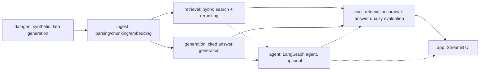
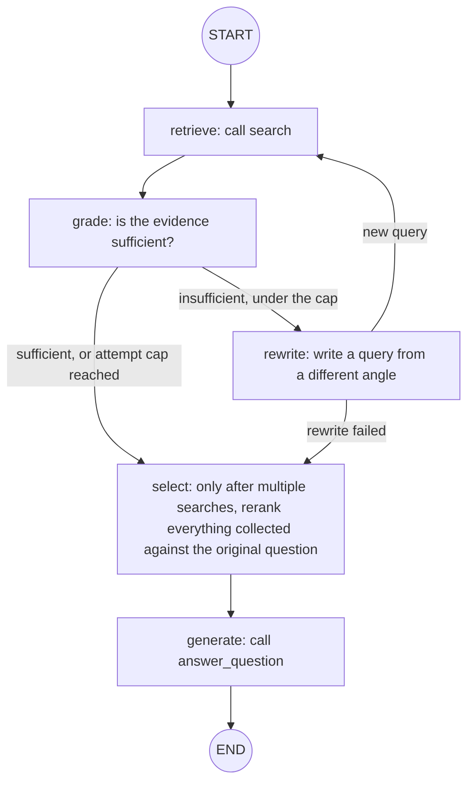

# Cross-Department Knowledge Search Assistant

[日本語](README_ja.md) | English

**A portfolio implementation of an internal knowledge-search RAG for cross-department project lessons and know-how, industry- and role-agnostic by design. All processing runs on a local LLM, with nothing sent externally.**

> 🧭 **The requirements here are the author's own. Most of the technical implementation was proposed by AI, which the author reviewed and approved.**
>
> - The theme: cross-department search for project lessons and know-how, industry- and role-agnostic. The motivation is a pattern the author has repeatedly seen across their career — weak cross-department collaboration and knowledge that never gets shared, which stalls innovation
> - The requirement to mix file formats (Markdown/Word/Excel/PowerPoint/PDF), reflecting how file formats are often inconsistent in the real world
> - The requirement to run everything on a local LLM with zero external transmission — a realistic constraint for business data that can be confidential
> - The requirement to bring "graph engineering" into the development process. The concrete realization of that — decomposing work into DAG nodes, implementing independent nodes in parallel, and making an independent review from a different vendor's AI (the `codex` CLI) a required gate after each node — was AI's proposal
>
> Individual technical decisions — the hybrid retrieval pipeline design, the `BM25Okapi` → `BM25Plus` bug fix, citation-based verifiability, the eval split design — were likewise proposed by AI (Claude Code) and approved by the author after an independent review (codex). AI was used as a pair-programming partner throughout, credited via `Co-Authored-By` on commits.
>
> After implementation, the author ran the UI themselves and fed back the bugs and rough edges they noticed (chat turn ordering, the title wrapping, over-eager answers to off-topic input, no support for conversation-aware follow-up questions, etc.); the AI diagnosed and fixed each one.

---

## Background and problem

In any industry or role, starting a new project almost always means digging up questions like "has something similar been tried before?" or "what worked, and what went wrong?" But terminology, report formats, and information sharing often aren't fully standardized across departments, so useful lessons from other departments tend to get buried.

This project demonstrates a value proposition: **as long as documents are kept in the right place, a RAG system can search and reuse them across departments even when information sharing between those departments is imperfect.**

- Since real data isn't available, the project uses **synthetic data** — dummy internal project-retrospective reports modeling a general business setting (marketing / sales / product development / customer support / corporate planning), industry-agnostic.
- **No company names appear anywhere, real or fictional.** The setting is anonymized as "multiple departments within a single company."
- **File formats are deliberately mixed across Markdown, Word, Excel, PowerPoint, and PDF** (reflecting how file formats are often inconsistent in the real world).
- Each report's "Outcome Summary" section has **one outcome chart attached** (a KPI trend or similar, synthesized with matplotlib). At ingest time, a local VLM (vision-capable model) captions it so the image content is also searchable.
- Weak cross-department collaboration where knowledge never spreads is a common pattern. Even SPDM (Simulation Process and Data Management) adoption in engineering organizations often stalls for the same reason — reluctance to collaborate across departments, more than any technical barrier.

## Setup

### Prerequisites

- Python 3.11 or later
- A local LLM server speaking an OpenAI-compatible API, such as [LM Studio](https://lmstudio.ai/)
  - Load three kinds of models: a chat model, an embedding model, and a **vision model (VLM) for image captioning** (e.g., something in the Qwen2.5-VL / Qwen3-VL family)
  - Everything else works even without the VLM loaded — only image captioning is skipped, with a warning
  - Connects to `http://localhost:1234/v1` by default — that's LM Studio's default port
  - To use a different OpenAI-compatible server (e.g. Ollama), change `[ai] base_url`
    in `config.toml` (Ollama's default is `http://localhost:11434/v1`), or override it
    with the `SILORAG_AI_BASE_URL` environment variable (priority: env var >
    `config.toml` > the code's built-in default)

### Install

```bash
python3 -m venv .venv
source .venv/bin/activate
pip install -e .
# If you're also doing development (tests, lint):
pip install -e ".[dev]"
```

This installs Streamlit, ChromaDB, and every other dependency in one go — no need to `pip install streamlit` separately. Run every command below with this virtual environment activated (`source .venv/bin/activate`).

### Configure

```bash
cp config.example.toml config.toml
```

Adjust LM Studio's base URL and model names in `config.toml` (these can also be overridden via environment variables such as `SILORAG_AI_LLM_MODEL` — see `src/silo_rag/config.py` for details).

## Usage

There are two ways to prepare data. Do either one, then launch the UI.

### Using the demo data

The prep work before launching the UI (generate synthetic data → ingest → evaluate) can be run in one command.

```bash
bash scripts/prepare_demo_data.sh
```

It just runs these three in order, so run them directly if you want to redo a single step
(see [Architecture](#architecture-dag) below for how each step is designed internally).

```bash
# Generate synthetic data (60 reports + 15 evaluation QA pairs by default)
python -m silo_rag.datagen

# Chunk + embed + store in ChromaDB
python -m silo_rag.ingest

# Evaluate (retrieval accuracy + answer quality, combined into one report)
python -m silo_rag.eval
```

While `datagen` runs, you may see a "generation failed" warning — a small local LLM doesn't always follow the required heading structure exactly. It retries automatically, both per-report and for the whole batch, so just let it run and it'll usually succeed. If it still fails, try a different model or re-run `python -m silo_rag.datagen` after a bit.

`python -m silo_rag.eval` writes its results to `data/eval/eval_results.json` (broken down into overall / cross_dept / same_dept, each with hit_rate, recall@k, MRR, citation_rate, and avg_judge_score). The actual numbers depend on whichever models — and dataset — are loaded in LM Studio.

### Using your own reports

`prepare_demo_data.sh` (and `datagen`/`eval`) is purely for trying the synthetic demo data.
To use your own reports, skip `datagen` and `eval` and just run `ingest` directly
(`eval` needs the synthetic gold-standard QA pairs, so it doesn't apply to your own data):

```bash
python -m silo_rag.ingest --reports-dir <path to the directory containing your report files>
```

(Replace the `<...>` part with an actual path, e.g. `--reports-dir ~/Documents/reports`.)

`ingest`'s parser itself is generic — any Markdown/Word/Excel/PowerPoint/PDF file split into
a `---` frontmatter block plus `## heading` sections works, whatever field or heading names
you use. That said, the Streamlit UI's sidebar filters (department / project-type dropdowns)
are hardcoded to the demo's fixed vocabulary (`DEPARTMENTS` / `PROJECT_TYPES` in
`datagen.py`), so they may not match your own data's categories (cross-department search
itself still works fine without using the filters).

### Using the agent version (optional)

Besides the plain search (search once, then answer), there's a LangGraph agent that rewrites the query and searches again when
the results look insufficient (design and evaluation: [Node G](#node-g-the-langgraph-agent)). LangGraph is an optional
dependency; everything in the plain mode works without it.

```bash
pip install -e ".[agent]"
```

- **UI**: pick "agent" under "answer mode" in the sidebar. A record of what the agent did (search, grade, rewrite) appears under each answer.
- **Evaluation**: `python -m silo_rag.eval --pipeline agent` (grading strictness via `--grade-mode strict|lenient`). To compare against plain mode, `bash scripts/compare_pipelines.sh <model name>` runs all three variants and prints a comparison table.
- **Config**: `[agent]` in `config.toml` (`max_attempts`, `grade_mode`).

### Launching the UI

Either way you prepared the data, launch the UI last (not included in either path above —
it's a foreground process that keeps a browser tab open, so run it yourself).

```bash
streamlit run src/silo_rag/app.py
```

## Constraints and scope

- Since the data is synthetic, the numbers and cases aren't drawn from real practice
- No company names are used, real or fictional
- Designed to be industry- and role-agnostic rather than tied to one specific domain
- **The application itself (UI, generated data, LLM prompts) is Japanese-only.** This README being bilingual is purely for portfolio readability, separate from the app's own language support
- **Conversation history is used only to interpret follow-up search questions** (e.g. "tell me more about that"). It doesn't support meta-questions about the conversation itself, like "do you remember what I just said?" — that's not a department-knowledge search question, so the assistant intentionally declines with "no matching case found"

> 💡 **If you just want to run it, this is all you need.** From here on it's the internals of the DAG and the development process (graph engineering + independent review).

---

## Architecture (DAG)

The pipeline is designed as a DAG (directed acyclic graph) with clear dependencies between modules.


```mermaid
graph LR
    A[datagen: synthetic data generation] --> B[ingest: parsing/chunking/embedding]
    B --> C[retrieval: hybrid search + reranking]
    B --> D[generation: cited answer generation]
    C --> E[eval: retrieval accuracy + answer quality evaluation]
    D --> E
    E --> F[app: Streamlit UI]
    C -.-> G[agent: LangGraph agent, optional]
    D -.-> G
    G -.-> E
    G -.-> F
```

| Node | Module | Role | Model used (`[ai]` in `config.toml`) |
| --- | --- | --- | --- |
| A | `src/silo_rag/datagen.py` | - Generates dummy retrospective reports (house style and file format randomized per department; embeds an outcome chart)<br>- Generates gold-standard QA pairs | `llm_model` (report body generation) |
| B | `src/silo_rag/ingest.py` | - Chunks by heading (5 formats supported)<br>- Captions embedded images with a VLM<br>- Vectorizes and stores in ChromaDB | - `embed_model` (chunk vectorization)<br>- `vlm_model` (outcome-chart captioning) |
| C | `src/silo_rag/retrieval.py` | - BM25 + vector-similarity hybrid search<br>- LLM-based reranking<br>- Rewrites the query using conversation history | - `embed_model` (query vectorization)<br>- `llm_model` (reranking, query rewriting) |
| D | `src/silo_rag/generation.py` | - Generates answers grounded in retrieved chunks<br>- Attaches citations (report ID, section, **department**)<br>- Resolves references using conversation history | `llm_model` (answer generation) |
| E | `src/silo_rag/eval.py` | - Measures retrieval accuracy (Recall@k, MRR)<br>- Measures answer quality (LLM-as-judge, citation coverage) | - Every model used by C and D<br>- `llm_model` (LLM-as-judge scoring) |
| F | `src/silo_rag/app.py` | - Streamlit chat UI<br>- Filter by department/type, citation display | Every model used by C and D (invoked on every question) |
| G (optional) | `src/silo_rag/agent.py` | - Runs a "search → grade → rewrite → search again" loop with LangGraph<br>- Details: [Node G](#node-g-the-langgraph-agent) | Every model used by C and D |

If `vlm_model` isn't loaded, only B's image captioning is skipped (a warning is logged); every other node is unaffected.

### What a "node" actually is

A node is a unit of work with a clear input/output boundary. In this project, nodes A–F line
up one-to-one with a single file each (granularity is a design choice — a node could just as
well be a single function or a whole multi-file subsystem).

Each node keeps its internals to itself. `retrieval.py` has several private helper functions
like `_bm25_search` and `_vector_search`, but exposes only `search()` — callers never need to
know whether it's using BM25, vector search, or how reranking works. `generation.py` exposes
only `answer_question()`.

### How nodes actually connect

- **A → B**: connected through files (`data/synth_reports/`). Zero import coupling.
- **B → C/D**: connected through ChromaDB. C and D import only the `Chunk` type (`from .ingest import Chunk`), not B's processing functions.
- **C/D → E/F**: ordinary function calls — `eval.py` and `app.py` call `search()` / `answer_question()` directly.
- **C/D → G → E/F**: G likewise only calls `search()` / `answer_question()` (and `rerank()`). E and F can switch between plain mode and G.

The stronger the dependency, the tighter the coupling (direct calls for the last, loose coupling for the first two).

### Which nodes are actually independent

The only independent pair is C and D (retrieval and generation) — both depend on B, not on each other.

| Pair | Dependency | Could be implemented in parallel? |
| --- | --- | --- |
| A-B, B-C, B-D, C-E, D-E, E-F | Yes | No — has to wait on its dependency |
| **C-D** | **None** | **Yes — actually split across two parallel Agents** |

Acyclic (no loops) just guarantees a valid build order exists at all; it's a separate claim from independence. Even a fully acyclic graph offers zero parallelism if it's one straight chain (A→B→C→D→E→F). The parallel-implementation payoff here came from the graph's actual shape — no arrow happens to connect C and D.

## Development process (graph engineering + independent review)

The development process itself was also a design target. The requirement to "bring graph engineering into the development process" (see 🧭 above) was concretized by AI as follows.

What graph engineering — designing the pipeline as a DAG and making dependencies between modules explicit — offers, and where this project actually got each benefit:

- **Parallel implementation**: nodes with no dependency on each other (C: retrieval, D: generation) were handed to two Agents (subagents) running at the same time.
- **Independent testability**: every node can be tested on its own, with fakes like `_FakeVLMClient` and `_ScriptedClient` standing in for the real LLM/VLM calls — the whole test suite passes in CI with no live LLM connection at all.
- **Bug localization**: after each node's implementation finished, an independent code review from a local `codex` CLI (a different vendor's AI) was a required gate — any findings were fixed and re-reviewed before moving to the next node. It caught a real bug in `retrieval.py` (`BM25Okapi`'s IDF going negative and inverting the ranking) and a data-leak bug in `datagen.py`'s evaluation-QA generation (kept as a regression test in `tests/test_datagen.py`).
- **Reusable module separation**: since each node is independent, rewriting or redoing just one of them later doesn't touch the others. In practice, follow-up changes like adjusting the system prompts, updating the test vocabulary, or revising the README have each been split across parallel Agents as independent tasks too.

Deciding a build order isn't a benefit unique to graph engineering. What pays off is what making the dependencies explicit as a graph reveals: "the part that can be parallelized (C/D)" and "boundaries narrow enough to review in isolation."

## Node G: the LangGraph agent

A new node (`src/silo_rag/agent.py`) that **only calls the public functions** of node C (retrieval) and node D (generation). It doesn't touch the
insides of C or D, and C and D stay independent of each other (only G knows both — the same shape as E, which calls both), so **the module dependency
graph is still a DAG**. The loop lives only inside this one node, as part of the runtime flow.


```mermaid
graph TD
    S((START)) --> R[retrieve: call search]
    R --> J[grade: is the evidence sufficient?]
    J -->|sufficient, or attempt cap reached| SEL[select: only after multiple searches, rerank everything collected against the original question]
    J -->|insufficient, under the cap| W[rewrite: write a query from a different angle]
    W -->|new query| R
    W -->|rewrite failed| SEL
    SEL --> G[generate: call answer_question]
    G --> X((END))
```

The LLM decides "is the evidence sufficient?" and "what query to try next"; the code decides "how many times at most" via
`[agent] max_attempts` in `config.toml` (3 by default).

### Design decisions

- **LangGraph used directly, not LangChain's `create_agent`.** `create_agent` builds a fixed loop in which the LLM calls tools, and it presupposes the LLM's tool calling (function calling). Tool calling is often unreliable on ~7B local models (not verified here), so I built a graph of my own shape — search → grade → rewrite — directly in LangGraph.
- **The LLM only answers in fixed formats.** Grading is the single word `SUFFICIENT` / `INSUFFICIENT`; rewriting is a single query line. The code parses them strictly (no substring matching). In the manual runs against a 7B model (4 questions, twice), every grading and rewriting response came back in the expected format.
- **Auxiliary decisions never stop the run.** If grading or rewriting hits an LLM connection error, malformed output, or a repeated query, it moves on to generation with the chunks in hand. A failure in generation itself still propagates to the caller as before.
- **The zero-external-transmission policy is unchanged.** Every LLM call goes through the existing `LLMClient` (local LM Studio, etc.). LangGraph sends nothing externally unless you set LangSmith environment variables (`LANGSMITH_TRACING`, etc.).
- **Grading strictness has two levels (`strict` / `lenient`).** The grading LLM can't know whether a better document exists that it hasn't seen yet, so which level is better isn't settled by prompt wording alone. `strict` retried up to the cap on most questions (8 of 9 gradings said "insufficient"); `lenient` says "sufficient" quickly. I kept both and compared them in the evaluation.

### Evaluation: comparison with plain mode

The same evaluation set (15 questions, 5 of them cross-department) was run through plain mode and the agent (`strict` / `lenient`), once each.

| Answer model | Mode | hit_rate | Cross-dept | Same-dept | MRR | Citation rate | judge | Searches | LLM calls | Sec/question |
| --- | --- | --- | --- | --- | --- | --- | --- | --- | --- | --- |
| 7B | plain | 0.60 | 0.40 | 0.70 | 0.49 | 0.60 | 3.67 | 1.0 | 2.0 | 10.8 |
| 7B | agent strict | **0.73** | 0.40 | **0.90** | 0.61 | 0.60 | 3.73 | 1.9 | 6.4 | 17.8 |
| 7B | agent lenient | 0.67 | 0.40 | 0.80 | 0.54 | 0.60 | 3.80 | 1.4 | 4.5 | 14.6 |
| 32B | plain | **0.87** | 1.00 | 0.80 | 0.71 | 0.87 | 3.60 | 1.0 | 2.0 | 50.4 |
| 32B | agent strict | 0.87 | 1.00 | 0.80 | 0.72 | 0.80 | 3.33 | 2.5 | 8.2 | 88.9 |
| 32B | agent lenient | 0.87 | 1.00 | 0.80 | 0.74 | 0.73 | 3.27 | 1.1 | 3.5 | 55.8 |

7B = `qwen2.5-7b-instruct`, 32B = `qwen2.5-coder-32b-instruct-mlx` (both in LM Studio, 4-bit).
LLM calls are the chat calls up to the answer (embeddings and judge scoring excluded).
The judge uses the same model as the answerer, so **judge scores are only comparable between rows of the same model**.

- **The smaller the model, the more it helps.** With 7B, `strict` raised hit_rate from 0.60 to 0.73 (9 → 11 of 15 questions). The gain was on same-department questions (0.70 → 0.90). The 7B agent (17.8 s) closes about half the gap to 32B plain mode (50.4 s) in roughly a third of the time.
- **It doesn't help a large-enough model.** With 32B, all three modes hit 13 of 15 questions — the same questions found, the same 2 missed. Plain mode was already strong, so there was nothing left to improve; `strict` cost about 1.8× the time and 4× the LLM calls. Citation rate and judge dipped slightly (retries may mix in other reports that generation doesn't separate well, but 15 questions can't establish that).
- **Cross-department questions stayed at 0.40 with 7B.** All the gains came from same-department questions.
- **Conclusion: plain mode stays the default.** The agent is positioned as an option for when you have to use a small model, trading time for accuracy.

> ⚠️ **This is 15 questions, one run per mode; a one-question difference (0.07) can't be called a real difference,** and LLM output varies between runs. Read it as a trend. I also tried Gemma 4 26B (MoE, a thinking model), but thinking inflated the output tokens to about 174 s per question, so I cut it off midway and left it out of the comparison.

### Problems found along the way

- **Three findings from the independent review (codex):** (1) CI didn't install the optional dependency, so the new tests couldn't be collected; (2) a retry returning `top_k` chunks pushed out all earlier evidence; (3) the grading prompt had no conversation history, so follow-up questions couldn't be graded. Each was reproduced with a mock, fixed, and given a regression test.
- **Three findings from running it against a real LLM (7B):** (1) grading was so strict it retried up to the cap every time; (2) rewritten queries included the asker's own department, biasing search toward it; (3) interleaving the retries' results pushed out a gold report the original query had found (fixed by the `select` node, which reranks everything collected against the original question). Mock-based tests alone didn't surface these.

## License

MIT License. See [LICENSE](LICENSE) for the full text.
