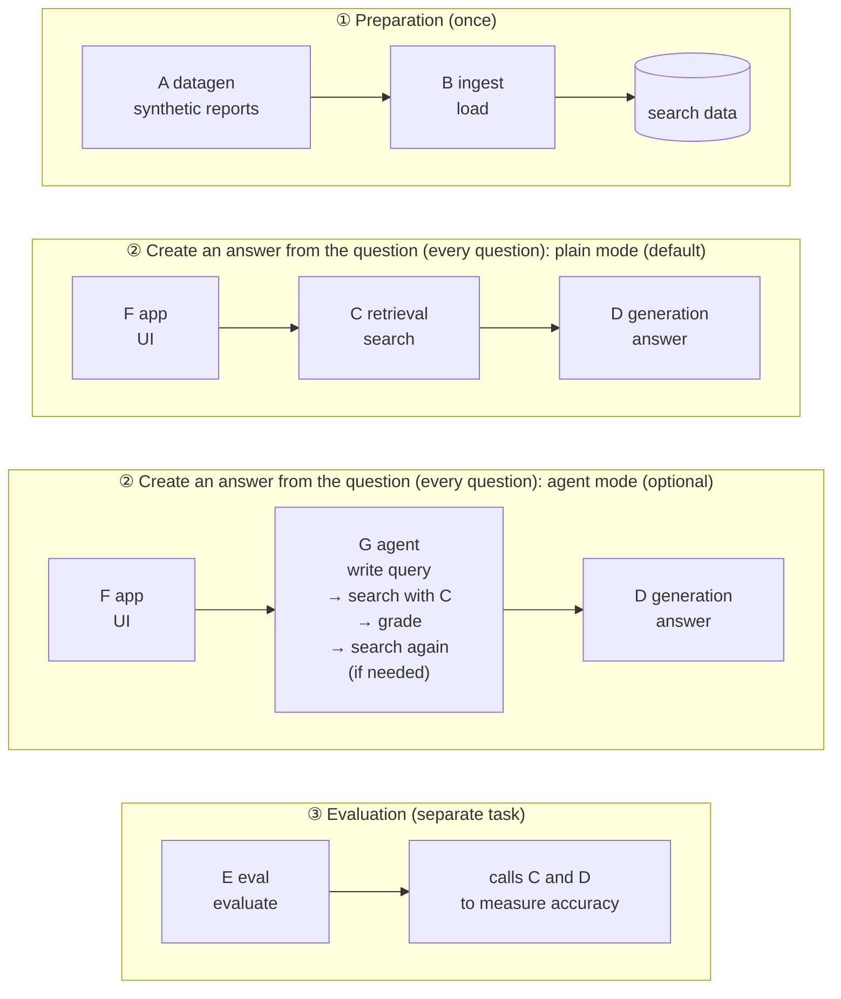
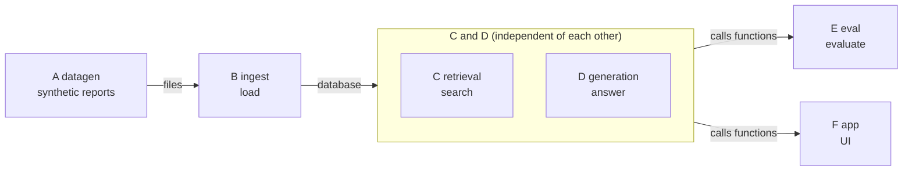
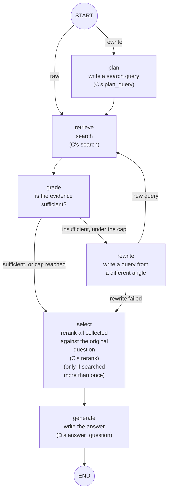

# Cross-Department Knowledge Search Assistant

[日本語](README_ja.md) | English

**A portfolio implementation of an internal knowledge-search RAG for cross-department project lessons and know-how. Everything runs on a local LLM, and nothing is sent externally.**

> 🧭 **The requirements are the author's own. Most of the technical implementation was proposed by AI, then reviewed and approved by the author.**
>
> - **The author's requirements**: cross-department knowledge search (motivated by weak collaboration between departments, so knowledge never gets shared) / five mixed file formats (Markdown/Word/Excel/PowerPoint/PDF) / all processing on a local LLM with zero external transmission / "graph engineering" in the development process
> - **What AI turned those into**: decomposing the work into DAG nodes, implementing independent nodes in parallel, and making an independent review by a different vendor's AI (the `codex` CLI) a required gate after each node
> - **Proposed by AI (Claude Code), approved by the author after independent review**: the hybrid retrieval design, the `BM25Okapi` → `BM25Plus` bug fix ([what BM25 is](#terms-bm25-and-vector-search)), citations, and the eval split design
> - AI was used as a pair-programming partner throughout, credited via `Co-Authored-By` on commits
> - The author ran the UI and found the bugs and rough edges; the AI diagnosed and fixed them

---

## Background and problem

- **Problem**: when starting a project, you want to find similar past work, but terminology and formats differ between departments, so other departments' lessons get buried
- **Value proposition**: as long as documents are kept in the right place, RAG can search and reuse them across departments, even when sharing between departments is imperfect
- **The data is synthetic**: retrospective reports for five generic business departments (marketing / sales / product development / customer support / corporate planning). No company names appear. Five file formats are mixed, and each report's outcome chart (a KPI trend or similar) is captioned by a local VLM at ingest time so the image content is searchable

## Setup

### Prerequisites

- Python 3.11 or later
- A local LLM server with an OpenAI-compatible API, such as [LM Studio](https://lmstudio.ai/)
  - Load three kinds of models: a chat model, an embedding model, and a **vision model (VLM) for image captioning** (e.g., the Qwen2.5-VL / Qwen3-VL family). Without the VLM only image captioning is skipped; everything else works
  - The default endpoint is `http://localhost:1234/v1`. For another server (e.g., Ollama at `http://localhost:11434/v1`), set `[ai] base_url` in `config.toml` or the `SILORAG_AI_BASE_URL` environment variable (priority: env var > `config.toml` > built-in default)

### Install

```bash
python3 -m venv .venv
source .venv/bin/activate
pip install -e .
# If you're also doing development (tests, lint):
pip install -e ".[dev]"
```

Run every command below with the virtual environment activated.

### Configure

```bash
cp config.example.toml config.toml
```

Adjust the base URL and model names in `config.toml` (environment variables such as `SILORAG_AI_LLM_MODEL` also work; see `src/silo_rag/config.py`).

## Usage

There are two ways to prepare data. Do one of them, then launch the UI.

### Using the demo data

```bash
bash scripts/prepare_demo_data.sh
```

It runs these three steps in order. To redo one step, run it directly.

```bash
python -m silo_rag.datagen   # generate synthetic data (60 reports + 15 evaluation QA pairs by default)
python -m silo_rag.ingest    # chunk, embed, and store in ChromaDB
python -m silo_rag.eval      # evaluate retrieval accuracy and answer quality (results in data/eval/eval_results.json)
```

- A "generation failed" message during `datagen` appears because a small local LLM doesn't always follow the required heading structure. It retries automatically, so it usually succeeds if you wait. If it keeps failing, try another model or re-run later

### Using your own reports

- Skip `datagen` and `eval` (`eval` needs the synthetic QA pairs) and run only `ingest`

```bash
python -m silo_rag.ingest --reports-dir <directory containing your reports>
```

- The parser is generic: any Markdown/Word/Excel/PowerPoint/PDF split into a `---` frontmatter block plus `## heading` sections loads, whatever the field and heading names
- The UI's filters (department / project type) use the demo's fixed vocabulary, so they may not match your categories (cross-department search itself works without the filters)

### Using the agent version (optional)

On top of plain mode (search once, then answer), there are agents where the LLM writes the search query and, if needed, searches again (design and evaluation: [Node G](#node-g-the-langgraph-agent), [Node H](#node-h-langchain-integration)). LangGraph and LangChain are optional dependencies; plain mode works without them.

```bash
pip install -e ".[agent]"        # LangGraph agent (node G)
pip install -e ".[langchain]"    # LangChain integration (node H); also installs langgraph
```

- **UI**: pick "agent" under "answer mode" in the sidebar. A record of what the agent did (search, grade, rewrite) appears under each answer
- **Evaluation**: `python -m silo_rag.eval --pipeline agent` (`--grade-mode strict|lenient`, `--first-query raw|rewrite`); `--pipeline langchain` for the stock LangChain agent. To compare them all: `bash scripts/compare_pipelines.sh <model name> [--rewrite-first]`
- **Config**: `[agent]` in `config.toml` (`max_attempts`, `grade_mode`, `first_query`). The defaults are `first_query = "rewrite"` and `max_attempts = 1` (write the query, search once), the combination that measured best on a 7B model with the 15 questions (on 45 questions no difference from plain mode could be confirmed; see "Re-measured on 45 questions" below)

### Launching the UI

It's a foreground process that keeps a browser tab open, so run it separately from data preparation.

```bash
streamlit run src/silo_rag/app.py
```

## Constraints and scope

- The data is synthetic, so the numbers and cases aren't from real practice. No company names are used
- **The application itself (UI, generated data, LLM prompts) is Japanese-only.** The bilingual README is for portfolio readability, separate from the app's language support
- **Conversation history is used only to interpret follow-up search questions** (e.g., "tell me more about that"). Meta-questions about the conversation itself ("what did I just say?") are intentionally answered with "no matching case found"

> [!TIP]
> **If you just want to run it, this is enough.**
> The rest covers the design and the development process. Read only what interests you.
>
> - How the system is organized: [Architecture](#architecture)
> - How one question becomes an answer: [Worked example](#worked-example-how-one-question-becomes-an-answer)
> - How it was developed: [Development process](#development-process-graph-engineering--independent-review)
> - The agent's design and measured results: [Node G](#node-g-the-langgraph-agent) and [Node H](#node-h-langchain-integration)

---

## Architecture

The system is made of six **nodes** (units of work; A to F each correspond to one file). They run at three different times. How a question is answered (②) can be **switched between the plain mode and the agent mode with the "answer mode" selector in the UI sidebar**.


```mermaid
%%{init: {"flowchart": {"padding": 24, "wrappingWidth": 400}}}%%
graph TB
    subgraph prep["① Preparation (once)"]
        direction LR
        A["A datagen<br/>synthetic reports"] --> B["B ingest<br/>load"] --> DB[("search data")]
    end
    subgraph plain["② Create an answer from the question (every question): plain mode (default)"]
        direction LR
        F1["F app<br/>UI"] --> C1["C retrieval<br/>search"] --> D1["D generation<br/>answer"]
    end
    subgraph agent["② Create an answer from the question (every question): agent mode (optional)"]
        direction LR
        F2["F app<br/>UI"] --> G["G agent<br/>write query<br/>→ search with C<br/>→ grade<br/>→ search again<br/>(if needed)"] --> D2["D generation<br/>answer"]
    end
    subgraph ev["③ Evaluation (separate task)"]
        direction LR
        E["E eval<br/>evaluate"] --> CD["calls C and D<br/>to measure accuracy"]
    end
    prep ~~~ plain
    plain ~~~ agent
    agent ~~~ ev
```

- **① Preparation**: A makes the synthetic reports, and B loads them into the search data (ChromaDB)
- **② Create an answer from the question** (runs on every question; the answer mode is switched in the sidebar)
  - **Plain mode** (default): F calls C (search) and hands the result to D (answer generation)
  - **Agent mode** (optional): instead of calling C and D directly, F calls G. G writes the query, searches with C, grades, and searches again if needed, then D writes the answer. With the default settings it searches once, so grading and re-search do not run
- **③ Evaluation**: E calls C and D to measure retrieval accuracy and answer quality. It is a separate task from answering questions

The optional nodes G and H, in detail:

- **G** (`agent.py`): calls functions from C and D (`search`, `rerank`, `answer_question`). E (`--pipeline agent`) and F (the "agent" answer mode) call it only when selected
- **H** (`langchain_adapter.py`): calls C's `search` and D's `Answer` and `build_citations`. E calls it only with `--pipeline langchain`
- Both are imported only when used. Plain mode works without LangGraph or LangChain installed

| Node | Module | Role | Model used (`[ai]` in `config.toml`) |
| --- | --- | --- | --- |
| A | `src/silo_rag/datagen.py` | - Generates dummy retrospective reports (house style and file format randomized per department; embeds an outcome chart)<br>- Generates gold-standard QA pairs | `llm_model` (report body generation) |
| B | `src/silo_rag/ingest.py` | - Chunks by heading (5 formats supported)<br>- Captions embedded images with a VLM<br>- Vectorizes and stores in ChromaDB | - `embed_model` (chunk vectorization)<br>- `vlm_model` (outcome-chart captioning) |
| C | `src/silo_rag/retrieval.py` | - [BM25](#terms-bm25-and-vector-search) + vector-similarity hybrid search<br>- LLM-based reranking<br>- Rewrites the query using conversation history<br>- (Optional) writes a search query from the question before searching (`[retrieval] rewrite_query`, off by default) | - `embed_model` (query vectorization)<br>- `llm_model` (reranking, query rewriting) |
| D | `src/silo_rag/generation.py` | - Generates answers grounded in retrieved chunks<br>- Attaches citations (report ID, section, **department**)<br>- Resolves references using conversation history | `llm_model` (answer generation) |
| E | `src/silo_rag/eval.py` | - Measures retrieval accuracy (Recall@k, MRR)<br>- Measures answer quality (LLM-as-judge, citation coverage) | - Every model used by C and D<br>- `llm_model` (LLM-as-judge scoring) |
| F | `src/silo_rag/app.py` | - Streamlit chat UI<br>- Filter by department/type, citation display | Every model used by C and D (invoked on every question) |
| G (optional) | `src/silo_rag/agent.py` | - Runs "write a search query → search → grade → rewrite → search again" with LangGraph<br>- Details: [Node G](#node-g-the-langgraph-agent) | Every model used by C and D |
| H (optional) | `src/silo_rag/langchain_adapter.py` | - Exposes the existing search as a LangChain Retriever<br>- Comparison against LangChain's stock agent<br>- Details: [Node H](#node-h-langchain-integration) | Every model used by C and D |

If `vlm_model` isn't loaded, only B's image captioning is skipped (a warning is logged).

### Terms: BM25 and vector search

C combines two searches of different kinds.

- **BM25 (keyword search)**: a **formula** that scores each document by how often, and how distinctively, the question's words appear in it. It is not an AI model and involves no training
  - The more often a word appears, the higher the score (with diminishing returns). A word found in almost every document (the Japanese equivalents of "is", "please") barely counts; a rare word (say, "budget planning") counts a lot. Long documents are discounted a little
  - Good at: searches where **the words themselves match** (part numbers, proper nouns, technical terms)
  - Weak at: treating a paraphrase ("budget" vs. "cost estimate") as the same thing. Words unrelated to the search raise the score of any document that happens to contain them, which can shift the ranking (a word absent from the index scores zero and changes nothing)
- **Vector search (semantic search)**: an embedding model (an AI model) turns each sentence into a list of numbers, and distance measures whether the **meaning is close**. Handles paraphrases well
- **Combining the scores**: each score is **normalized** to 0–1, then the two are added using `vector_weight` (0.5 by default), and an LLM reranks the top candidates
  - Normalization: the best score becomes 1, the worst 0, and the rest are rescaled proportionally. Exceptions: if the highest and lowest scores are almost equal, all become 1; for keyword search, if the highest score is 0 or below, all become 0 (checked first)
  - A calculation example is in the [worked example](docs/worked_example_en.md)
- **In this project**: preprocessing is deliberately simple (no morphological analyzer). Japanese text is cut into overlapping **two-character pieces** (e.g., "予算策定" → "予算", "算策", "策定"), while ASCII words and IDs (such as `RPT-014`) are **kept whole and lowercased** (`rpt-014`). It uses `BM25Plus` from `rank_bm25`; `BM25Okapi` can give a negative weight (IDF) to a word found in more than half the documents, which genuinely happens on a small corpus, so it was replaced

### Worked example: how one question becomes an answer

[docs/worked_example_en.md](docs/worked_example_en.md) follows a question through every stage (ingestion, query writing, BM25, vector search, combining scores, reranking, answer generation) with real values. It has two examples (one that works, and one that doesn't: the gold report was among the candidates but dropped in reranking) and a step-by-step breakdown of where the query rewrite helps (from the 15 questions; on 45 questions the rewrite's effect could not be confirmed).

## Development process (graph engineering + independent review)

The requirement to "bring graph engineering into the development process" (see 🧭) was concretized by AI as follows. Graph engineering means designing the pipeline as a DAG and making dependencies explicit.

- **Parallel implementation**: nodes with no dependency on each other (C and D) were handed to two Agents (subagents) at the same time
- **Independent testing**: fakes (`_FakeVLMClient`, `_ScriptedClient`) stand in for dependencies, so every node can be tested on its own with no live LLM
- **Bug localization**: after each node, an independent review by the local `codex` CLI (a different vendor's AI) was a required gate; findings were fixed and re-reviewed before moving on. It caught `BM25Okapi`'s negative-IDF bug in `retrieval.py` and a data leak in `datagen.py`'s evaluation-QA generation (kept as a regression test in `tests/test_datagen.py`)
- **Easy to change**: each node exposes only its entry functions, so rewriting a node's internals doesn't affect the nodes that call it
- Being able to decide a build order isn't unique to graph engineering. What paid off was "the part that can be parallelized (C and D)" and "boundaries narrow enough to review in isolation"

### Node dependencies (DAG)

The pipeline is designed as a DAG (directed acyclic graph) with clear dependencies between nodes. **This diagram is not the runtime flow; it is a design map of "which node uses the results of which node".** I used it during development to decide the build order and which parts could be built in parallel.


```mermaid
%%{init: {"flowchart": {"padding": 24, "wrappingWidth": 400}}}%%
graph LR
    A["A datagen<br/>synthetic reports"] -->|files| B["B ingest<br/>load"]
    B -->|database| cd
    subgraph cd["C and D (independent of each other)"]
        C["C retrieval<br/>search"]
        D["D generation<br/>answer"]
    end
    cd -->|calls functions| E["E eval<br/>evaluate"]
    cd -->|calls functions| F["F app<br/>UI"]
```

- **Connections**: A to B goes through files (`data/synth_reports/`; zero import coupling). B to C/D goes through ChromaDB (they import only the `Chunk` type). E and F call C's and D's functions directly (there is no dependency between E and F; F also uses A's constants `DEPARTMENTS` and `PROJECT_TYPES`)
- Each node hides its internals; only entry points such as `search()` and `answer_question()` are exposed
- The optional G and H are not in this picture. **G and H depend on C and D** (they call functions of C and D). E and F use G (and E also H) only when needed. The direction is C/D → G/H → E/F, with no cycle
- **The only independent pair is C and D.** Both depend on B, not on each other. Every other pair has a dependency and has to wait for it, so they can't be built in parallel. **C and D were actually implemented in parallel by two Agents**
- "Acyclic" only guarantees a valid build order exists; it's separate from independence. A single straight chain (A→B→C→D→E→F) is acyclic yet offers zero parallelism. The payoff here came from the graph's shape: no arrow happens to connect C and D

> ⚠️ **"Parallel" here means parallel development (writing the code), not parallel execution at runtime.**
>
> - The DAG's arrows show which module depends on which; they are not the runtime order of operations
> - At runtime, each question runs C (retrieval) and then D (generation), one after the other. D takes the chunks C returned as its input, handed over by E/F
> - Because C and D don't depend on each other, two Agents **could write them at the same time**; that is all the claim means

## Node G: the LangGraph agent

A new node (`src/silo_rag/agent.py`) that **only calls the public functions** of nodes C and D. **G depends on C and D** (C and D exist first, and G uses their functions). C and D, in turn, know nothing about G (they don't depend on it), and they still don't depend on each other. So the dependencies contain no cycle and are **still a DAG**. The loop exists only inside G, as part of the runtime flow.


```mermaid
%%{init: {"flowchart": {"padding": 24, "wrappingWidth": 400}}}%%
graph TD
    S((START)) -->|raw| R["retrieve<br/>search<br/>(C's search)"]
    S -->|rewrite| P["plan<br/>write a search query<br/>(C's plan_query)"]
    P --> R
    R --> J["grade<br/>is the evidence<br/>sufficient?"]
    J -->|sufficient, or cap reached| SEL["select<br/>rerank all collected<br/>against the original<br/>question<br/>(C's rerank)<br/>(only if searched<br/>more than once)"]
    J -->|insufficient, under the cap| W["rewrite<br/>write a query from<br/>a different angle"]
    W -->|new query| R
    W -->|rewrite failed| SEL
    SEL --> G["generate<br/>write the answer<br/>(D's answer_question)"]
    G --> X((END))
```

In the diagram, "(C's ...)" and "(D's ...)" are steps that call a function of that node. The steps without a mark (grading and writing a query from a different angle) live only in G. **G is not inside C or D; it is a separate node that calls functions of C and D.**

- The LLM decides "is the evidence sufficient?" and "what query next"; the code decides "how many times at most" via `[agent] max_attempts` (1 by default, i.e., no re-search)
- The first query is chosen by `[agent] first_query` (`raw` = the question as is; `rewrite` = a query the LLM writes from the question; `rewrite` by default)

### Design decisions

- **LangGraph used directly, not LangChain's `create_agent`.** `create_agent` is a fixed loop built on the LLM's tool calling (function calling), which is often unreliable on ~7B local models. So I built the "search → grade → rewrite" graph myself (`create_agent` was run as a comparison target in [node H](#node-h-langchain-integration))
- **The LLM answers only in fixed formats.** Grading is the single word `SUFFICIENT` / `INSUFFICIENT`; rewriting is one query line. The code parses them strictly
- **Auxiliary decisions never stop the run.** A connection error, malformed output, or repeated query in grading or rewriting moves on to generation with the chunks in hand
- **Zero external transmission is unchanged.** Every LLM call goes through the existing local `LLMClient`. LangGraph sends nothing externally unless you set LangSmith environment variables
- **Grading strictness has two levels (`strict` / `lenient`).** The grading LLM can't know whether a better document exists that it hasn't seen, so prompt wording alone doesn't settle which level is better. `strict` retried up to the cap on most questions (8 of 9 gradings said "insufficient"); `lenient` says "sufficient" quickly. I kept both and compared them
- **You can choose whether the first query is written from the question (`first_query`).** A question contains a lot unrelated to search (a self-introduction, request phrasing), which I expected to scatter the search ([BM25](#terms-bm25-and-vector-search)). So I added a `plan` node that has the LLM write a search query from the question (falling back to the question itself on failure). On the 15-question evaluation this mattered most (but re-measured on 45 questions, no difference showed; see "Re-measured on 45 questions" below). The query-writing itself lives in node C (`retrieval.plan_query`), and plain mode can turn it on with `[retrieval] rewrite_query` (off by default; I measured plain mode on 45 questions and could not confirm any effect)
- **Grading is skipped once the search cap is reached.** No further search is possible, so the verdict can't change anything

### Evaluation

- The tables below are from one evaluation set (15 questions, 5 of them cross-department), run once per variant. **These 15 questions are the ones I was looking at when I designed the query rewriting, so the design probably fits them especially well** (the 45-question re-measurement is further down). 7B = `qwen2.5-7b-instruct`, 32B = `qwen2.5-coder-32b-instruct-mlx` (both in LM Studio, 4-bit)
- "Query writing" is `first_query = "rewrite"`; "1 search" is `max_attempts = 1`
- "LLM calls" are the chat calls up to the answer (embeddings and judge excluded). Measured before "skip grading at the cap", so each question that reached the cap actually costs one call fewer
- The judge uses the same model as the answerer, so **judge scores are only comparable between rows of the same model**

**7B**

| Variant | hit_rate | Cross-dept | Same-dept | MRR | Citation rate | judge | Searches | LLM calls | Sec/question |
| --- | --- | --- | --- | --- | --- | --- | --- | --- | --- |
| Plain | 0.60 | 0.40 | 0.70 | 0.49 | 0.60 | 3.67 | 1.0 | 2.0 | 10.8 |
| G strict | 0.73 | 0.40 | 0.90 | 0.61 | 0.60 | 3.73 | 1.9 | 6.4 | 17.8 |
| G lenient | 0.67 | 0.40 | 0.80 | 0.54 | 0.60 | 3.80 | 1.4 | 4.5 | 14.6 |
| G strict + query writing | 0.80 | 0.60 | 0.90 | 0.66 | 0.80 | 3.73 | 2.4 | 9.0 | 19.5 |
| G lenient + query writing | 0.87 | 0.60 | 1.00 | 0.69 | 0.80 | 3.60 | 1.6 | 6.2 | 14.9 |
| **G lenient + query writing + 1 search** | **0.93** | **0.80** | 1.00 | 0.72 | **0.87** | 3.53 | 1.0 | 4.0 | **12.0** |
| LangChain stock ([node H](#node-h-langchain-integration)) | **0.93** | **0.80** | 1.00 | 0.54 | **0.87** | 3.73 | 1.3 | 3.3 | 18.6 |

**32B**

| Variant | hit_rate | Cross-dept | Same-dept | MRR | Citation rate | judge | Searches | LLM calls | Sec/question |
| --- | --- | --- | --- | --- | --- | --- | --- | --- | --- |
| Plain | 0.87 | 1.00 | 0.80 | 0.71 | 0.87 | 3.60 | 1.0 | 2.0 | 50.4 |
| G strict | 0.87 | 1.00 | 0.80 | 0.72 | 0.80 | 3.33 | 2.5 | 8.2 | 88.9 |
| G lenient | 0.87 | 1.00 | 0.80 | 0.74 | 0.73 | 3.27 | 1.1 | 3.5 | 55.8 |
| G lenient + query writing | 0.87 | 0.60 | 1.00 | 0.73 | 0.80 | 3.00 | 1.2 | 4.8 | 63.8 |
| G lenient + query writing + 1 search | 0.93 | 0.80 | 1.00 | 0.72 | 0.87 | 3.33 | 1.0 | 4.0 | 57.2 |

I didn't measure the 32B model with the stock LangChain agent (LM Studio's model list shows no tool-support icon for it).

**What the results show**

- **On the 15 questions, what helped looked like not "searching again" but "rewriting the question into a search query" (7B).** With the question used as is, adding re-search only moved hit_rate from 0.60 to 0.67–0.73. Having the LLM write the first query took it to 0.80–0.93, and **limiting it to a single search (0.93) did no worse**. Cross-department questions also rose from 0.40 to 0.80. The step-by-step breakdown of where it helps is in the [worked example](docs/worked_example_en.md) (also from the 15 questions). **However, re-measured on 45 questions, this effect could not be confirmed** (see "Re-measured on 45 questions" below)
- **This breakdown was prompted by losing to the stock LangChain agent.** It reached 0.93 without searching more. Looking into it, the LLM rewrote the question into a keyword-style query before every search, while my G used the question as is on the first search. My original hypothesis ("re-search makes up for it") was only half right
- **With 32B, none of the tweaks shows a clear effect.** Plain mode was already at 0.87; query writing + 1 search reached 0.93 (one question). Cross-department dropped from 1.00 to 0.80 (one question), and to 0.60 once re-search was added
- **Conclusion: plain mode stays the default answer mode; the agent looked better on small models with the 15 questions, but on 45 questions no difference from plain mode could be confirmed.** The agent's defaults are `first_query = "rewrite"` with `max_attempts = 1`, the best-measured on the 15 questions (the "query writing + 1 search" rows). Re-measured on 7B with 45 questions, these defaults behave the same as plain mode with the rewrite turned on, and the difference is within chance (see "Re-measured on 45 questions" below). The re-search loop is available by raising `max_attempts`, but it showed no benefit on top of query writing with either model. With larger models, use plain mode
  - After making these the defaults, I re-ran both models; per-question hit/miss and metrics such as hit_rate matched. LLM calls dropped from the 4.0 in the table to 3.0 because grading is skipped at the cap

**Re-measured on 45 questions (plain mode, without and with the rewrite)**

I turned on `rewrite_query` in plain mode's `search()`, and ran the agent's defaults (`first_query = "rewrite"`, `max_attempts = 1`) on 7B, with more questions: 45, one run per condition.

| Model and variant | hit_rate | Cross-dept | Same-dept | MRR | Citation rate | judge | LLM calls | Sec/question |
| --- | --- | --- | --- | --- | --- | --- | --- | --- |
| 7B, no rewrite | 0.71 | 0.60 | 0.77 | 0.50 | 0.64 | 3.80 | 2.0 | 10.8 |
| 7B, rewrite | 0.76 | 0.60 | 0.83 | 0.52 | 0.67 | 3.73 | 3.0 | 10.8 |
| 7B, agent defaults (rewrite + 1 search) | 0.76 | 0.60 | 0.83 | 0.52 | 0.71 | 3.78 | 3.0 | 11.7 |
| 32B, no rewrite | 0.76 | 0.47 | 0.90 | 0.57 | 0.69 | 3.11 | 2.0 | 49.3 |
| 32B, rewrite | 0.80 | 0.60 | 0.90 | 0.61 | 0.73 | 2.93 | 3.0 | 50.5 |

- **Questions**: 45 (15 cross-department, 30 same-department), built mechanically from the report specifications (no LLM). Same reports and same construction as the 15-question evaluation; 13 questions have the same wording as the 15, and 32 are new
- **Counting hit_rate changes question by question, the difference is within chance** (sign test)
  - 7B: 7 improved, 5 got worse (p=0.77)
  - 32B: 6 improved, 4 got worse (p=0.75). Cross-department went from 0.47 to 0.60, but 4 improved and 2 got worse (p=0.69)
- **Restricted to the 13 questions shared with the 15, there is an improvement; restricted to the 32 new ones, there is none.** Improved / got worse: 7B 4 / 0 on the 13 and 3 / 5 on the 32 new ones; 32B 2 / 0 on the 13 and 4 / 4 on the 32 new ones. The large improvement seen on the 15 questions probably looked large because the design was tuned to them
- **Cost**: LLM calls go from 2.0 to 3.0 per question. The elapsed time is about the same (7B 10.8 to 10.8 s, 32B 49.3 to 50.5 s)
- **The agent's defaults behave the same as plain mode with the rewrite turned on (7B).** The retrieved reports are identical, in order, for 44 of 45 questions, and the hit/miss outcome is identical for all 45 (one question differed slightly because of LLM variation). With one search, no grading or re-search happens, so it is just "write the query, search, answer". So its difference from plain mode is the same as the rewrite's above, within chance (7 better, 5 worse, p=0.77). I did not measure 32B because the structure is the same. The re-search loop (raising `max_attempts`) was not measured on 45 questions
- **Conclusion**: since no effect could be confirmed, `[retrieval] rewrite_query` stays off

> ⚠️ **This is 15 questions, one run per variant. A one-question difference (0.07) can't be called real; read the results as a trend on these 15 questions.**
>
> - Temperature 0 does not guarantee an exact repeat. What varies is answer generation (citation rate, judge) and the stock LangChain agent's search (its tool query is written by the LLM at temperature 0.2 each time)
> - The stock agent's variation is something I observed across several runs I stopped partway; only the last run's result is saved, so the numbers don't back it up
> - That retrieval reproduces doesn't mean a different question set would give the same result. In fact, the query rewriting I chose on the 15 questions showed no effect on 45 questions (32 of them new)
> - I also tried Gemma 4 26B (a thinking model), but it took about 174 s per question, so I cut it off midway and left it out of the comparison

### Problems found along the way

- **Three findings from the independent review (codex)**: CI didn't install the optional dependency; a retry pushed out all earlier evidence; the grading prompt had no conversation history. Each was reproduced with a mock, fixed, and given a regression test
- **Three findings from running a real LLM (7B)** (mock-based tests alone didn't surface these): grading was so strict it retried up to the cap every time; rewritten queries included the asker's own department; interleaving the retries' results pushed out a gold report the original query had found (fixed by the `select` node, which reranks everything collected against the original question)
- **A design mistake found by the evaluation**: the original hypothesis that "re-search helps" was only half right. And the next conclusion, "query rewriting helps", was too strong because it was tuned to the 15 questions (found by re-measuring on 45)

## Node H: LangChain integration

`src/silo_rag/langchain_adapter.py` (optional; `pip install -e ".[langchain]"`). Like G, it only calls the public functions of C and D.

- **`SiloRetriever`**: exposes the existing hybrid search (`search()`) as a LangChain Retriever (`BaseRetriever`). The search internals are unchanged, and it can be used as a component in LangChain chains and agents
- **`run_langchain_agent`**: uses that Retriever as a search tool for LangChain's stock `create_agent` and answers with it. It is the comparison target for the hand-built node G. The search cap is 3, a constant independent of G's `max_attempts`
- Every LLM call goes to the local LM Studio (`config.ai.base_url`). Zero external transmission is unchanged
- Evaluate it with `python -m silo_rag.eval --pipeline langchain`. The result is in the 7B table above (hit_rate 0.93, citation rate 0.87). Its retrieval metrics are computed over every chunk the tool returned, so more searches favor it; citation rate and judge compare fairly

### What running the stock agent on a small model showed

Neither problem appeared in mock-based tests; both showed up only when I ran a real 7B model.

- **Parallel tool calls broke search.** When the LLM calls the search tool several times in one response, LangGraph runs them concurrently on threads. `search()` assumes a single thread, and failed on both ChromaDB and LM Studio (HTTP 500). `SiloRetriever` now runs searches one at a time
- **One response tried to call the search tool about 50 times at once (282 s).** LangGraph's step limit (`recursion_limit`) doesn't cover parallel calls within one response. `SiloRetriever` now caps how many searches it actually runs

## License

MIT License. See [LICENSE](LICENSE) for the full text.
