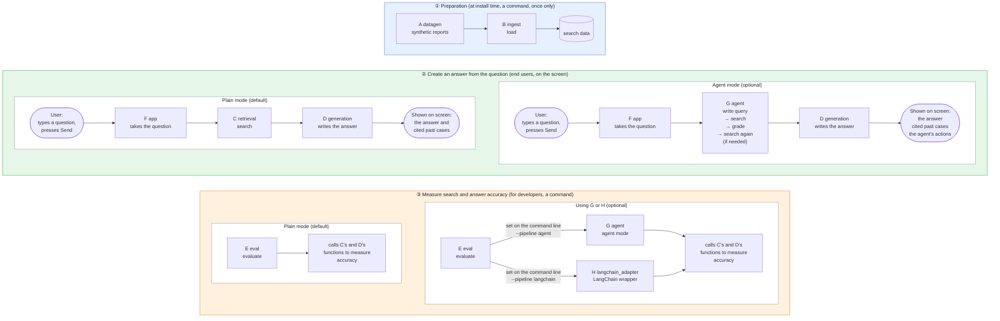
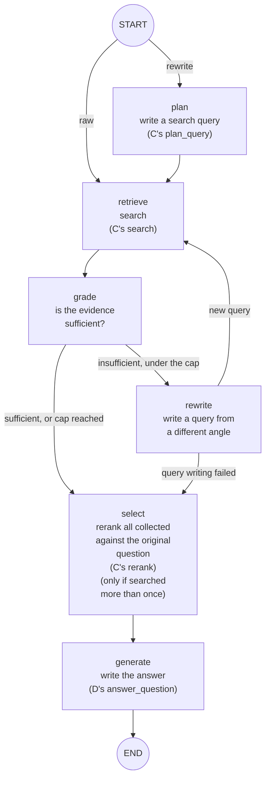
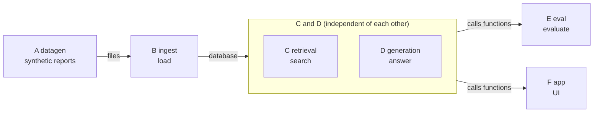

# Cross-Department Knowledge Search Assistant

[日本語](README_ja.md) | English

**A portfolio implementation of an internal knowledge-search RAG for cross-department project lessons and know-how. Everything runs on a local LLM, and nothing is sent externally.**

> 🧭 **The requirements are the author's own. Most of the technical implementation was proposed by AI, then reviewed and approved by the author.**
>
> - **The author's requirements**: cross-department knowledge search (motivated by weak collaboration between departments, so knowledge never gets shared) / five mixed file formats (Markdown/Word/Excel/PowerPoint/PDF) / all processing on a local LLM with zero external transmission / "graph engineering" in the development process
> - **What AI turned those into**: decomposing the work into DAG nodes, implementing independent nodes in parallel, and making an independent review by a different vendor's AI (the `codex` CLI) a required gate after each node
> - **Proposed by AI (Claude Code), approved by the author after independent review**: the hybrid retrieval design, the `BM25Okapi` → `BM25Plus` bug fix ([what BM25 is](#terms-bm25-and-vector-search)), citations, and the eval split design
> - AI was used as a pair-programming partner throughout, credited via `Co-Authored-By` on commits
> - The author ran the UI and found the bugs and rough edges; the AI diagnosed and fixed them

---

## Background and problem

- **Problem**: when starting a project, you want to find similar past work, but terminology and formats differ between departments, so other departments' lessons get buried
- **Value proposition**: as long as documents are kept in the right place, RAG can search and reuse them across departments, even when sharing between departments is imperfect
- **The data is synthetic**: retrospective reports for five generic business departments (marketing / sales / product development / customer support / corporate planning). No company names appear. Five file formats are mixed, and each report's outcome chart (a KPI trend or similar) is captioned by a local VLM at ingest time so the image content is searchable

## Screenshots

The "answer mode" in the sidebar switches between the plain mode and the agent mode, question by question (both screenshots are the same question asked of the synthetic data; the UI itself is in Japanese).

<table>
<tr>
<td width="50%"><br><b>Plain mode</b>: searches the question almost as is, and shows the answer and the past cases it drew on (citations)</td>
<td width="50%"><br><b>Agent mode</b> (optional): writes a search query, then searches. A record of what the agent did appears under the answer</td>
</tr>
</table>

## Setup

### Prerequisites

- Python 3.11 or later
- A local LLM server with an OpenAI-compatible API, such as [LM Studio](https://lmstudio.ai/)
  - Load three kinds of models: a chat model, an embedding model, and a **vision model (VLM) for image captioning** (e.g., the Qwen2.5-VL / Qwen3-VL family). Without the VLM only image captioning is skipped; everything else works
  - The default endpoint is `http://localhost:1234/v1`. For another server (e.g., Ollama at `http://localhost:11434/v1`), set `[ai] base_url` in `config.toml` or the `SILORAG_AI_BASE_URL` environment variable (priority: env var > `config.toml` > built-in default)

### Install

```bash
python3 -m venv .venv
source .venv/bin/activate
pip install -e .
# If you're also doing development (tests, lint):
pip install -e ".[dev]"
```

Run every command below with the virtual environment activated.

### Configure

```bash
cp config.example.toml config.toml
```

Adjust the base URL and model names in `config.toml` (environment variables such as `SILORAG_AI_LLM_MODEL` also work; see `src/silo_rag/config.py`).

## Usage

Usage has three steps. In **step 1** you prepare the data; in **step 2** you launch the UI and ask questions. **Step 3** is only for when you want the agent mode.

### Step 1: Prepare the data (either A or B)

#### A. Using the demo data

```bash
bash scripts/prepare_demo_data.sh
```

It runs these three steps in order. To redo one step, run it directly.

```bash
python -m silo_rag.datagen   # generate synthetic data (60 reports + 15 evaluation QA pairs by default)
python -m silo_rag.ingest    # chunk, embed, and store in ChromaDB
python -m silo_rag.eval      # evaluate retrieval accuracy and answer quality (results in data/eval/eval_results.json)
```

- A "generation failed" message during `datagen` appears because a small local LLM doesn't always follow the required heading structure. It retries automatically, so it usually succeeds if you wait. If it keeps failing, try another model or re-run later

#### B. Using your own reports

- Skip `datagen` and `eval` (`eval` needs the synthetic QA pairs) and run only `ingest`

```bash
python -m silo_rag.ingest --reports-dir <directory containing your reports>
```

- The parser is generic: any Markdown/Word/Excel/PowerPoint/PDF split into a `---` frontmatter block plus `## heading` sections loads, whatever the field and heading names

> [!WARNING]
> **Things to know before using your own reports** (every number in this README comes from the synthetic data)
>
> - **You cannot measure accuracy as is.** `eval` (which measures retrieval accuracy and answer quality) needs the synthetic data's own questions and correct answers. To measure on your reports, you have to prepare questions with known correct answers yourself
> - **Do not rely on the accuracy figures in this README.** hit_rate and the rest are results on the synthetic data (60 reports). The same accuracy is not guaranteed on your reports
> - **The UI's filters (department / project type) use the demo's fixed vocabulary.** They may not match your categories. Cross-department search itself works without the filters
> - **What has not been tried.** I tried only the 60 synthetic reports. Large volumes of data, materials with very uneven formatting, badly laid-out PDFs, and real documents with a small local model (such as 7B) have not been checked

### Step 2: Launch the UI

Run it after step 1. It's a foreground process that keeps a browser tab open, so run it separately from data preparation.

```bash
streamlit run src/silo_rag/app.py
```

### Step 3 (optional): Use the agent mode

On top of plain mode (the question is searched almost as is, then answered), there is an agent mode in which the LLM writes a search query before searching. A setting makes it search again when the results fall short (by default it does not). Design and evaluation: [Node G](#node-g-the-langgraph-agent), [Node H](#node-h-langchain-integration). LangGraph and LangChain are extra libraries used only by the agent mode; plain mode works without them.

```bash
pip install -e ".[agent]"        # LangGraph agent (node G)
pip install -e ".[langchain]"    # LangChain integration (node H); also installs langgraph
```

- **UI**: once either of the above is installed, "agent" appears under "answer mode" in the sidebar (without it, only the plain mode is offered). Which mode answers is **switched in the UI, question by question** (no reinstalling). Node H (`.[langchain]`) does not appear in the UI; it is only for the evaluation command. A record of what the agent did (writing the query, searching, and, if it searched again, grading and the second search) appears under each answer
- **Evaluation**: `python -m silo_rag.eval --pipeline agent` (`--grade-mode strict|lenient`, `--first-query raw|rewrite`); `--pipeline langchain` for the stock LangChain agent. To compare them all: `bash scripts/compare_pipelines.sh <model name> [--rewrite-first]`
- **Config**: `[agent]` in `config.toml` (`max_attempts`, `grade_mode`, `first_query`). The defaults are `first_query = "rewrite"` and `max_attempts = 1` (write the query, search once), the combination that measured best on a 7B model with the 15 questions (on 45 questions no difference from plain mode could be confirmed; see "Evaluation" below)

## Constraints and scope

- The data is synthetic, so the numbers and cases aren't from real practice. No company names are used
- **The application itself (UI, generated data, LLM prompts) is Japanese-only.** The bilingual README is for portfolio readability, separate from the app's language support
- **Conversation history is used only to interpret follow-up search questions** (e.g., "tell me more about that"). Meta-questions about the conversation itself ("what did I just say?") are intentionally answered with "no matching case found"

> [!TIP]
> **If you just want to run it, this is enough.**
> The rest covers the design and the development process. Read only what interests you.
>
> - How the system is organized: [Architecture](#architecture)
> - How one question becomes an answer: [Worked example](#worked-example-how-one-question-becomes-an-answer)
> - The agent's design and measured results: [Node G](#node-g-the-langgraph-agent) and [Node H](#node-h-langchain-integration) (the detailed tables are in the [evaluation details](docs/agent_evaluation_en.md))
> - How it was developed: [Development process](#development-process-graph-engineering--independent-review)

---

## Architecture

The system is made of six **nodes** (units of work; A to F each correspond to one file). They run at three different times and are used by different people. **End users use only ②** (asking questions on the screen). ① is a one-time preparation that whoever installs the system runs from the command line. ③ is a measurement that only developers use. How a question is answered (②) can be **switched between the plain mode and the agent mode with the "answer mode" selector in the UI sidebar**.


```mermaid
%%{init: {"flowchart": {"padding": 24, "wrappingWidth": 400}}}%%
graph TB
    subgraph g1["① Preparation (at install time, a command, once only)"]
        direction LR
        A["A datagen<br/>synthetic reports"] --> B["B ingest<br/>load"] --> DB[("search data")]
    end
    subgraph g2["② Create an answer from the question (end users, on the screen)"]
        subgraph plain["Plain mode (default)"]
            direction LR
            U1(["User:<br/>types a question,<br/>presses Send"]) --> F1["F app<br/>takes the question"] --> C1["C retrieval<br/>search"] --> D1["D generation<br/>writes the answer"] --> R1(["Shown on screen:<br/>the answer and<br/>cited past cases"])
        end
        subgraph agent["Agent mode (optional)"]
            direction LR
            U2(["User:<br/>types a question,<br/>presses Send"]) --> F2["F app<br/>takes the question"] --> G["G agent<br/>write query<br/>→ search<br/>→ grade<br/>→ search again<br/>(if needed)"] --> D2["D generation<br/>writes the answer"] --> R2(["Shown on screen:<br/>the answer<br/>cited past cases<br/>the agent's actions"])
        end
        plain ~~~ agent
    end
    subgraph g3["③ Measure search and answer accuracy (for developers, a command)"]
        subgraph ev["Plain mode (default)"]
            direction LR
            E1["E eval<br/>evaluate"] --> CD1["calls C's and D's<br/>functions to measure<br/>accuracy"]
        end
        subgraph ev2["Using G or H (optional)"]
            direction LR
            E2["E eval<br/>evaluate"] -->|"set on the command line<br/>--pipeline agent"| G2["G agent<br/>agent mode"] --> CD2["calls C's and D's<br/>functions to measure<br/>accuracy"]
            E2 -->|"set on the command line<br/>--pipeline langchain"| H["H langchain_adapter<br/>LangChain wrapper"] --> CD2
        end
        ev ~~~ ev2
    end
    g1 ~~~ g2
    g2 ~~~ g3
    style g1 fill:#e7f0ff,stroke:#3b6fd4,color:#1f2328
    style g2 fill:#e6f6e8,stroke:#2f9e44,color:#1f2328
    style g3 fill:#fff1de,stroke:#d9822b,color:#1f2328
    style plain fill:#ffffff,stroke:#8c959f,color:#1f2328
    style agent fill:#ffffff,stroke:#8c959f,color:#1f2328
    style ev fill:#ffffff,stroke:#8c959f,color:#1f2328
    style ev2 fill:#ffffff,stroke:#8c959f,color:#1f2328
```

- **① Preparation** (whoever installs the system runs it once from the command line): A makes the synthetic reports, and B loads them into the search data (ChromaDB)
- **② Create an answer from the question** (it runs when the user types a question in the text box and presses "Send"; the answer mode is switched in the sidebar). F handles the screen (the text box, the "Send" button, the sidebar) and shows the result: the answer and the past cases it cited
  - **Plain mode** (default): F calls C's search function (`search`) and hands the result to D's answer-generation function (`answer_question`)
  - **Agent mode** (optional): instead of calling C and D directly, F calls G. G calls functions of C (writing the query `plan_query`, searching `search`, reranking `rerank`) and of D (writing the answer `answer_question`) while it grades and searches again if needed. With the default settings it searches once, so grading and re-search do not run. The screen also shows a record of what the agent did
- **③ Measure search and answer accuracy** (evaluation, for developers): developers run it from the command line, on questions whose correct answers are known, to compare the plain mode, G and H with numbers and decide between them (end users do not use it; it is not part of the flow that answers a question)
  - **Plain mode** (default): E calls C's search function and D's answer-generation function directly and measures them
  - **Using G or H** (optional): E goes through G or H to call the functions of C and D and measures them. How to switch is in the table below

The optional nodes G and H are switched on like this:

| | ② Answering a question (UI) | ③ Measuring accuracy (command) | Install first |
| --- | --- | --- | --- |
| Plain mode (default) | "Answer mode" in the sidebar: "plain" | `python -m silo_rag.eval` | nothing |
| **G** agent mode | "Answer mode" in the sidebar: "agent" | `python -m silo_rag.eval --pipeline agent` | `pip install -e ".[agent]"` |
| **H** LangChain integration | **not available** (it does not appear in the UI) | `python -m silo_rag.eval --pipeline langchain` | `pip install -e ".[langchain]"` |

What G and H do:

- **G** (`agent.py`): calls functions from C and D (`search`, `rerank`, `answer_question`)
- **H** (`langchain_adapter.py`): calls C's `search` and D's `Answer` and `build_citations`
- Both are imported only when used. Plain mode works without LangGraph or LangChain installed

| Node | Module | Role | Model used (`[ai]` in `config.toml`) |
| --- | --- | --- | --- |
| A | `src/silo_rag/datagen.py` | - Generates dummy retrospective reports (house style and file format randomized per department; embeds an outcome chart)<br>- Generates gold-standard QA pairs | `llm_model` (report body generation) |
| B | `src/silo_rag/ingest.py` | - Chunks by heading (5 formats supported)<br>- Captions embedded images with a VLM<br>- Vectorizes and stores in ChromaDB | - `embed_model` (chunk vectorization)<br>- `vlm_model` (outcome-chart captioning) |
| C | `src/silo_rag/retrieval.py` | - [BM25](#terms-bm25-and-vector-search) + vector-similarity hybrid search<br>- LLM-based reranking<br>- Resolves references using conversation history (rewrites the question for searching)<br>- (Optional) writes a search query from the question before searching (`[retrieval] rewrite_query`, off by default) | - `embed_model` (query vectorization)<br>- `llm_model` (reranking, resolving references, writing the search query) |
| D | `src/silo_rag/generation.py` | - Generates answers grounded in retrieved chunks<br>- Attaches citations (report ID, section, **department**)<br>- Resolves references using conversation history | `llm_model` (answer generation) |
| E | `src/silo_rag/eval.py` | - Measures retrieval accuracy (Recall@k, MRR)<br>- Measures answer quality (LLM-as-judge, citation coverage) | - Every model used by C and D<br>- `llm_model` (LLM-as-judge scoring) |
| F | `src/silo_rag/app.py` | - Streamlit chat UI<br>- Filter by department/type, citation display | Every model used by C and D (invoked on every question) |
| G (optional) | `src/silo_rag/agent.py` | - Runs "write a search query → search → grade → write a query from a different angle → search again" with LangGraph<br>- Details: [Node G](#node-g-the-langgraph-agent) | Every model used by C and D |
| H (optional) | `src/silo_rag/langchain_adapter.py` | - Exposes the existing search as a LangChain Retriever<br>- Comparison against LangChain's stock agent<br>- Details: [Node H](#node-h-langchain-integration) | Every model used by C and D |

If `vlm_model` isn't loaded, only B's image captioning is skipped (a warning is logged).

### Terms: BM25 and vector search

C combines two searches of different kinds.

- **BM25 (keyword search)**: a **formula** that scores each document by how often, and how distinctively, the question's words appear in it. It is not an AI model and involves no training
  - The more often a word appears, the higher the score (with diminishing returns). A word found in almost every document (the Japanese equivalents of "is", "please") barely counts; a rare word (say, "budget planning") counts a lot. Long documents are discounted a little
  - Good at: searches where **the words themselves match** (part numbers, proper nouns, technical terms)
  - Weak at: treating a paraphrase ("budget" vs. "cost estimate") as the same thing. Words unrelated to the search raise the score of any document that happens to contain them, which can shift the ranking (a word absent from the index scores zero and changes nothing)
- **Vector search (semantic search)**: an embedding model (an AI model) turns each sentence into a list of numbers, and distance measures whether the **meaning is close**. Handles paraphrases well
- **Combining the scores**: each score is **normalized** to 0–1, then the two are added using `vector_weight` (0.5 by default), and an LLM reranks the top candidates
  - Normalization: the best score becomes 1, the worst 0, and the rest are rescaled proportionally. Exceptions: if the highest and lowest scores are almost equal, all become 1; for keyword search, if the highest score is 0 or below, all become 0 (checked first)
  - A calculation example is in the [worked example](docs/worked_example_en.md)
- **In this project**: preprocessing is deliberately simple (no morphological analyzer). Japanese text is cut into overlapping **two-character pieces** (e.g., "予算策定" → "予算", "算策", "策定"), while ASCII words and IDs (such as `RPT-014`) are **kept whole and lowercased** (`rpt-014`). It uses `BM25Plus` from `rank_bm25`; `BM25Okapi` can give a negative weight (IDF) to a word found in more than half the documents, which genuinely happens on a small corpus, so it was replaced

### Worked example: how one question becomes an answer

[docs/worked_example_en.md](docs/worked_example_en.md) follows a question through every stage (ingestion, query writing, BM25, vector search, combining scores, reranking, answer generation) with real values. It has two examples (one that works, and one that doesn't: the gold report was among the candidates but dropped in reranking) and a step-by-step breakdown of where writing the search query helps (from the 15 questions; on 45 questions its effect could not be confirmed).

## Node G: the LangGraph agent

An optional node (`src/silo_rag/agent.py`) that **only calls the public functions** of nodes C and D. **G depends on C and D** (C and D exist first, and G uses their functions). C and D, in turn, know nothing about G (they don't depend on it), and they don't depend on each other. So the dependencies contain no cycle: the design map of "which node uses which" ([Node dependencies (DAG)](#node-dependencies-dag)) **stays** acyclic (a DAG). The loop exists only inside G, as part of the runtime flow.


```mermaid
%%{init: {"flowchart": {"padding": 24, "wrappingWidth": 400}}}%%
graph TD
    S((START)) -->|raw| R["retrieve<br/>search<br/>(C's search)"]
    S -->|rewrite| P["plan<br/>write a search query<br/>(C's plan_query)"]
    P --> R
    R --> J["grade<br/>is the evidence<br/>sufficient?"]
    J -->|sufficient, or cap reached| SEL["select<br/>rerank all collected<br/>against the original<br/>question<br/>(C's rerank)<br/>(only if searched<br/>more than once)"]
    J -->|insufficient, under the cap| W["rewrite<br/>write a query from<br/>a different angle"]
    W -->|new query| R
    W -->|query writing failed| SEL
    SEL --> G["generate<br/>write the answer<br/>(D's answer_question)"]
    G --> X((END))
```

In the diagram, "(C's ...)" and "(D's ...)" are steps that call a function of that node. The steps without a mark (grading and writing a query from a different angle) live only in G. **G is not inside C or D; it is a separate node that calls functions of C and D.**

**There are three kinds of query processing.** The names are similar, so keep them apart.

| | Processing | Where | When it runs |
| --- | --- | --- | --- |
| (a) | Resolving references (look at the conversation history and turn "that" into concrete words) | A function of C | When there is a history, in both modes |
| (b) | Writing a search query (from the question, write a sentence of search-friendly words only) | C's `plan_query` | In agent mode, on by default (`first_query = "rewrite"`). In plain mode, only when turned on (`rewrite_query`, off by default) |
| (c) | Writing a query from a different angle (when the results fall short, search again with other words) | G's `rewrite` node | Only when searching more than once (does not run by default) |

The `rewrite` in the setting names (`first_query = "rewrite"`, `rewrite_query`) turns on "writing a search query" (b); it is not G's `rewrite` node (c).

- The LLM decides "is the evidence sufficient?" and "what query next"; the code decides "how many times at most" via `[agent] max_attempts` (1 by default, i.e., no re-search)
- The first query is chosen by `[agent] first_query` (`raw` = the question as is; `rewrite` = a query the LLM writes from the question; `rewrite` by default)

### Design decisions

- **LangGraph used directly, not LangChain's `create_agent`.** `create_agent` is a fixed loop built on the LLM's tool calling (function calling), which is often unreliable on ~7B local models. So I built the "search → grade → write a query from a different angle" graph myself (`create_agent` was run as a comparison target in [node H](#node-h-langchain-integration))
- **The LLM answers only in fixed formats.** Grading is the single word `SUFFICIENT` / `INSUFFICIENT`; query writing (the search query and the different-angle query) is one query line. The code parses them strictly
- **Auxiliary decisions never stop the run.** A connection error, malformed output, or repeated query in grading or query writing moves on to generation with the chunks in hand
- **Zero external transmission is unchanged.** Every LLM call goes through the existing local `LLMClient`. LangGraph sends nothing externally unless you set LangSmith environment variables
- **Grading strictness has two levels (`strict` / `lenient`).** The grading LLM can't know whether a better document exists that it hasn't seen, so prompt wording alone doesn't settle which level is better. `strict` retried up to the cap on most questions (8 of 9 gradings said "insufficient"); `lenient` says "sufficient" quickly. I kept both and compared them
- **You can choose whether the first query is written from the question (`first_query`).** A question contains a lot unrelated to search (a self-introduction, request phrasing), which I expected to scatter the search ([BM25](#terms-bm25-and-vector-search)). So I added a `plan` node that has the LLM write a search query from the question (falling back to the question itself on failure). On the 15-question evaluation this mattered most (but re-measured on 45 questions, no difference showed; see "Evaluation" below). The query-writing itself lives in node C (`retrieval.plan_query`), and plain mode can turn it on with `[retrieval] rewrite_query` (off by default; I measured plain mode on 45 questions and could not confirm any effect)
- **Grading is skipped once the search cap is reached.** No further search is possible, so the verdict can't change anything

### Evaluation

I measured the agent mode against plain mode on the same question sets. The tables, the question sets and how I measured are in [docs/agent_evaluation_en.md](docs/agent_evaluation_en.md); only the summary is here.

- **15 questions (5 of them cross-department)**: on 7B, hit_rate is 0.60 for plain mode and 0.93 for the agent's defaults (query writing + one search). On 32B it is 0.87 and 0.93 (one question's difference). But these 15 questions are the ones I was looking at when I designed the agent, so the design probably fits them especially well
- **Re-measured on 45 questions**: no effect could be confirmed. On 7B, hit_rate is 0.71 for plain mode, 0.76 with search-query writing, and 0.76 for the agent's defaults. On 32B it is 0.76 without and 0.80 with search-query writing. Counting, question by question, how many got better and how many got worse, the difference is within chance (sign test, p = 0.75 to 0.77)
- **Conclusion**: plain mode stays the default answer mode, and `[retrieval] rewrite_query` stays off. The agent's defaults are `first_query = "rewrite"` with `max_attempts = 1`, the best on the 15 questions. The re-search loop is available by raising `max_attempts`, but showed no confirmed effect. With larger models, use plain mode
- **A design mistake the evaluation exposed**: my first hypothesis, "re-searching helps", was only half right (what appeared to help was writing a search query from the question). And the next conclusion, "search-query writing helps", was also too strong, because I had tuned it to those 15 questions
- The problems found during development (3 from the independent review and 3 from running the real 7B model) are in the same document

> ⚠️ **Every result is a single run per condition. A difference of one question (0.07 on 15 questions, 0.02 on 45) cannot be called conclusive. Read the numbers as a "tendency" on this question set.**

## Node H: LangChain integration

`src/silo_rag/langchain_adapter.py` (optional; `pip install -e ".[langchain]"`). Like G, it only calls the public functions of C and D.

- **`SiloRetriever`**: exposes the existing hybrid search (`search()`) as a LangChain Retriever (`BaseRetriever`). The search internals are unchanged, and it can be used as a component in LangChain chains and agents
- **`run_langchain_agent`**: uses that Retriever as a search tool for LangChain's stock `create_agent` and answers with it. It is the comparison target for the hand-built node G. The search cap is 3, a constant independent of G's `max_attempts`
- Every LLM call goes to the local LM Studio (`config.ai.base_url`). Zero external transmission is unchanged
- Evaluate it with `python -m silo_rag.eval --pipeline langchain`. The result is in the 7B table of the [evaluation details](docs/agent_evaluation_en.md) (hit_rate 0.93, citation rate 0.87). Its retrieval metrics are computed over every chunk the tool returned, so more searches favor it; citation rate and judge compare fairly

### What running the stock agent on a small model showed

Neither problem appeared in mock-based tests; both showed up only when I ran a real 7B model.

- **Parallel tool calls broke search.** When the LLM calls the search tool several times in one response, LangGraph runs them concurrently on threads. `search()` assumes a single thread, and failed on both ChromaDB and LM Studio (HTTP 500). `SiloRetriever` now runs searches one at a time
- **One response tried to call the search tool about 50 times at once (282 s).** LangGraph's step limit (`recursion_limit`) doesn't cover parallel calls within one response. `SiloRetriever` now caps how many searches it actually runs

## Development process (graph engineering + independent review)

The requirement to "bring graph engineering into the development process" (see 🧭) was concretized by AI as follows. Graph engineering means designing the pipeline as a DAG and making dependencies explicit.

- **Parallel implementation**: nodes that do not depend on each other (C and D) were handed to two Agents (subagents) at the same time
- **Independent testing**: fakes (`_FakeVLMClient`, `_ScriptedClient`) stand in for dependencies, so every node can be tested on its own with no live LLM
- **Bug localization**: after each node, an independent review by the local `codex` CLI (a different vendor's AI) was a required gate; findings were fixed and re-reviewed before moving on. It caught `BM25Okapi`'s negative-IDF bug in `retrieval.py` and a data leak in `datagen.py`'s evaluation-QA generation (kept as a regression test in `tests/test_datagen.py`)
- **Easy to change**: each node exposes only its entry functions, so rewriting a node's internals doesn't affect the nodes that call it
- Being able to decide a build order isn't unique to graph engineering. What paid off was "the part that can be parallelized (C and D)" and "boundaries narrow enough to review in isolation"

### Node dependencies (DAG)

The pipeline is designed as a DAG (directed acyclic graph) with clear dependencies between nodes. **This diagram is not the runtime flow; it is a design map of "which node uses the results of which node".** I used it during development to decide the build order and which parts could be built in parallel.


```mermaid
%%{init: {"flowchart": {"padding": 24, "wrappingWidth": 400}}}%%
graph LR
    A["A datagen<br/>synthetic reports"] -->|files| B["B ingest<br/>load"]
    B -->|database| cd
    subgraph cd["C and D (independent of each other)"]
        C["C retrieval<br/>search"]
        D["D generation<br/>answer"]
    end
    cd -->|calls functions| E["E eval<br/>evaluate"]
    cd -->|calls functions| F["F app<br/>UI"]
```

- **Connections**: A to B goes through files (`data/synth_reports/`; zero import coupling). B to C/D goes through ChromaDB (they import only the `Chunk` type). E and F call C's and D's functions directly (there is no dependency between E and F; F also uses A's constants `DEPARTMENTS` and `PROJECT_TYPES`)
- Each node hides its internals; only entry points such as `search()` and `answer_question()` are exposed
- The optional G and H are not in this picture (they are covered in [Node G](#node-g-the-langgraph-agent) and [Node H](#node-h-langchain-integration)). **G and H depend on C and D** (they call functions of C and D). E and F use G (and E also H) only when needed. The direction is C/D → G/H → E/F, with no cycle
- **The only independent pair is C and D.** Both depend on B, not on each other. Every other pair has a dependency and has to wait for it, so they can't be built in parallel. **C and D were actually implemented in parallel by two Agents**
- "Acyclic" only guarantees a valid build order exists; it's separate from independence. A single straight chain (A→B→C→D→E→F) is acyclic yet offers zero parallelism. The payoff here came from the graph's shape: no arrow happens to connect C and D

> ⚠️ **"Parallel" here means parallel development (writing the code), not parallel execution at runtime.**
>
> - The DAG's arrows show which module depends on which; they are not the runtime order of operations
> - At runtime, each question runs C (retrieval) and then D (generation), one after the other. D takes the chunks C returned as its input, handed over by E/F in plain mode and by G in agent mode
> - Because C and D don't depend on each other, two Agents **could write them at the same time**; that is all the claim means

## License

MIT License. See [LICENSE](LICENSE) for the full text.
