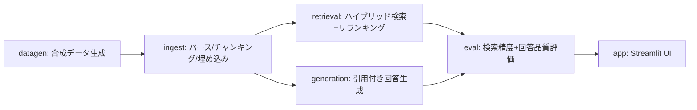

# 部署横断ナレッジ検索アシスタント

日本語 | [English](README_en.md)

**業界・職種を問わない、部署横断のプロジェクト知見・教訓を検索・再利用できる社内ナレッジ検索RAGのポートフォリオ実装。処理はすべてローカルLLMで完結し、外部への送信は一切行わない。**

> 🧭 **要件は本人によるもの。技術的な実現方法の多くはAIが提案し、本人が承認・レビューした。**
>
> - 部署横断のプロジェクト知見・教訓ナレッジ検索、というテーマ設定（業界・職種を問わない）。キャリアで繰り返し感じてきた「部署間の連携が弱く、知見が共有されずイノベーションが起きない」という課題意識が動機
> - ファイル形式（Markdown/Word/Excel/PowerPoint/PDF）を混在させる、という要件（現場ではファイル形式が統一されていないことが多いという前提を反映）
> - 全処理をローカルLLMで完結させ、外部送信ゼロにする、という要件（機密情報を扱いうる業務データを想定した現実的な制約）
> - 開発プロセスに「グラフエンジニアリング」を取り入れる、という要件。DAGへの具体的なノード分解・依存のないノードの並列実装・各ノード完了ごとの別ベンダーAI（codex CLI）による独立レビュー必須化は、この要件をAIが具体化したもの
>
> ハイブリッド検索パイプラインの設計、`BM25Okapi`→`BM25Plus`のバグ修正、出典付与による検証可能性の担保、評価分割設計といった個々の技術的判断も同様にAI（Claude Code）が提案し、独立レビュー（codex）を経て本人が承認したもの。実装全体でAIをペアプログラミング相手として併用しており、その旨をcommitの`Co-Authored-By`に残している。

---

## 背景・課題設定

どの業界・職種でも、新しいプロジェクトの着手時に「過去に似た取り組みはなかったか」「その時何がうまくいって、何でつまずいたか」を探す作業が頻繁に発生する。しかし部署間で用語や報告フォーマット、情報共有が完全には統一されていないことも多く、他部署の有用な教訓が埋もれがちになる。

本プロジェクトが示すのは、**資料さえ所定の場所に残しておけば、部署間の情報共有が不十分でもRAGが横断的に検索・再引用できる**、という価値提案。

- 実データは使えないため、業界・職種を問わない一般的な社内プロジェクト（マーケティング／営業／商品開発／カスタマーサポート／経営企画）の振り返りを想定した**合成データ**（ダミーの社内プロジェクトレポート）を使用している。
- **実在・架空を問わず企業名は一切登場しない**。「ある1社内の複数部署」という匿名設定。
- **ファイル形式もMarkdown/Word/Excel/PowerPoint/PDFの5種類が混在**する（現場ではファイル形式が統一されていないことが多いという前提の反映）。
- 各レポートの「成果サマリー」セクションには**成果画像（KPI推移グラフ等をmatplotlibで合成）が1枚添付**されている。ingest時にローカルのVLM（vision対応モデル）でキャプション化し、画像の内容も検索対象にする。
- 部署間の連携が弱く、知見が横展開されない、という課題は珍しくない。たとえばSPDM（Simulation Process and Data Management）のような部署横断のデータ管理基盤の導入がなかなか進まないのも、技術的な障壁より部署間連携への消極性が大きいことが多く、同じ構造の一例だと感じている。

## セットアップ

### 前提

- Python 3.11 以上
- [LM Studio](https://lmstudio.ai/) 等、OpenAI互換APIを話すローカルLLMサーバー
  - チャット用モデル・埋め込み用モデル・**画像説明用のvisionモデル（VLM）**の3種類をロードする（例: Qwen2.5-VL/Qwen3-VL系）
  - VLMが未ロードでも他の機能は動く（画像キャプション取得だけスキップされ、警告が出る）
  - 既定では `http://localhost:1234/v1` に接続する

### インストール

```bash
python3 -m venv .venv
source .venv/bin/activate
pip install -e .
# 開発（テスト・lint）も行う場合
pip install -e ".[dev]"
```

Streamlit・ChromaDB等の依存パッケージはこのコマンドでまとめてインストールされる（`streamlit`を個別にインストールする必要はない）。以降のコマンドは、この仮想環境を有効化した状態（`source .venv/bin/activate`）で実行する。

### 設定

```bash
cp config.example.toml config.toml
```

`config.toml` でLM StudioのベースURL・モデル名を調整する（環境変数 `SILORAG_AI_LLM_MODEL` 等でも上書き可能。詳細は `src/silo_rag/config.py` 参照）。

## 使い方

以下の順に実行する（各ステップの内部設計は後述の[アーキテクチャ](#アーキテクチャdag)を参照）。

```bash
# 合成データ生成（デフォルト60件のレポート + 15件の評価QAペア）
python -m silo_rag.datagen

# チャンキング + 埋め込み + ChromaDBへの格納
python -m silo_rag.ingest

# 評価（検索精度・回答品質をまとめてレポート）
python -m silo_rag.eval

# Streamlit UIの起動
streamlit run src/silo_rag/app.py
```

`datagen`実行中に「生成に失敗しました」という警告が出ることがある（小規模なローカルLLMが指定した見出し構成を毎回厳密には守れないため）。レポート単位・バッチ全体の両方で自動的にリトライするので、そのまま待てば通常は成功する。それでも失敗する場合は、ロードしているモデルを変えるか、少し時間を置いて `python -m silo_rag.datagen` を再実行する。

`python -m silo_rag.eval` の実行結果は `data/eval/eval_results.json` に書き出される（overall / cross_dept / same_dept の内訳付きで、区分ごとにhit_rate・recall@k・MRR・citation_rate・avg_judge_scoreを集計する）。実際の数値はLM Studioにロードしたモデルとデータセットに依存する。

## 制約・スコープ

- 合成データのため、実務の数値・事例そのものではない
- 企業名（実在・架空問わず）は一切使用していない
- 業界・職種を限定しない一般的な業務ドメインを想定した設計

> 💡 **動かすだけなら、ここまで読めば十分です。** この先は、DAGの内部設計と開発プロセス（グラフエンジニアリング + 独立レビュー）の解説です。

---

## アーキテクチャ（DAG）

処理をモジュール間の依存関係が明確なDAG（有向非巡回グラフ）として設計した。依存のないノード（retrieval / generation）は独立に実装できる。



| ノード | モジュール | 役割 | 使用モデル（`config.toml`の`[ai]`） |
| --- | --- | --- | --- |
| A | `src/silo_rag/datagen.py` | 業界・職種を問わない社内プロジェクトのダミー振り返りレポート（部署ごとにハウススタイルが微妙に異なり、Markdown/Word/Excel/PowerPoint/PDFのいずれかにランダムに書き出す。成果画像も1枚合成して埋め込む）と評価用QAペアを生成 | `llm_model`（レポート本文生成） |
| B | `src/silo_rag/ingest.py` | 5形式それぞれの読み取りロジックで見出し単位にチャンキングし、埋め込み画像をVLMでキャプション化してから、ローカル埋め込みモデルでベクトル化しChromaDBに格納 | `embed_model`（チャンクのベクトル化）／`vlm_model`（成果画像のキャプション化） |
| C | `src/silo_rag/retrieval.py` | BM25（キーワード）＋ベクトル類似度のハイブリッド検索 → LLMによるリランキング | `embed_model`（クエリのベクトル化）／`llm_model`（リランキング） |
| D | `src/silo_rag/generation.py` | 検索済みチャンクを根拠に、出典（レポートID・セクション・**部署**）付きの回答を生成 | `llm_model`（回答生成） |
| E | `src/silo_rag/eval.py` | gold-standard QAペアに対する検索精度（Recall@k, MRR）と回答品質（簡易LLM-as-judge, 引用網羅率）を測定 | C・Dが使う全モデル＋`llm_model`（LLM-as-judge採点） |
| F | `src/silo_rag/app.py` | Streamlitチャット UI（部署・プロジェクト種別での絞り込み、引用元の展開表示） | C・Dが使う全モデル（質問のたびに呼び出す） |

`vlm_model`が未ロードの場合、Bの画像キャプション化だけがスキップされる（警告ログのみ）。他のノードは影響を受けない。

retrieval（C）とgeneration（D）は互いに依存せず、どちらも `ingest.Chunk` のみに依存する設計。両者を初めて組み合わせる場所は `app.py` / `eval.py`。

## 開発プロセス（グラフエンジニアリング + 独立レビュー）

開発プロセス自体も設計対象にした。「グラフエンジニアリングを取り入れてほしい」という要件（🧭参照）を、AIが次のように具体化した。

- **DAGのノード単位で実装を分割**: 上記DAGの6ノード（A〜F）はそれぞれ独立した実装単位。依存関係のないノード（C: retrieval、D: generation）は**互いを待たずに並列で実装**できる。
- **並列実装**: 依存のないノードは、複数のAgent（サブエージェント）に同時に実装させた。1つのセッションが順番に全部書くのではなく、独立したタスクを並列に走らせることで、依存グラフの形をそのまま開発プロセスに反映させた。
- **ノードごとの独立レビューゲート**: 各ノードの実装が完了するたびに、ローカルの`codex` CLI（別ベンダーのAI）による独立コードレビューを必須ゲートとして通した。指摘があれば修正→再レビューを繰り返してから次のノードに進んだ（同一モデルが実装もレビューも担うと見落としが共通しがちなため、別ベンダーの視点を強制的に挟む設計）。
- 例えば`retrieval.py`は、小規模コーパス＋文字bigramトークナイザという本プロジェクト特有の条件下で`BM25Okapi`のIDFが負に転びランキングが逆転するバグをこのレビューで検出し、`BM25Plus`へ切り替えて解消した。`datagen.py`の評価QA生成でも、部署をまたいだ設問の正解に質問者自身の部署のレポートが混入するバグを検出・修正した（`tests/test_datagen.py`に回帰テストとして残している）。
- ドメインピボット（構造解析 → 部署横断プロジェクト知見）自体も同じ流儀で進めた。システムプロンプト群の置き換え・テストの語彙置き換え・README書き直しという互いに独立したタスクを、並列のAgentに分担させている。
