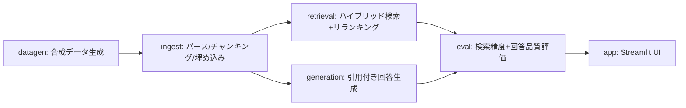

# 部署横断ナレッジ検索アシスタント

日本語 | [English](README_en.md)

**業界・職種を問わない、部署横断のプロジェクト知見・教訓を検索・再利用できる社内ナレッジ検索RAGのポートフォリオ実装。処理はすべてローカルLLMで完結し、外部への送信は一切行わない。**

> 🧭 **要件は本人によるもの。技術的な実現方法の多くはAIが提案し、本人が承認・レビューした。**
>
> - 部署横断のプロジェクト知見・教訓ナレッジ検索、というテーマ設定（業界・職種を問わない）。キャリアで繰り返し感じてきた「部署間の連携が弱く、知見が共有されずイノベーションが起きない」という課題意識が動機
> - ファイル形式（Markdown/Word/Excel/PowerPoint/PDF）を混在させる、という要件（現場ではファイル形式が統一されていないことが多いという前提を反映）
> - 全処理をローカルLLMで完結させ、外部送信ゼロにする、という要件（機密情報を扱いうる業務データを想定した現実的な制約）
> - 開発プロセスに「グラフエンジニアリング」を取り入れる、という要件。DAGへの具体的なノード分解・依存のないノードの並列実装・各ノード完了ごとの別ベンダーAI（codex CLI）による独立レビュー必須化は、この要件をAIが具体化したもの
>
> ハイブリッド検索パイプラインの設計、`BM25Okapi`→`BM25Plus`のバグ修正、出典付与による検証可能性の担保、評価分割設計といった個々の技術的判断も同様にAI（Claude Code）が提案し、独立レビュー（codex）を経て本人が承認したもの。実装全体でAIをペアプログラミング相手として併用しており、その旨をcommitの`Co-Authored-By`に残している。

---

## 背景・課題設定

どの業界・職種でも、新しいプロジェクトの着手時に「過去に似た取り組みはなかったか」「その時何がうまくいって、何でつまずいたか」を探す作業が頻繁に発生する。しかし部署間で用語や報告フォーマット、情報共有が完全には統一されていないことも多く、他部署の有用な教訓が埋もれがちになる。

本プロジェクトが示すのは、**資料さえ所定の場所に残しておけば、部署間の情報共有が不十分でもRAGが横断的に検索・再引用できる**、という価値提案。

- 実データは使えないため、業界・職種を問わない一般的な社内プロジェクト（マーケティング／営業／商品開発／カスタマーサポート／経営企画）の振り返りを想定した**合成データ**（ダミーの社内プロジェクトレポート）を使用している。
- **実在・架空を問わず企業名は一切登場しない**。「ある1社内の複数部署」という匿名設定。
- **ファイル形式もMarkdown/Word/Excel/PowerPoint/PDFの5種類が混在**する（現場ではファイル形式が統一されていないことが多いという前提の反映）。
- 各レポートの「成果サマリー」セクションには**成果画像（KPI推移グラフ等をmatplotlibで合成）が1枚添付**されている。ingest時にローカルのVLM（vision対応モデル）でキャプション化し、画像の内容も検索対象にする。
- 部署間の連携が弱く、知見が横展開されない、という課題は珍しくない。たとえばSPDM（Simulation Process and Data Management）のような部署横断のデータ管理基盤の導入がなかなか進まないのも、技術的な障壁より部署間連携への消極性が大きいことが多く、同じ構造の一例だと感じている。

## セットアップ

### 前提

- Python 3.11 以上
- [LM Studio](https://lmstudio.ai/) 等、OpenAI互換APIを話すローカルLLMサーバー
  - チャット用モデル・埋め込み用モデル・**画像説明用のvisionモデル（VLM）**の3種類をロードする（例: Qwen2.5-VL/Qwen3-VL系）
  - VLMが未ロードでも他の機能は動く（画像キャプション取得だけスキップされ、警告が出る）
  - 既定では`http://localhost:1234/v1`（LM Studioのデフォルトポート）に接続する想定
  - Ollama等、別のOpenAI互換サーバーを使う場合は、`config.toml`の`[ai] base_url`を
    書き換える（例: Ollamaなら`http://localhost:11434/v1`）。環境変数
    `SILORAG_AI_BASE_URL`での上書きも可能（優先順位: 環境変数 > `config.toml` >
    コード内デフォルト値）

### インストール

```bash
python3 -m venv .venv
source .venv/bin/activate
pip install -e .
# 開発（テスト・lint）も行う場合
pip install -e ".[dev]"
```

Streamlit・ChromaDB等の依存パッケージはこのコマンドでまとめてインストールされる（`streamlit`を個別にインストールする必要はない）。以降のコマンドは、この仮想環境を有効化した状態（`source .venv/bin/activate`）で実行する。

### 設定

```bash
cp config.example.toml config.toml
```

`config.toml` でLM StudioのベースURL・モデル名を調整する（環境変数 `SILORAG_AI_LLM_MODEL` 等でも上書き可能。詳細は `src/silo_rag/config.py` 参照）。

## 使い方

データの用意方法は2通りある。どちらか一方を実行してからUIを起動する。

### デモデータを使う

UI起動前の下準備（合成データ生成 → 取り込み → 評価）は1コマンドでまとめて実行できる。

```bash
bash scripts/prepare_demo_data.sh
```

内部で以下の3つを順番に実行しているだけなので、個別ステップだけやり直したい場合は直接叩けばよい
（各ステップの内部設計は後述の[アーキテクチャ](#アーキテクチャdag)を参照）。

```bash
# 合成データ生成（デフォルト60件のレポート + 15件の評価QAペア）
python -m silo_rag.datagen

# チャンキング + 埋め込み + ChromaDBへの格納
python -m silo_rag.ingest

# 評価（検索精度・回答品質をまとめてレポート）
python -m silo_rag.eval
```

`datagen`実行中に「生成に失敗しました」という警告が出ることがある（小規模なローカルLLMが指定した見出し構成を毎回厳密には守れないため）。レポート単位・バッチ全体の両方で自動的にリトライするので、そのまま待てば通常は成功する。それでも失敗する場合は、ロードしているモデルを変えるか、少し時間を置いて `python -m silo_rag.datagen` を再実行する。

`python -m silo_rag.eval` の実行結果は `data/eval/eval_results.json` に書き出される（overall / cross_dept / same_dept の内訳付きで、区分ごとにhit_rate・recall@k・MRR・citation_rate・avg_judge_scoreを集計する）。実際の数値はLM Studioにロードしたモデルとデータセットに依存する。

### 自前のレポートを使う

`prepare_demo_data.sh`（および`datagen`・`eval`）はあくまで合成デモデータを試すためのもの。
自前のレポートを使う場合は`datagen`・`eval`を実行せず、`ingest`だけ次のように実行する
（`eval`は合成データ専用のgold-standard QAペアが前提のため、自前データには使えない）。

```bash
python -m silo_rag.ingest --reports-dir path/to/your/reports
```

`ingest`のパーサー自体は汎用的で、`---`フロントマター＋`## 見出し`単位で区切られた
Markdown/Word/Excel/PowerPoint/PDFであれば、フィールド名や見出し名が自由でも読み込める。
ただしStreamlit UIのサイドバーの絞り込み（部署・プロジェクト種別のドロップダウン）は、
デモ用の固定語彙（`datagen.py`の`DEPARTMENTS`・`PROJECT_TYPES`）をそのまま使っているため、
自前データの分類語彙とは一致しない可能性がある（絞り込みを使わなければ、横断検索自体は
問題なく機能する）。

### UIを起動する

どちらの方法でデータを用意した場合も、最後にUIを起動する（これはスクリプトに含まれていない。
ブラウザが開いたままになるフォアグラウンドのプロセスなので、データの用意とは別に自分で叩く）。

```bash
streamlit run src/silo_rag/app.py
```

## 制約・スコープ

- 合成データのため、実務の数値・事例そのものではない
- 企業名（実在・架空問わず）は一切使用していない
- 業界・職種を限定しない一般的な業務ドメインを想定した設計
- **プログラム本体（UI・生成データ・LLMプロンプト）は日本語のみ対応。** 英語化はしていない（このREADMEを日英併記にしているのはポートフォリオとしての可読性のためで、アプリ自体の多言語対応とは別）。UIラベルだけ英語化して選択肢や回答本文が日本語のまま残る中途半端な状態を避けるための判断

> 💡 **動かすだけなら、ここまで読めば十分です。** この先は、DAGの内部設計と開発プロセス（グラフエンジニアリング + 独立レビュー）の解説です。

---

## アーキテクチャ（DAG）

処理をモジュール間の依存関係が明確なDAG（directed acyclic graph）（有向非巡回グラフ）として設計した。依存のないノード（retrieval / generation）は独立に実装できる。



| ノード | モジュール | 役割 | 使用モデル（`config.toml`の`[ai]`） |
| --- | --- | --- | --- |
| A | `src/silo_rag/datagen.py` | - ダミーの振り返りレポートを生成（部署ごとにハウススタイル・ファイル形式がランダム、成果画像も埋め込む）<br>- 評価用QAペアを生成 | `llm_model`（レポート本文生成） |
| B | `src/silo_rag/ingest.py` | - 見出し単位にチャンキング（5形式対応）<br>- 埋め込み画像をVLMでキャプション化<br>- ベクトル化しChromaDBに格納 | - `embed_model`（チャンクのベクトル化）<br>- `vlm_model`（成果画像のキャプション化） |
| C | `src/silo_rag/retrieval.py` | - BM25＋ベクトル類似度のハイブリッド検索<br>- LLMによるリランキング | - `embed_model`（クエリのベクトル化）<br>- `llm_model`（リランキング） |
| D | `src/silo_rag/generation.py` | - 検索チャンクを根拠に回答生成<br>- 出典（レポートID・セクション・**部署**）を付与 | `llm_model`（回答生成） |
| E | `src/silo_rag/eval.py` | - 検索精度（Recall@k, MRR）を測定<br>- 回答品質（LLM-as-judge, 引用網羅率）を測定 | - C・Dが使う全モデル<br>- `llm_model`（LLM-as-judge採点） |
| F | `src/silo_rag/app.py` | - Streamlitチャット UI<br>- 部署・種別での絞り込み、引用元表示 | C・Dが使う全モデル（質問のたびに呼び出す） |

`vlm_model`が未ロードの場合、Bの画像キャプション化だけがスキップされる（警告ログのみ）。他のノードは影響を受けない。

retrieval（C）とgeneration（D）は互いに依存せず、どちらも `ingest.Chunk` のみに依存する設計。両者を初めて組み合わせる場所は `app.py` / `eval.py`。

## 開発プロセス（グラフエンジニアリング + 独立レビュー）

開発プロセス自体も設計対象にした。「グラフエンジニアリングを取り入れてほしい」という要件（🧭参照）を、AIが次のように具体化した。

グラフエンジニアリング（処理をDAGとして設計し、モジュール間の依存関係を明示する開発手法）の利点と、このプロジェクトで実際に受けた恩恵:

- **並列実装**: 依存のないノード（C: retrieval、D: generation）は、2つのAgent（サブエージェント）に同時に実装させた。
- **独立テスト**: 各ノードは`_FakeVLMClient`・`_ScriptedClient`のようなフェイクで依存先を差し替えられるため、実LLM接続なしで全ノードを個別にテストできる。
- **バグの局所化**: 各ノード完了ごとに、ローカルの`codex` CLI（別ベンダーのAI）による独立コードレビューを必須ゲートとして通した。指摘があれば修正→再レビューを繰り返してから次のノードに進んだ。`retrieval.py`の`BM25Okapi`IDF負転バグ、`datagen.py`の評価QA生成でのデータリークバグを、それぞれのノードのレビュー中に検出・修正した（後者は`tests/test_datagen.py`に回帰テストとして残している）。
- **モジュール分離の再利用性**: ノードごとに独立しているため、後から一部だけ書き換える・作り直す作業も他のノードに影響を与えずに進められる。実際、システムプロンプトの調整・テストの語彙変更・README更新のような後続の変更も、それぞれ独立したタスクとして並列のAgentに分担できている。

## ライセンス

MIT License。全文は [LICENSE](LICENSE) を参照。
