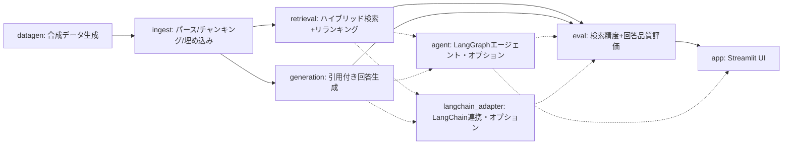
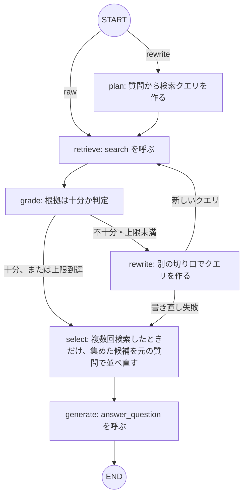

# 部署横断ナレッジ検索アシスタント

日本語 | [English](README_en.md)

**業界・職種を問わない、部署横断のプロジェクト知見・教訓を検索・再利用できる社内ナレッジ検索RAGのポートフォリオ実装。処理はすべてローカルLLMで完結し、外部への送信は一切行わない。**

> 🧭 **要件は本人によるもの。技術的な実現方法の多くはAIが提案し、本人が承認・レビューした。**
>
> - 部署横断のプロジェクト知見・教訓ナレッジ検索、というテーマ設定（業界・職種を問わない）。キャリアで繰り返し感じてきた「部署間の連携が弱く、知見が共有されずイノベーションが起きない」という課題意識が動機
> - ファイル形式（Markdown/Word/Excel/PowerPoint/PDF）を混在させる、という要件（現場ではファイル形式が統一されていないことが多いという前提を反映）
> - 全処理をローカルLLMで完結させ、外部送信ゼロにする、という要件（機密情報を扱いうる業務データを想定した現実的な制約）
> - 開発プロセスに「グラフエンジニアリング」を取り入れる、という要件。DAGへの具体的なノード分解・依存のないノードの並列実装・各ノード完了ごとの別ベンダーAI（codex CLI）による独立レビュー必須化は、この要件をAIが具体化したもの
>
> ハイブリッド検索パイプラインの設計、`BM25Okapi`→`BM25Plus`のバグ修正、出典付与による検証可能性の担保、評価分割設計といった個々の技術的判断も同様にAI（Claude Code）が提案し、独立レビュー（codex）を経て本人が承認したもの。実装全体でAIをペアプログラミング相手として併用しており、その旨をcommitの`Co-Authored-By`に残している。
>
> 実装後は本人が実際にUIを動かし、気づいた不具合・改善点（チャット表示順、UIタイトルの折り返し、雑談的な入力への過剰な応答、会話履歴を踏まえた検索・応答ができない、等）をフィードバックし、原因調査・修正はAIが行った。

---

## 背景・課題設定

どの業界・職種でも、新しいプロジェクトの着手時に「過去に似た取り組みはなかったか」「その時何がうまくいって、何でつまずいたか」を探す作業が頻繁に発生する。しかし部署間で用語や報告フォーマット、情報共有が完全には統一されていないことも多く、他部署の有用な教訓が埋もれがちになる。

本プロジェクトが示すのは、**資料さえ所定の場所に残しておけば、部署間の情報共有が不十分でもRAGが横断的に検索・再引用できる**、という価値提案。

- 実データは使えないため、業界・職種を問わない一般的な社内プロジェクト（マーケティング／営業／商品開発／カスタマーサポート／経営企画）の振り返りを想定した**合成データ**（ダミーの社内プロジェクトレポート）を使用している。
- **実在・架空を問わず企業名は一切登場しない**。「ある1社内の複数部署」という匿名設定。
- **ファイル形式もMarkdown/Word/Excel/PowerPoint/PDFの5種類が混在**する（現場ではファイル形式が統一されていないことが多いという前提の反映）。
- 各レポートの「成果サマリー」セクションには**成果画像（KPI推移グラフ等をmatplotlibで合成）が1枚添付**されている。ingest時にローカルのVLM（vision対応モデル）でキャプション化し、画像の内容も検索対象にする。
- 部署間の連携が弱く、知見が横展開されない、という課題は珍しくない。たとえばSPDM（Simulation Process and Data Management）のような部署横断のデータ管理基盤の導入がなかなか進まないのも、技術的な障壁より部署間連携への消極性が大きいことが多く、同じ構造の一例だと感じている。

## セットアップ

### 前提

- Python 3.11 以上
- [LM Studio](https://lmstudio.ai/) 等、OpenAI互換APIを話すローカルLLMサーバー
  - チャット用モデル・埋め込み用モデル・**画像説明用のvisionモデル（VLM）**の3種類をロードする（例: Qwen2.5-VL/Qwen3-VL系）
  - VLMが未ロードでも他の機能は動く（画像キャプション取得だけスキップされ、警告が出る）
  - 既定では`http://localhost:1234/v1`（LM Studioのデフォルトポート）に接続する想定
  - Ollama等、別のOpenAI互換サーバーを使う場合は、`config.toml`の`[ai] base_url`を
    書き換える（例: Ollamaなら`http://localhost:11434/v1`）。環境変数
    `SILORAG_AI_BASE_URL`での上書きも可能（優先順位: 環境変数 > `config.toml` >
    コード内デフォルト値）

### インストール

```bash
python3 -m venv .venv
source .venv/bin/activate
pip install -e .
# 開発（テスト・lint）も行う場合
pip install -e ".[dev]"
```

Streamlit・ChromaDB等の依存パッケージはこのコマンドでまとめてインストールされる（`streamlit`を個別にインストールする必要はない）。以降のコマンドは、この仮想環境を有効化した状態（`source .venv/bin/activate`）で実行する。

### 設定

```bash
cp config.example.toml config.toml
```

`config.toml` でLM StudioのベースURL・モデル名を調整する（環境変数 `SILORAG_AI_LLM_MODEL` 等でも上書き可能。詳細は `src/silo_rag/config.py` 参照）。

## 使い方

データの用意方法は2通りある。どちらか一方を実行してからUIを起動する。

### デモデータを使う

UI起動前の下準備（合成データ生成 → 取り込み → 評価）は1コマンドでまとめて実行できる。

```bash
bash scripts/prepare_demo_data.sh
```

内部で以下の3つを順番に実行しているだけなので、個別ステップだけやり直したい場合は直接叩けばよい
（各ステップの内部設計は後述の[アーキテクチャ](#アーキテクチャdag)を参照）。

```bash
# 合成データ生成（デフォルト60件のレポート + 15件の評価QAペア）
python -m silo_rag.datagen

# チャンキング + 埋め込み + ChromaDBへの格納
python -m silo_rag.ingest

# 評価（検索精度・回答品質をまとめてレポート）
python -m silo_rag.eval
```

`datagen`実行中に「生成に失敗しました」という警告が出ることがある（小規模なローカルLLMが指定した見出し構成を毎回厳密には守れないため）。レポート単位・バッチ全体の両方で自動的にリトライするので、そのまま待てば通常は成功する。それでも失敗する場合は、ロードしているモデルを変えるか、少し時間を置いて `python -m silo_rag.datagen` を再実行する。

`python -m silo_rag.eval` の実行結果は `data/eval/eval_results.json` に書き出される（overall / cross_dept / same_dept の内訳付きで、区分ごとにhit_rate・recall@k・MRR・citation_rate・avg_judge_scoreを集計する）。実際の数値はLM Studioにロードしたモデルとデータセットに依存する。

### 自前のレポートを使う

`prepare_demo_data.sh`（および`datagen`・`eval`）はあくまで合成デモデータを試すためのもの。
自前のレポートを使う場合は`datagen`・`eval`を実行せず、`ingest`だけ次のように実行する
（`eval`は合成データ専用のgold-standard QAペアが前提のため、自前データには使えない）。

```bash
python -m silo_rag.ingest --reports-dir <自分のレポートファイルが入っているディレクトリのパス>
```

（`<...>`部分は実際のパスに置き換える。例: `--reports-dir ~/Documents/reports`）

`ingest`のパーサー自体は汎用的で、`---`フロントマター＋`## 見出し`単位で区切られた
Markdown/Word/Excel/PowerPoint/PDFであれば、フィールド名や見出し名が自由でも読み込める。
ただしStreamlit UIのサイドバーの絞り込み（部署・プロジェクト種別のドロップダウン）は、
デモ用の固定語彙（`datagen.py`の`DEPARTMENTS`・`PROJECT_TYPES`）をそのまま使っているため、
自前データの分類語彙とは一致しない可能性がある（絞り込みを使わなければ、横断検索自体は
問題なく機能する）。

### エージェント版を使う（オプション）

通常の検索（1回検索して回答）に加えて、LLMが検索クエリを作り、必要なら検索し直すエージェントも使える
（設計と評価は[ノードG](#ノードglanggraphエージェント)・[ノードH](#ノードhlangchain連携)を参照）。
LangGraph・LangChainは任意の依存で、入れなくても通常方式はすべて動く。

```bash
pip install -e ".[agent]"        # LangGraphエージェント（ノードG）
pip install -e ".[langchain]"    # LangChain連携（ノードH）。langgraphも一緒に入る
```

- **UI**: サイドバーの「回答方式」で「エージェント」を選ぶ。回答の下に、エージェントが何をしたか（検索・判定・書き直し）の記録が出る。
- **評価**: `python -m silo_rag.eval --pipeline agent`（`--grade-mode strict|lenient`、`--first-query raw|rewrite`）。
  LangChain既製エージェントとの比較は`--pipeline langchain`。通常方式・エージェントをまとめて比べるには
  `bash scripts/compare_pipelines.sh <モデル名> [--rewrite-first]`（3〜5方式を続けて評価して比較表を出す）。
- **設定**: `config.toml`の`[agent]`（`max_attempts`、`grade_mode`、`first_query`）。既定は`first_query = "rewrite"`と
  `max_attempts = 1`（検索クエリを作って1回検索する）。小さいモデル（7B）での測定で最も良かった組み合わせで、
  32Bでは通常方式との差が見えない（ノードGの評価を参照）。

### UIを起動する

どちらの方法でデータを用意した場合も、最後にUIを起動する（これはスクリプトに含まれていない。
ブラウザが開いたままになるフォアグラウンドのプロセスなので、データの用意とは別に自分で叩く）。

```bash
streamlit run src/silo_rag/app.py
```

## 制約・スコープ

- 合成データのため、実務の数値・事例そのものではない
- 企業名（実在・架空問わず）は一切使用していない
- 業界・職種を限定しない一般的な業務ドメインを想定した設計
- **プログラム本体（UI・生成データ・LLMプロンプト）は日本語のみ対応。** 英語化はしていない（このREADMEが日英併記なのはポートフォリオとしての可読性のためで、アプリの多言語対応とは別）
- **会話履歴は、フォローアップの検索質問（例:「それについてもう少し詳しく」）の解釈にのみ使う。** 「さっき何て言ったか覚えてる？」のような、会話そのものについてのメタな質問には対応していない（部署横断のプロジェクト知見・教訓についての検索質問ではないため、意図的に「該当する事例が見つかりません」と答える）

> 💡 **動かすだけなら、ここまで読めば十分です。** この先は、DAGの内部設計と開発プロセス（グラフエンジニアリング + 独立レビュー）の解説です。

---

## アーキテクチャ（DAG）

処理をモジュール間の依存関係が明確なDAG（directed acyclic graph）（有向非巡回グラフ）として設計した。


```mermaid
graph LR
    A[datagen: 合成データ生成] --> B[ingest: パース/チャンキング/埋め込み]
    B --> C[retrieval: ハイブリッド検索+リランキング]
    B --> D[generation: 引用付き回答生成]
    C --> E[eval: 検索精度+回答品質評価]
    D --> E
    E --> F[app: Streamlit UI]
    C -.-> G[agent: LangGraphエージェント・オプション]
    D -.-> G
    G -.-> E
    G -.-> F
    C -.-> H[langchain_adapter: LangChain連携・オプション]
    D -.-> H
    H -.-> E
```

| ノード | モジュール | 役割 | 使用モデル（`config.toml`の`[ai]`） |
| --- | --- | --- | --- |
| A | `src/silo_rag/datagen.py` | - ダミーの振り返りレポートを生成（部署ごとにハウススタイル・ファイル形式がランダム、成果画像も埋め込む）<br>- 評価用QAペアを生成 | `llm_model`（レポート本文生成） |
| B | `src/silo_rag/ingest.py` | - 見出し単位にチャンキング（5形式対応）<br>- 埋め込み画像をVLMでキャプション化<br>- ベクトル化しChromaDBに格納 | - `embed_model`（チャンクのベクトル化）<br>- `vlm_model`（成果画像のキャプション化） |
| C | `src/silo_rag/retrieval.py` | - BM25＋ベクトル類似度のハイブリッド検索<br>- LLMによるリランキング<br>- 会話履歴を踏まえたクエリ書き換え | - `embed_model`（クエリのベクトル化）<br>- `llm_model`（リランキング・クエリ書き換え） |
| D | `src/silo_rag/generation.py` | - 検索チャンクを根拠に回答生成<br>- 出典（レポートID・セクション・**部署**）を付与<br>- 会話履歴を踏まえた指示語の解決 | `llm_model`（回答生成） |
| E | `src/silo_rag/eval.py` | - 検索精度（Recall@k, MRR）を測定<br>- 回答品質（LLM-as-judge, 引用網羅率）を測定 | - C・Dが使う全モデル<br>- `llm_model`（LLM-as-judge採点） |
| F | `src/silo_rag/app.py` | - Streamlitチャット UI<br>- 部署・種別での絞り込み、引用元表示 | C・Dが使う全モデル（質問のたびに呼び出す） |
| G（オプション） | `src/silo_rag/agent.py` | - LangGraphで「検索クエリ作成 → 検索 → 判定 → 書き直し → 再検索」を回す<br>- 詳細は[ノードG](#ノードglanggraphエージェント) | C・Dが使う全モデル |
| H（オプション） | `src/silo_rag/langchain_adapter.py` | - 自前の検索をLangChainのRetrieverとして公開<br>- LangChain既製エージェントとの比較<br>- 詳細は[ノードH](#ノードhlangchain連携) | C・Dが使う全モデル |

`vlm_model`が未ロードの場合、Bの画像キャプション化だけがスキップされる（警告ログのみ）。他のノードは影響を受けない。

### ノードとは何か

「ノード」とは、入出力の境界がはっきりした1つの役割のまとまり。このプロジェクトではノードA〜F
がそれぞれ1ファイルに対応している（粒度は設計次第で、1関数のこともあれば複数ファイルの
こともある）。

各ノードは内部実装を隠す。`retrieval.py`は`_bm25_search`等の非公開関数を複数持つが、公開して
いるのは`search()`だけ。呼び出し側はBM25かベクトル検索か、リランキングの中身を知らなくていい。
`generation.py`も`answer_question()`だけを公開する。

### ノード間の接続方法

- **A→B**: ファイル経由（`data/synth_reports/`）。importの結合はゼロ。
- **B→C・D**: ChromaDB経由。importしているのは`Chunk`という型定義だけ（`from .ingest import Chunk`）で、Bの処理関数は使わない。
- **C・D→E・F**: 通常の関数呼び出し。`eval.py`・`app.py`が`search()`・`answer_question()`を直接呼ぶ。
- **C・D→G→E・F**: Gも同じく`search()`・`answer_question()`（と`rerank()`）を呼ぶだけ。E・Fは、通常方式かGかを切り替えられる。
- **C・D→H→E**: Hも`search()`・`answer_question()`側の公開関数だけを呼ぶ。Eが`--pipeline langchain`で呼ぶ（比較用）。

依存が強いほど結合も強い（3番目は直接呼び出し、1・2番目は疎結合）。

### 独立なノードはどこか

独立なペアはC・D（retrieval・generation）だけ。両方Bに依存するが、互いには依存しない。

| ペア | 依存関係 | 並列実装できたか |
| --- | --- | --- |
| A-B, B-C, B-D, C-E, D-E, E-F | あり | できない（依存先の完成を待つ） |
| **C-D** | **なし** | **できた（実際に2つのAgentへ並列実装）** |

非巡回（ループがない）は構築順序が矛盾なく決まることの保証で、独立性とは別の話。非巡回でも
一直線の依存（A→B→C→D→E→F）なら並列化の余地はゼロになる。並列実装できたのは、C・D間に
たまたま矢印がなかった、というグラフの形そのものによる。

## 開発プロセス（グラフエンジニアリング + 独立レビュー）

開発プロセス自体も設計対象にした。「グラフエンジニアリングを取り入れてほしい」という要件（🧭参照）を、AIが次のように具体化した。

グラフエンジニアリング（処理をDAGとして設計し、モジュール間の依存関係を明示する開発手法）の利点と、このプロジェクトで実際に受けた恩恵:

- **並列実装**: 依存のないノード（C: retrieval、D: generation）は、2つのAgent（サブエージェント）に同時に実装させた。
- **独立テスト**: 各ノードは`_FakeVLMClient`・`_ScriptedClient`のようなフェイクで依存先を差し替えられるため、実LLM接続なしで全ノードを個別にテストできる。
- **バグの局所化**: 各ノード完了ごとに、ローカルの`codex` CLI（別ベンダーのAI）による独立コードレビューを必須ゲートとして通した。指摘があれば修正→再レビューを繰り返してから次のノードに進んだ。`retrieval.py`の`BM25Okapi`IDF負転バグ、`datagen.py`の評価QA生成でのデータリークバグを、それぞれのノードのレビュー中に検出・修正した（後者は`tests/test_datagen.py`に回帰テストとして残している）。
- **モジュール分離の再利用性**: ノードごとに独立しているため、後から一部だけ書き換える・作り直す作業も他のノードに影響を与えずに進められる。実際、システムプロンプトの調整・テストの語彙変更・README更新のような後続の変更も、それぞれ独立したタスクとして並列のAgentに分担できている。

処理の順番を決められること自体はグラフエンジニアリング特有の利点ではない。効いているのは、依存関係をグラフとして明示化したことで見えた「並列化できる箇所（C・D）」と「狭い範囲でレビューできる境界」の2点。

## ノードG：LangGraphエージェント

ノードC（検索）・D（回答生成）の**公開関数だけを呼ぶ**新しいノード（`src/silo_rag/agent.py`）。C・Dの中身には手を
入れておらず、C・Dは互いに依存しないまま（Gだけが両方を知っている。Eが両方を呼ぶのと同じ形）なので、
**モジュール間の依存関係はDAGのまま**。ループは、このノードの内側（実行時の処理の流れ）にだけある。


```mermaid
graph TD
    S((START)) -->|raw| R[retrieve: search を呼ぶ]
    S -->|rewrite| P[plan: 質問から検索クエリを作る]
    P --> R
    R --> J[grade: 根拠は十分か判定]
    J -->|十分、または上限到達| SEL[select: 複数回検索したときだけ、集めた候補を元の質問で並べ直す]
    J -->|不十分・上限未満| W[rewrite: 別の切り口でクエリを作る]
    W -->|新しいクエリ| R
    W -->|書き直し失敗| SEL
    SEL --> G[generate: answer_question を呼ぶ]
    G --> X((END))
```

「根拠が十分か」「次にどんなクエリで探すか」はLLMが判断し、「何回まで繰り返すか」は`config.toml`の
`[agent] max_attempts`（既定1回＝再検索しない）でコードが決める。1回目の検索クエリは`[agent] first_query`で選ぶ
（`raw`＝質問そのまま、`rewrite`＝質問からLLMが検索クエリを作る。既定は`rewrite`）。

### 設計判断

- **LangGraphを直接使い、LangChainの`create_agent`は使っていない。** `create_agent`が作るのは「LLMがツールを呼ぶ」
  決まった形のループで、LLMのツール呼び出し（function calling）を前提にする。7B程度のローカルモデルでは
  ツール呼び出しが安定しないことが多いため、「検索 → 判定 → 書き直し」という独自の形のグラフを
  LangGraphで自分で組んだ。（`create_agent`は、[ノードH](#ノードhlangchain連携)で比較対象として実際に動かした。）
- **LLMには決まった形式でしか答えさせない。** 判定は`SUFFICIENT`／`INSUFFICIENT`の1語、書き直しは検索クエリ1行。
  コード側で厳密に解釈する（部分一致では拾わない）。7Bでの動作確認（4問を2回実行）では、判定・書き直しの応答は
  すべて決まった形式で返ってきた。
- **補助的な判断の失敗では止まらない。** 判定・書き直しでLLMの接続失敗や形式の崩れ、同じクエリの繰り返しが起きたら、
  手元のチャンクで回答生成に進む。回答生成そのものの失敗は、従来どおり呼び出し元に伝える。
- **外部送信ゼロの方針は変わらない。** LLM呼び出しはすべて既存の`LLMClient`（ローカルのLM Studio等）経由。
  LangGraphはLangSmith用の環境変数（`LANGSMITH_TRACING`等）を設定しない限り、外部へ何も送信しない。
- **判定の厳しさを2段階（`strict`／`lenient`）で切り替えられる。** 判定するLLMは「まだ見ていない、もっと良い資料があるか」を
  知りようがないため、どちらが良いかはプロンプトの言い回しだけでは決まらない。strictは多くの質問で上限まで再検索し
  （9回中8回が「不十分」）、lenientはすぐ「十分」と判定する。両方を残して、評価で比較した。
- **1回目の検索クエリを、質問から作るかどうかを選べる（`first_query`）。** 質問文には、名乗り（「経営企画部です。」）や
  依頼の言い回し（「教えてください」）など、検索に関係の無い言葉が多く混ざる。BM25（文字2-gram）はそれで散るため、
  LLMに質問から検索クエリを作らせる`plan`ノードを足した（失敗したら質問のまま検索する）。評価で、これが最も効いた。
- **上限に達したら、判定のLLM呼び出しを省略する。** もう再検索できないので、判定の結果は何も変えない。

### 評価

同じ評価セット（15問。うち部署横断5問）を、各方式1回ずつ回した。7B = `qwen2.5-7b-instruct`、
32B = `qwen2.5-coder-32b-instruct-mlx`（いずれもLM Studio、4bit）。「クエリ作成」は`first_query = "rewrite"`、
「1検索」は`max_attempts = 1`（再検索しない）。LLM呼び出しは回答までのチャット呼び出し回数
（埋め込みとjudgeの採点は含まない。「上限に達したら判定を省略する」変更の前に測ったので、実際は、上限に達した質問ごとに
この表より1回少ない）。judgeの採点には回答と同じモデルを使っているため、**judgeは同じモデルの行どうしでしか比べられない**。

**7B**

| 方式 | hit_rate | 部署横断 | 自部署 | MRR | 引用率 | judge | 検索回数 | LLM呼び出し | 秒/問 |
| --- | --- | --- | --- | --- | --- | --- | --- | --- | --- |
| 通常方式 | 0.60 | 0.40 | 0.70 | 0.49 | 0.60 | 3.67 | 1.0 | 2.0 | 10.8 |
| G strict | 0.73 | 0.40 | 0.90 | 0.61 | 0.60 | 3.73 | 1.9 | 6.4 | 17.8 |
| G lenient | 0.67 | 0.40 | 0.80 | 0.54 | 0.60 | 3.80 | 1.4 | 4.5 | 14.6 |
| G strict ＋ クエリ作成 | 0.80 | 0.60 | 0.90 | 0.66 | 0.80 | 3.73 | 2.4 | 9.0 | 19.5 |
| G lenient ＋ クエリ作成 | 0.87 | 0.60 | 1.00 | 0.69 | 0.80 | 3.60 | 1.6 | 6.2 | 14.9 |
| **G lenient ＋ クエリ作成 ＋ 1検索** | **0.93** | **0.80** | 1.00 | 0.72 | **0.87** | 3.53 | 1.0 | 4.0 | **12.0** |
| LangChain既製（[ノードH](#ノードhlangchain連携)） | **0.93** | **0.80** | 1.00 | 0.54 | **0.87** | 3.73 | 1.3 | 3.3 | 18.6 |

**32B**

| 方式 | hit_rate | 部署横断 | 自部署 | MRR | 引用率 | judge | 検索回数 | LLM呼び出し | 秒/問 |
| --- | --- | --- | --- | --- | --- | --- | --- | --- | --- |
| 通常方式 | 0.87 | 1.00 | 0.80 | 0.71 | 0.87 | 3.60 | 1.0 | 2.0 | 50.4 |
| G strict | 0.87 | 1.00 | 0.80 | 0.72 | 0.80 | 3.33 | 2.5 | 8.2 | 88.9 |
| G lenient | 0.87 | 1.00 | 0.80 | 0.74 | 0.73 | 3.27 | 1.1 | 3.5 | 55.8 |
| G lenient ＋ クエリ作成 | 0.87 | 0.60 | 1.00 | 0.73 | 0.80 | 3.00 | 1.2 | 4.8 | 63.8 |
| G lenient ＋ クエリ作成 ＋ 1検索 | 0.93 | 0.80 | 1.00 | 0.72 | 0.87 | 3.33 | 1.0 | 4.0 | 57.2 |

32Bの`LangChain既製`は測っていない（LM Studioのモデル一覧で、このモデルにはツール対応のアイコンが付いていないため）。

- **効いていたのは「再検索」ではなく「質問を検索クエリに書き直すこと」だった（7B）。** 質問そのままで検索する版では、
  再検索を足しても0.60→0.67〜0.73にとどまった。1回目から検索クエリを作らせると0.80〜0.93になり、
  **再検索を1回に制限しても（0.93）劣らなかった**。質問文の名乗りや依頼の言い回しが、BM25を散らしていた。
  部署横断の質問も、0.40→0.80（クエリ作成＋1検索）に上がった。
- **この切り分けは、LangChain既製エージェントに負けたことがきっかけだった。** 既製エージェントは、検索回数を増やさずに
  0.93を出した。調べると、LLMが毎回、要点だけのクエリに書き直してから検索していた。自作のGは、1回目に質問をそのまま
  使っていた。最初の仮説（「再検索で補える」）は、半分しか合っていなかった。
- **32Bでは、どの工夫も、はっきりした効果が見えない。** 通常方式がすでに0.87で、クエリ作成＋1検索が0.93（1問差）。
  部署横断は1.00→0.80（1問差）に下がり、再検索まで付けると0.60に下がった。
- **結論：回答方式の既定は通常方式のまま。エージェントは、小さいモデルを使わざるを得ないときのオプション。**
  エージェントの既定設定は、測定で最も良かった`first_query = "rewrite"`＋`max_attempts = 1`（クエリを作って1回検索する）
  にした。再検索のループは、設定（`max_attempts`を増やす）で使えるが、クエリ作成に上乗せする効果を、どちらのモデルでも
  確認できなかった。32Bでは、通常方式との差が見えず、部署横断が下がる傾向もあるので、大きいモデルでは通常方式を使う。
  なお、表の「G ... ＋クエリ作成 ＋ 1検索」の行が、この既定設定にあたる（既定を切り替える前の測定）。

> ⚠️ **15問・各方式1回ずつの結果で、差が1問分（0.07）の比較は断定できない。** LLMの出力にもばらつきがある
> （同じ質問でも、実行のたびに正解を拾えたり拾えなかったりした）。「傾向」として読んでほしい。
> Gemma 4 26B（MoE・思考モデル）でも測ろうとしたが、思考で出力トークンが膨らみ1問あたり約174秒かかったため、
> 途中で打ち切って比較には含めていない。

### 開発中に見つけた問題

- **独立レビュー（codex）の指摘3件**: ①CIが任意依存を入れておらず新しいテストを読み込めない、②再検索がtop_k件を返すと
  前回までの根拠がすべて押し出される、③判定のプロンプトに会話履歴が無く、フォローアップ質問を判定できない。
  いずれもモックで再現して修正し、回帰テストを足した。
- **実LLM（7B）での動作確認で見つけた3件**: ①判定が厳しすぎて毎回上限まで再検索する、②書き直したクエリに質問者自身の
  部署名が入り、検索が自部署寄りになる、③再検索の結果を交互に並べる方式が、元の質問で拾えていた正解を押し出す
  （集めた候補全体を元の質問で並べ直す`select`ノードで解消）。モックのテストだけでは見つからなかった。
- **評価で見つけた設計の誤り**: 「再検索が効く」という最初の仮説は半分しか合っていなかった。効いていたのは、1回目のクエリの
  作り方だった（上記）。

## ノードH：LangChain連携

`src/silo_rag/langchain_adapter.py`（オプション。`pip install -e ".[langchain]"`）。ノードGと同じく、C・Dの公開関数だけを呼び、
中身には手を入れない。

1. **`SiloRetriever`**: 自前のハイブリッド検索（`search()`）を、LangChainのRetriever（`langchain_core`の`BaseRetriever`）の
   規格に合わせて公開する。検索の中身（BM25＋ベクトル＋LLMリランキング）はそのままで、LangChainのチェーンやエージェントから
   部品として使える。
2. **`run_langchain_agent`**: 上のRetrieverを検索ツールにして、LangChain既製の`create_agent`（LLMがツール呼び出しで検索する）で
   回答する。自作のノードGとの比較対象。回答の方針はGと同じで、検索の上限回数は3回（Gの`max_attempts`の既定とは
   独立した定数。Gの既定を1にしても、既製エージェントには複数回の検索を許す）。

LLM呼び出しは、検索内のリランキング等は既存の`LLMClient`、エージェント自身の判断は`ChatOpenAI`経由で、どちらもローカルの
LM Studio（`config.ai.base_url`）に向かう。外部送信ゼロの方針は変わらない。評価は`python -m silo_rag.eval --pipeline langchain`。
結果は上の7Bの表のとおり（hit_rate 0.93、引用率0.87）。検索系の指標は、ツールが返した全チャンクで計算するため、検索回数が
多いほど有利になる（拾ったレポートは平均4.5件で、通常方式の4.0件との差は小さい）。引用率とjudgeは公平に比べられる。

### 既製エージェントを小さなモデルで動かして分かったこと

- **並列ツール呼び出しで、検索が壊れた。** LLMが1回の応答で検索ツールを複数同時に呼ぶと、LangGraphがそれを別スレッドで
  同時に実行する。`search()`は1スレッドでの利用を前提にしていて、ChromaDB（同じフォルダの同時オープン）とLM Studio
  （埋め込みの同時リクエスト → HTTP 500）の両方で失敗した。`SiloRetriever`で、検索を1つずつ順番に実行するようにした。
- **1回の応答が、検索ツールを約50回同時に呼ぼうとした（282秒）。** LangGraphのステップ数の上限（`recursion_limit`）は
  「モデルが何回考え直すか」しか数えず、1回の応答の中の並列呼び出しには効かない。`SiloRetriever`に実行回数の上限を入れた。
- どちらも、モックのテストでは見つからず、実際に7Bを動かして初めて分かった。

## ライセンス

MIT License。全文は [LICENSE](LICENSE) を参照。
