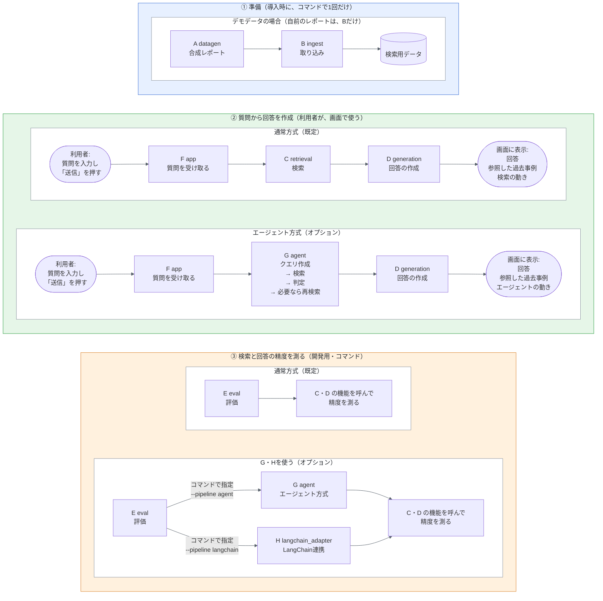

# 部署横断ナレッジ検索アシスタント

日本語 | [English](README_en.md)

**社内の部署をまたいで、過去のプロジェクトの知見や教訓を探せる、検索アシスタント。質問すると、社内の資料を検索し、見つけた資料を根拠に、出典つきで答える（この仕組みを、RAG＝検索拡張生成と呼ぶ）。処理はすべて手元のPCで動くAI（ローカルLLM）で完結し、外部へは一切送信しない。** 専門用語は、[用語](#用語)にまとめた。

> 🧭 **要件は作者によるもの。技術的な実現方法の多くはAI（Claude Code）が提案し、作者がレビュー・承認した。**
>
> - **作者の要件**: 部署横断の知見検索（動機は「部署間の連携が弱く、知見が共有されない」という課題意識）／5形式（Markdown/Word/Excel/PowerPoint/PDF）の混在／全処理をローカルLLMで完結し外部送信ゼロ／開発プロセスへの「グラフエンジニアリング」（処理をノードに分け、ノードどうしの依存関係を図にして設計する進め方）の導入
> - **AIが具体化したもの**: 処理をノード（処理のまとまり）に分けた設計図（DAG）、互いに依存しないノードの並列実装、各ノード完了ごとの、別ベンダーのAI（`codex` CLI）による独立レビューの必須化
> - **AIが提案し、独立レビューを経て作者が承認したもの**: ハイブリッド検索（キーワード検索と意味検索の組み合わせ）の設計、`BM25Okapi`→`BM25Plus`のバグ修正（[BM25とは](docs/architecture_ja.md#検索の仕組みbm25とベクトル検索)）、出典の付け方、評価の分け方（部署をまたいだ質問と、自部署の質問を分けて測る）の設計
> - AIをペアプログラミングの相手として使い、コミットの`Co-Authored-By`に残している
> - 作者が画面を動かして不具合・改善点を見つけ、原因の調査と修正はAIが行った
>
> 開発の進め方（グラフエンジニアリングと独立レビュー）の詳細は、[開発の進め方](docs/development_process_ja.md)。

## 背景・課題設定

- **課題**: 新しいプロジェクトを始めるとき、過去の似た取り組みを探したいが、部署ごとに用語や資料の形式がばらばらで、他部署の教訓が埋もれる
- **解決策**: 各部署の資料を、このアシスタントに取り込んでおくと、部署間の情報共有が不十分でも、部署を横断して探し、出典つきで答える
- **データは合成**: 一般的な社内5部署（マーケティング／営業／商品開発／カスタマーサポート／経営企画）の振り返りレポート60件を、LLMで作った。Markdown・Word・Excel・PowerPoint・PDFの5形式が混在する。レポートの中の画像（KPIの推移グラフなど）も、画像を読めるAI（VLM）で説明文にして、検索できるようにしている

## 画面

サイドバーの「回答方式」で、通常方式とエージェント方式を、質問ごとに切り替えられる（エージェント方式は、[手順4](#手順4オプション-エージェント方式を入れる)で追加のライブラリを入れたときだけ使える）。2枚とも、合成データに同じ質問をしたところ。

<table>
<tr>
<td width="50%"><br><b>通常方式</b>: 質問をそのまま使って、資料を探す。回答と、参照した過去事例（出典）に加えて、「検索の動き」の記録が出る</td>
<td width="50%"><br><b>エージェント方式</b>（オプション）: 質問を検索語に直して、資料を探す。回答と、参照した過去事例（出典）に加えて、「エージェントの動き」の記録が出る</td>
</tr>
</table>

## セットアップ

### 前提

- Python 3.11 以上
- 手元のPCでAIモデルを動かすソフト（[LM Studio](https://lmstudio.ai/)など。OpenAIと同じ形式で呼び出せるもの）
  - 読み込んでおくモデル: 文章を書くチャット用、文を数値の並びに変える埋め込み用、**画像を読めるモデル（VLM）**（例: Qwen2.5-VL/Qwen3-VL系）。VLMを読み込んでいなくても、画像の説明文だけが作られず、ほかは動く
  - 既定の接続先は`http://localhost:1234/v1`。別のサーバー（例: Ollamaの`http://localhost:11434/v1`）は、`config.toml`の`[ai] base_url`か、環境変数`SILORAG_AI_BASE_URL`で変える（優先順位: 環境変数 > `config.toml` > コード内の既定値）

### インストール

```bash
python3 -m venv .venv
source .venv/bin/activate
pip install -e .
# 開発（テスト・lint）も行う場合
pip install -e ".[dev]"
```

以降のコマンドは、仮想環境を有効化した状態で実行する。

### 設定

```bash
cp config.example.toml config.toml
```

`config.toml`でベースURL・モデル名を調整する（環境変数`SILORAG_AI_LLM_MODEL`等でも上書きできる。詳細は`src/silo_rag/config.py`）。

## 使い方

使い方は、4つの手順。**手順1**でデータを用意し、**手順2**で画面を起動し、**手順3**で画面から質問する。**手順4**は、エージェント方式を使いたいときだけ。

> [!IMPORTANT]
> **コマンドは、仮想環境を有効にしてから実行する。** ターミナルを新しく開いたら、毎回、このリポジトリのフォルダに移動してから、次を実行する。
>
> ```bash
> source .venv/bin/activate
> ```
>
> 行の先頭に`(.venv)`と出れば、有効になっている。出ていないと、`zsh: command not found: python`などのエラーで止まる。

### 手順1: データを用意する（A・Bのどちらか1つ）

検索用データは1組だけで、A・Bのうち、あとから実行したほうに入れ替わる（両方を同時には使えない）。

#### A. デモデータを使う

```bash
bash scripts/prepare_demo_data.sh
```

内部では、次の3つを順に実行している。個別にやり直す場合は、直接実行する。

```bash
python -m silo_rag.datagen   # 合成レポート60件と、評価用の質問・正解15件を作る
python -m silo_rag.ingest    # レポートを見出しごとに分け、数値の並びに変えて、検索用のデータベース（ChromaDB）に入れる
python -m silo_rag.eval      # 検索と回答の精度を測る（結果は data/eval/eval_results.json）
```

- 3つ目の`eval`は、[アーキテクチャ](#アーキテクチャ)の③（開発者向けの精度の測定）。画面で質問するだけなら不要だが、スクリプトは、正しく動くことの確認を兼ねて、最後に実行する。時間を省くときは、上の2つだけを直接実行する
- `datagen`中の「生成に失敗しました」は、小さなローカルLLMが見出し構成を守れないために出る。自動でリトライするので、通常は待てば成功する。続く場合は、モデルを変えるか、時間を置いて再実行する

#### B. 自前のレポートを使う

- `datagen`・`eval`は実行しない（`eval`は、合成データ専用の「質問と正解」が前提）。`ingest`だけ実行する

```bash
python -m silo_rag.ingest --reports-dir <レポートが入っているディレクトリ>
```

- 読み込めるのは、Markdown/Word/Excel/PowerPoint/PDFで、ファイルの先頭に`---`で囲んだ項目（フロントマター。部署・日付など）があり、本文が`## 見出し`で区切られているもの。項目名・見出し名は自由

> [!WARNING]
> **自前のレポートで使うときの注意**（READMEの数字は、すべて合成データでの結果）
>
> - **`ingest`は、検索用データを入れ替える。** 先にAでデモデータを入れていた場合、デモデータの検索用データ（ChromaDB）は消える。合成レポートのファイル（`data/synth_reports/`）は残るので、デモに戻すには、`python -m silo_rag.ingest`を、フォルダを指定せずに実行する。`ingest`が途中で失敗したときは、入れ替えは起きず、既存のデータは壊れない
> - **精度は測れない。** `eval`（検索精度・回答品質の測定）は、合成データ専用の「質問と正解」が前提。自前のレポートで測るには、正解つきの質問を、自分で用意する必要がある
> - **READMEの精度の数字が、そのまま当てはまるとは限らない。** 正解の資料を見つけられた割合（hit_rate）などは、合成データ（レポート60件）での結果。自前のレポートで同じ精度が出るとは言えない
> - **画面の絞り込み（部署・プロジェクト種別）は、デモ用の固定の分類語を使う。** 自前データの分類と合わないことがある。絞り込みを使わなければ、横断検索は動く
> - **試していないこと。** 試したのは、合成データ60件だけ。大量のデータ、書式のばらつきが大きい資料、体裁の崩れたPDF、手元で動く小さなモデル（7B＝パラメータ数70億など）での実務の文書は、確認していない

### 手順2: 画面を起動する

手順1が終わってから実行する。起動すると、ブラウザにチャット形式の画面が開く（見た目は、[画面](#画面)のスクリーンショットのとおり）。質問の仕方は、手順3。このコマンドは、画面を使っているあいだ動き続ける（終えるときは、ターミナルで`Ctrl+C`）。画面を開いたまま、ほかのコマンドを実行するときは、別のターミナルを使う。

```bash
streamlit run src/silo_rag/app.py --server.address localhost
```

`--server.address localhost`は、このパソコンのブラウザからだけ開けるようにする指定。付けないと、同じネットワークにつながった他の機器からも、画面を開ける状態になる。

### 手順3: 画面で質問する

画面の左がサイドバー（設定）、右が質問と回答の欄（見た目は、[画面](#画面)のスクリーンショットを参照）。

- **質問する**: 下のテキスト欄に質問を入力し、「送信」ボタンを押す。Enterキーは改行になり、送信はしない（日本語の変換の確定で、誤って送信しないため）。処理中は「検索・回答生成中...」と出る
- **回答を見る**: 回答の下に「参照した過去事例」が、「レポートID ／ セクション ／ 部署」の形で並ぶ。開くと、根拠にした本文が出る。似た事例が他部署にあれば、他部署の事例だと明記して紹介する
- **答えが無いとき**: 資料が質問と関係ないときや、雑談・挨拶など検索の質問になっていないときは、「該当する事例が見つかりませんでした」と答える。件数や集計を問う質問（「全部でいくつ？」「最も多いのは？」など）には、「分かりません」と答える（検索で見つけた一部の資料しか見ていないため）
- **続けて質問する**: 前の質問を受けた質問（例:「それについてもう少し詳しく」）もできる。このときは、会話履歴を見て、「それ」などの言葉を具体的な言葉に直してから、資料を探す（通常方式・エージェント方式のどちらでも）。会話履歴は、検索の質問の解釈にだけ使う（「さっき何て言った？」には答えない）。ブラウザを再読み込みすると、会話履歴は消える
- **回答方式（サイドバー）**: 「通常」（質問をそのまま使って、資料を探す）と「エージェント」（質問を検索語に直して、資料を探す）を、質問ごとに切り替える。それぞれの説明は、画面の選択肢の下にも出る。「エージェント」は、手順4で追加のライブラリを入れたときだけ出る。回答の下には、処理の記録も出る。通常方式では「検索の動き」（使った検索語、候補の件数、並べ直し）、エージェント方式では「エージェントの動き」（クエリ作成・検索・判定）
- **絞り込み（任意。サイドバー）**: 「作成部署」と「プロジェクト種別」で、検索の対象を絞る。指定しなければ、全部署を横断して探す（自前のレポートでは、分類が合わないことがある。手順1のBの注意）

### 手順4（オプション）: エージェント方式を入れる

通常方式は、質問をそのまま使って資料を探し、答える。エージェント方式は、質問を検索語（検索クエリ）に直して資料を探し、答える。使うには、追加のライブラリを入れる（入れなくても、通常方式は動く）。

```bash
pip install -e ".[agent]"
```

入れると、サイドバーの「回答方式」に「エージェント」が出る（切り替え方は、手順3）。どの処理にどのモデルを使うかは、[アーキテクチャ](#アーキテクチャ)の「処理ごとに使うモデル」にある。設定や、精度の測り方は、[エージェント方式の設計](docs/agent_ja.md)にある。

## 制約・スコープ

- **デモデータのレポート（60件）は、LLMで作った合成データ。** 中の数値（KPIなど）や事例は、実在の業務のものではない。実在の企業名も、出てこない
- **プログラム本体（画面・生成データ・AIへの指示文）は日本語のみ。** READMEが日英併記なのは可読性のためで、アプリの多言語対応とは別

> [!TIP]
> **動かすだけなら、ここまで読めば十分です。** この先は、仕組みと開発の説明です。
>
> - 全体の仕組み: [アーキテクチャ](#アーキテクチャ)
> - エージェント方式と、その結果: [エージェント方式（ノードG・H）](#エージェント方式ノードgh)
> - 開発の進め方: [開発の進め方](#開発の進め方)
> - 用語の説明: [用語](#用語)
> - さらに詳しい資料: [詳しい資料](#詳しい資料)

---

## アーキテクチャ

システムは、8つの**ノード**（処理のまとまり。A〜Hが、それぞれ1ファイル。G・Hはオプション）でできている。動く時期と、使う人は、3つに分かれる。**利用者が使うのは、②だけ**（手順2で起動するブラウザの画面で、質問する。見た目は[画面](#画面)）。①は、導入する人が、最初にコマンドで1回だけ実行する準備。③は、開発者だけが使う、精度の測定。


```mermaid
%%{init: {"flowchart": {"padding": 24, "wrappingWidth": 400}, "themeVariables": {"lineColor": "#57606a"}}}%%
graph TB
    subgraph g1["① 準備（導入時に、コマンドで1回だけ）"]
        direction TB
        subgraph prep["デモデータの場合（自前のレポートは、Bだけ）"]
            direction LR
            A["A datagen<br/>合成レポート"] --> B["B ingest<br/>取り込み"] --> DB[("検索用データ")]
        end
    end
    subgraph g2["② 質問から回答を作成（利用者が、画面で使う）"]
        direction TB
        subgraph plain["通常方式（既定）"]
            direction LR
            U1(["利用者:<br/>質問を入力し<br/>「送信」を押す"]) --> F1["F app<br/>質問を受け取る"] --> C1["C retrieval<br/>検索"] --> D1["D generation<br/>回答の作成"] --> R1(["画面に表示:<br/>回答<br/>参照した過去事例<br/>検索の動き"])
        end
        subgraph agent["エージェント方式（オプション）"]
            direction LR
            U2(["利用者:<br/>質問を入力し<br/>「送信」を押す"]) --> F2["F app<br/>質問を受け取る"] --> G["G agent<br/>クエリ作成<br/>→ 検索<br/>→ 判定<br/>→ 必要なら再検索"] --> D2["D generation<br/>回答の作成"] --> R2(["画面に表示:<br/>回答<br/>参照した過去事例<br/>エージェントの動き"])
        end
        plain ~~~ agent
    end
    subgraph g3["③ 検索と回答の精度を測る（開発用・コマンド）"]
        direction TB
        subgraph ev["通常方式（既定）"]
            direction LR
            E1["E eval<br/>評価"] --> CD1["C・D の機能を呼んで<br/>精度を測る"]
        end
        subgraph ev2["G・Hを使う（オプション）"]
            direction LR
            E2["E eval<br/>評価"] -->|"コマンドで指定<br/>--pipeline agent"| G2["G agent<br/>エージェント方式"] --> CD2["C・D の機能を呼んで<br/>精度を測る"]
            E2 -->|"コマンドで指定<br/>--pipeline langchain"| H["H langchain_adapter<br/>LangChain連携"] --> CD2
        end
        ev ~~~ ev2
    end
    g1 ~~~ g2
    g2 ~~~ g3
    style g1 fill:#e7f0ff,stroke:#3b6fd4,color:#1f2328
    style g2 fill:#e6f6e8,stroke:#2f9e44,color:#1f2328
    style g3 fill:#fff1de,stroke:#d9822b,color:#1f2328
    style prep fill:#ffffff,stroke:#8c959f,color:#1f2328
    style plain fill:#ffffff,stroke:#8c959f,color:#1f2328
    style agent fill:#ffffff,stroke:#8c959f,color:#1f2328
    style ev fill:#ffffff,stroke:#8c959f,color:#1f2328
    style ev2 fill:#ffffff,stroke:#8c959f,color:#1f2328
```

- **① 準備**（導入する人が、最初にコマンドで1回だけ実行する）: Aが合成レポートを作り、Bが取り込んで、検索用データ（ChromaDB）にする
- **② 質問から回答を作成**（利用者が、画面で質問して「送信」を押すと動く）: Fが画面を受け持ち、結果（回答と、参照した過去事例）を表示する
  - **通常方式**（既定）: Fが、Cで検索し、その結果をDに渡して、回答を作る
  - **エージェント方式**（オプション）: Fは、Gを呼ぶ。Gは、C・Dの機能を使いながら、検索クエリの作成・検索・判定・再検索を行う（初期設定では、検索は1回で、判定と再検索は動かない）
- **③ 検索と回答の精度を測る**（開発者向け。利用者は使わない）: 通常方式とG・Hを、数字で比べて決めるために、正解の分かっている質問で、精度を測る
  - **通常方式**（既定）: Eが、C・Dを直接呼んで測る
  - **G・Hを使う方式**（オプション）: Eが、GまたはHを経由して、C・Dを呼んで測る

**G・Hの使い方**（通常方式は、何もしなくても、画面でも精度の測定でも、最初から使える）

- **G（エージェント方式）を使う**: 先に、`pip install -e ".[agent]"`を一度実行する。すると、次の2つができるようになる
  - 画面: サイドバーの「回答方式」で「エージェント」を選ぶと、Gが答える（質問ごとに、通常方式と切り替えられる）
  - 精度の測定: `python -m silo_rag.eval --pipeline agent`と実行すると、Gを使って測る
- **H（LangChain連携）を使う**: 先に、`pip install -e ".[langchain]"`を一度実行する。Hは、画面では使えない。精度の測定で、`python -m silo_rag.eval --pipeline langchain`と実行したときだけ使う（LangChain既製のエージェントと、Gを比べるため）

**各ノードの役割**

| ノード | ファイル（`src/silo_rag/`） | 役割 |
| --- | --- | --- |
| A | `datagen.py` | デモ用の合成レポートと、評価用の質問・正解を作る |
| B | `ingest.py` | レポートを見出しごとに分けて、検索用データ（ChromaDB）に入れる |
| C | `retrieval.py` | キーワード検索と意味検索を組み合わせて探し、AIで並べ直す |
| D | `generation.py` | 見つけた資料を根拠に、出典つきの回答を作る |
| E | `eval.py` | 正解の分かっている質問で、検索と回答の精度を測る（開発用） |
| F | `app.py` | 画面（Streamlit） |
| G（オプション） | `agent.py` | エージェント方式（LangGraph） |
| H（オプション） | `langchain_adapter.py` | LangChain既製のエージェントで答え、Gと比べる |

**処理ごとに使うモデル**（どれも手元のPCで動く。`config.toml`の`[ai]`で、`llm_model`・`embed_model`・`vlm_model`として指定する）

- **質問を検索用の言葉に直す**（エージェント方式。通常方式でも、設定でオンにできる）: チャット用のLLM
- **資料を探す**: キーワード検索（BM25。AIモデルではなく、言葉の出方で点数を付ける計算式）と、埋め込み用のモデル（文を数値の並びに変えて、意味の近さで探す）の2つで、候補を集める。そのあと、チャット用のLLMが、候補を質問に合う順に並べ直す
- **「それ」などを具体的な言葉に直す・回答を作る**: チャット用のLLM
- **レポートの中の画像を説明文にする**（取り込みのとき）: 画像を読めるモデル（VLM）

**検索用データ（ChromaDB）**: ChromaDBは、手元のPCで動くデータベースの部品（数値の並びの近さで探せる、ベクトルデータベース）。B（取り込み）が、レポートを見出しごとに分けた本文（チャンク）と、部署などの情報、埋め込み用のモデルが作った数値の並びを、`data/chroma_db/`に保存する。検索のときは、意味検索がこの数値の並びの近さで探し、キーワード検索（BM25）はここに保存した本文から点数を計算する。外部のサーバーには送らず、gitの管理にも入れない。

各ノードが使うAIモデルと、検索の仕組み（キーワード検索のBM25と、意味で探すベクトル検索）は、[仕組みの詳細](docs/architecture_ja.md)にある。1つの質問が回答になるまでを、実際の値で追った[具体例](docs/worked_example_ja.md)もある。

## エージェント方式（ノードG・H）

- **何をするか**: 通常方式は、質問をそのまま使って資料を1回探す。エージェント方式（ノードG）は、LangGraph（AIの処理の流れを組み立てるライブラリ）で、「検索クエリを作る → 検索 → 根拠が足りるか判定 → 足りなければ、別の言葉で再検索」を回す。ノードHは、LangChain（AIアプリを作るためのライブラリ）に用意されている既製のエージェントに同じ仕事をさせ、Gと比べるためのもの
- **結果**: 正解の資料を見つけられた質問の割合（hit_rate）で比べた。小さめのモデル（7B＝パラメータ数70億）と15問では、エージェント方式が大きく良く見えた（通常方式0.60 → エージェント方式0.93）。しかし、この15問は、設計を決めるときに見ていた質問だった。45問で測り直すと、7Bで0.71 → 0.76で、差は偶然の範囲だった。大きめのモデル（32B＝320億）でも、エージェント方式と同じ動き（検索クエリを作ってから1回検索）を通常方式で測り、0.76 → 0.80で、同じく偶然の範囲だった
- **結論**: 回答方式の既定は、通常方式のまま。エージェント方式は、オプションとして残した
- **詳しくは**: 作りと設計判断は[エージェント方式の設計](docs/agent_ja.md)、表と測り方は[エージェント方式の評価](docs/agent_evaluation_ja.md)

> ⚠️ どの結果も、各条件1回の測定。差が1問分の比較は、断定できない。この質問セットでの「傾向」を示すもの。

## 開発の進め方

- **グラフエンジニアリング**: 処理をノードに分け、「どのノードがどのノードを使うか」を図（DAG）にして設計した。互いに依存しないノード（C・D）は、2つのAI（Claude Code のサブエージェント。製品の「エージェント方式」とは別物）に、同時に書かせた
- **独立レビュー**: 各ノードの完了ごとに、別ベンダーのAI（`codex` CLI）のレビューを必須にした。BM25の重みが負になるバグや、評価データの漏れを、レビューで見つけて直した
- **テスト**: 依存先を偽物に差し替えて、本物のLLMなしで、全ノードを1つずつテストできる

詳しくは、[開発の進め方](docs/development_process_ja.md)。

## 用語

この README に出てくる専門用語。

| 用語 | 意味 |
| --- | --- |
| RAG（検索拡張生成） | 質問に関係する資料を検索し、見つけた資料を根拠に、AIが回答を書く仕組み |
| LLM（大規模言語モデル） | 文章を読んで、文章を書くAI。このプロジェクトでは、質問を検索語に直す、候補を並べ直す、回答を書く、などに使う |
| ローカルLLM | 外部のサービスではなく、手元のPCで動かすLLM。データが外に出ない |
| VLM | 画像も読めるAIモデル。レポートの中のグラフなどを、説明文にするのに使う |
| 埋め込み（embedding） | 文を、意味を表す数値の並び（ベクトル）に変えること。意味が近い文ほど、数値の並びも近くなる |
| 意味検索（ベクトル検索） | 埋め込みの近さで、意味が近い資料を探す方法。言い換えにも強い |
| BM25（キーワード検索） | 質問の言葉が、資料にどれだけ出てくるかで点数を付ける計算式。AIモデルではない |
| ハイブリッド検索 | キーワード検索と意味検索を組み合わせた検索 |
| チャンク | レポートを見出しごとに分けた、本文のかたまり。検索の単位になる |
| ChromaDB | 手元のPCで動く、ベクトルデータベース。チャンクと、その埋め込みを保存する |
| 検索クエリ（検索語） | 検索に使う言葉。エージェント方式では、質問から作る |
| エージェント | 決まった手順を1回だけ実行するのではなく、AIが途中の結果を見て、次に何をするかを決めながら進む仕組み。このプロジェクトでは、検索の結果を見て、検索し直すかを判断できる |
| LangGraph / LangChain | AIを使ったアプリを作るためのライブラリ。LangGraphは処理の流れを組み立てる。LangChainは、既製のエージェントなどの部品を持つ |
| ノード | このプロジェクトの処理のまとまり（A〜H）。それぞれ1つのファイル |
| DAG | 矢印に向きがあり、ぐるっと回って元に戻る矢印がない図。このプロジェクトでは、ノードどうしの依存関係を表す |
| グラフエンジニアリング | 処理をノードに分け、ノードどうしの依存関係をDAGにして設計する、開発の進め方 |
| hit_rate | 検索結果（上位5件）に、正解の資料が入った質問の割合。精度の測定に使う |
| 7B / 32B | AIモデルの大きさ（パラメータ数。7Bは70億、32Bは320億）。大きいほど性能が高い傾向があるが、処理に時間がかかる |
| Streamlit | Pythonで、ブラウザで開く画面を作るライブラリ。このプロジェクトの画面に使う |
| 仮想環境（.venv） | このプロジェクト専用に、Pythonと必要なライブラリを入れておく場所。ほかのプロジェクトに影響しない |
| LM Studio / Ollama | 手元のPCで、AIモデルを動かすソフト |
| Claude Code | Anthropic社の、コードを書いたり直したりするAIの道具。このプロジェクトの実装の多くを担当した |
| codex CLI | OpenAI社の、コードを扱うAIの道具。このプロジェクトでは、Claude Codeの作業を、別の会社のAIとしてレビューさせた |
| サブエージェント | Claude Codeが、作業の一部を任せるために立ち上げる、別のAIの作業者 |
| Co-Authored-By | gitのコミットに、共同で作業した者を記録する書き方 |

## 詳しい資料

| 文書 | 内容 |
| --- | --- |
| [仕組みの詳細](docs/architecture_ja.md) | 各ノードの役割と使うモデル、検索の仕組み（BM25とベクトル検索） |
| [具体例](docs/worked_example_ja.md) | 1つの質問が回答になるまでを、実際の値で追う |
| [エージェント方式の設計](docs/agent_ja.md) | ノードG・Hの処理の流れ、設定、設計判断、既製エージェントで分かったこと |
| [エージェント方式の評価](docs/agent_evaluation_ja.md) | 通常方式・G・Hを比べた表、45問での測り直し、開発中に見つけた問題 |
| [開発の進め方](docs/development_process_ja.md) | グラフエンジニアリングで何が楽になったか、独立レビューで見つけたバグ、ノードの依存関係（DAG） |

## ライセンス

MIT License。全文は [LICENSE](LICENSE) を参照。
