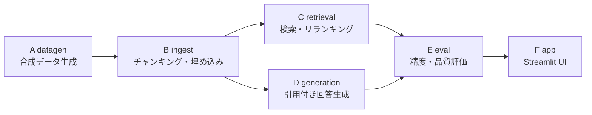
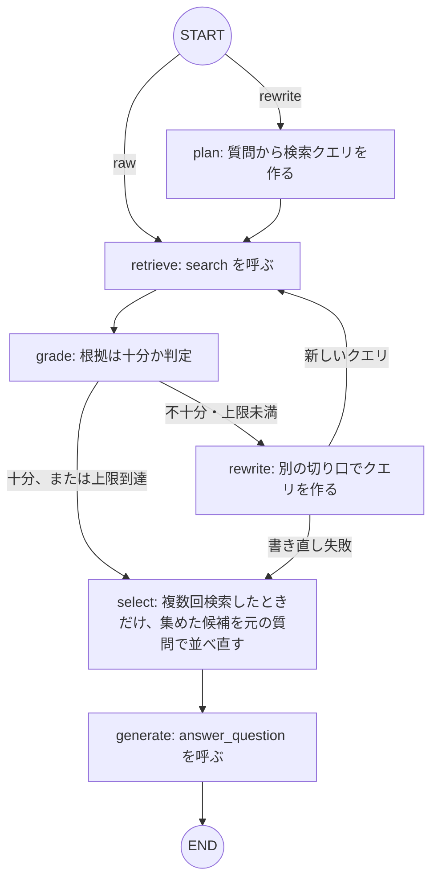

# 部署横断ナレッジ検索アシスタント

日本語 | [English](README_en.md)

**部署横断のプロジェクト知見・教訓を検索・再利用できる、社内ナレッジ検索RAGのポートフォリオ実装。処理はすべてローカルLLMで完結し、外部への送信は一切行わない。**

> 🧭 **要件は本人によるもの。技術的な実現方法の多くはAIが提案し、本人が承認・レビューした。**
>
> - **本人の要件**
>   - 部署横断のプロジェクト知見・教訓の検索（業界・職種は問わない）。動機は「部署間の連携が弱く、知見が共有されない」という課題意識
>   - Markdown/Word/Excel/PowerPoint/PDFの混在（現場ではファイル形式が統一されていないことが多い）
>   - 全処理をローカルLLMで完結し、外部送信ゼロ（機密情報を扱いうる業務データを想定）
>   - 開発プロセスに「グラフエンジニアリング」を取り入れる
> - **AIが具体化したもの**: DAGへのノード分解、依存のないノードの並列実装、各ノード完了ごとの別ベンダーAI（codex CLI）による独立レビューの必須化
> - **AI（Claude Code）が提案し、独立レビューを経て本人が承認したもの**: ハイブリッド検索の設計、`BM25Okapi`→`BM25Plus`のバグ修正（[BM25とは](#用語bm25とベクトル検索)）、出典付与、評価分割の設計
> - AIをペアプログラミング相手として使い、commitの`Co-Authored-By`に残している
> - 本人はUIを実際に動かして不具合・改善点（チャット表示順、タイトルの折り返し、雑談への過剰な応答、会話履歴を踏まえた検索ができない、等）をフィードバックし、原因調査・修正はAIが行った

---

## 背景・課題設定

- **課題**: 新プロジェクトの着手時に「過去の似た取り組みと、うまくいった点・つまずいた点」を探したいが、部署間で用語・フォーマットが揃わず、他部署の教訓が埋もれる
- **価値提案**: 資料を所定の場所に残しておけば、部署間の情報共有が不十分でも、RAGが横断的に検索・再引用できる
- **データは合成**: 実データは使えないため、一般的な社内5部署（マーケティング／営業／商品開発／カスタマーサポート／経営企画）の振り返りレポートを合成した
  - 企業名は、実在・架空を問わず登場しない
  - 5形式が混在する
  - 各レポートに成果画像（KPI推移グラフ等）が1枚付き、ingest時にローカルのVLMでキャプション化して検索対象にする
- 部署間連携の弱さは、技術より人の問題であることが多い（例: 部署横断のデータ管理基盤の導入が進まない）。同じ構造の一例だと感じている

## セットアップ

### 前提

- Python 3.11 以上
- [LM Studio](https://lmstudio.ai/) 等、OpenAI互換APIのローカルLLMサーバー
  - ロードするモデルは3種類: チャット用、埋め込み用、**画像説明用のvisionモデル（VLM）**（例: Qwen2.5-VL/Qwen3-VL系）
  - VLMが未ロードでも動く（画像キャプションだけスキップされ、警告が出る）
  - 既定の接続先は`http://localhost:1234/v1`。別のサーバー（例: Ollamaの`http://localhost:11434/v1`）は、`config.toml`の`[ai] base_url`か、環境変数`SILORAG_AI_BASE_URL`で変える（優先順位: 環境変数 > `config.toml` > コード内の既定値）

### インストール

```bash
python3 -m venv .venv
source .venv/bin/activate
pip install -e .
# 開発（テスト・lint）も行う場合
pip install -e ".[dev]"
```

- Streamlit・ChromaDB等の依存はまとめて入る
- 以降のコマンドは、仮想環境を有効化した状態で実行する

### 設定

```bash
cp config.example.toml config.toml
```

- `config.toml`でベースURL・モデル名を調整する（環境変数`SILORAG_AI_LLM_MODEL`等でも上書きできる。詳細は`src/silo_rag/config.py`）

## 使い方

データの用意は2通り。どちらか一方を実行してから、UIを起動する。

### デモデータを使う

```bash
bash scripts/prepare_demo_data.sh
```

内部では、次の3つを順に実行している。個別にやり直す場合は、直接実行する。

```bash
python -m silo_rag.datagen   # 合成データ生成（既定は60件のレポート＋15件の評価QAペア）
python -m silo_rag.ingest    # チャンキング・埋め込み・ChromaDBへの格納
python -m silo_rag.eval      # 検索精度・回答品質の評価
```

- `datagen`中に「生成に失敗しました」と出ることがある（小さなローカルLLMが見出し構成を毎回は守れないため）。自動でリトライするので、通常は待てば成功する。失敗が続く場合は、モデルを変えるか、時間を置いて再実行する
- `eval`の結果は`data/eval/eval_results.json`に出る（overall / cross_dept / same_deptの内訳つきで、hit_rate・recall@k・MRR・citation_rate・avg_judge_scoreを集計）。数値はモデルとデータに依存する

### 自前のレポートを使う

- `datagen`・`eval`は実行しない（`eval`は合成データ専用のQAペアが前提）。`ingest`だけ実行する

```bash
python -m silo_rag.ingest --reports-dir <レポートが入っているディレクトリ>
```

- パーサーは汎用的で、`---`フロントマター＋`## 見出し`で区切られたMarkdown/Word/Excel/PowerPoint/PDFなら、フィールド名・見出し名が自由でも読み込める
- UIのサイドバーの絞り込み（部署・プロジェクト種別）は、デモ用の固定語彙（`datagen.py`の`DEPARTMENTS`・`PROJECT_TYPES`）を使う。自前データの分類とは一致しない可能性がある（絞り込みを使わなければ、横断検索は問題なく動く）

### エージェント版を使う（オプション）

通常方式（1回検索して回答）に加えて、LLMが検索クエリを作り、必要なら検索し直す方式も使える（設計と評価は[ノードG](#ノードglanggraphエージェント)・[ノードH](#ノードhlangchain連携)）。LangGraph・LangChainは任意の依存で、入れなくても通常方式は動く。

```bash
pip install -e ".[agent]"        # LangGraphエージェント（ノードG）
pip install -e ".[langchain]"    # LangChain連携（ノードH）。langgraphも入る
```

- **UI**: サイドバーの「回答方式」で「エージェント」を選ぶ。回答の下に、検索・判定・書き直しの記録が出る
- **評価**: `python -m silo_rag.eval --pipeline agent`（`--grade-mode strict|lenient`、`--first-query raw|rewrite`）。LangChain既製との比較は`--pipeline langchain`
  - 通常方式・エージェントをまとめて比べる: `bash scripts/compare_pipelines.sh <モデル名> [--rewrite-first]`（3方式。`--rewrite-first`で6方式）
- **設定**: `config.toml`の`[agent]`（`max_attempts`、`grade_mode`、`first_query`）。既定は`first_query = "rewrite"`・`max_attempts = 1`（クエリを作って1回検索）。7Bでの測定で最も良かった組み合わせ

### UIを起動する

- ブラウザが開いたままになる、フォアグラウンドのプロセスなので、データの用意とは別に実行する

```bash
streamlit run src/silo_rag/app.py
```

## 制約・スコープ

- 合成データのため、実務の数値・事例そのものではない
- 企業名（実在・架空とも）は使っていない。業界・職種を限定しない業務ドメインを想定
- **プログラム本体（UI・生成データ・LLMプロンプト）は日本語のみ。** READMEが日英併記なのは可読性のためで、アプリの多言語対応とは別
- **会話履歴は、フォローアップの検索質問（例:「それについてもう少し詳しく」）の解釈にだけ使う。** 「さっき何て言った？」のような会話そのものへの質問は、意図的に「該当する事例が見つかりません」と答える

> [!TIP]
> **動かすだけなら、ここまで読めば十分です。**
> この先は、設計と開発プロセスの解説です。気になるところだけ読んでください。
>
> - 全体の構成を知りたい: [アーキテクチャ（DAG）](#アーキテクチャdag)
> - 1つの質問が回答になるまでを見たい: [具体例](#具体例1つの質問が回答になるまで)
> - 開発のやり方を知りたい: [開発プロセス](#開発プロセスグラフエンジニアリング--独立レビュー)
> - エージェントの設計と測定結果を見たい: [ノードG](#ノードglanggraphエージェント)・[ノードH](#ノードhlangchain連携)

---

## アーキテクチャ（DAG）

処理を、モジュール間の依存関係が明確なDAG（directed acyclic graph、有向非巡回グラフ）として設計した。


```mermaid
graph LR
    A["A datagen<br/>合成データ生成"] --> B["B ingest<br/>チャンキング・埋め込み"]
    B --> C["C retrieval<br/>検索・リランキング"]
    B --> D["D generation<br/>引用付き回答生成"]
    C --> E["E eval<br/>精度・品質評価"]
    D --> E
    E --> F["F app<br/>Streamlit UI"]
```

オプションのノードG・Hは、メインフローの外にあるので、図には含めない。

- **G**（`agent.py`）: C・Dの関数（`search`・`rerank`・`answer_question`）を呼ぶ。E（`--pipeline agent`）とF（回答方式「エージェント」）が、選ばれたときだけ呼ぶ
- **H**（`langchain_adapter.py`）: Cの`search`と、Dの`Answer`・`_build_citations`（非公開の関数）を呼ぶ。Eが`--pipeline langchain`のときだけ呼ぶ
- どちらも、使うときだけ`import`する。LangGraph・LangChainが入っていなくても、通常方式は動く

| ノード | モジュール | 役割 | 使用モデル（`config.toml`の`[ai]`） |
| --- | --- | --- | --- |
| A | `src/silo_rag/datagen.py` | - ダミーの振り返りレポートを生成（部署ごとにハウススタイル・ファイル形式がランダム、成果画像も埋め込む）<br>- 評価用QAペアを生成 | `llm_model`（レポート本文生成） |
| B | `src/silo_rag/ingest.py` | - 見出し単位にチャンキング（5形式対応）<br>- 埋め込み画像をVLMでキャプション化<br>- ベクトル化しChromaDBに格納 | - `embed_model`（チャンクのベクトル化）<br>- `vlm_model`（成果画像のキャプション化） |
| C | `src/silo_rag/retrieval.py` | - [BM25](#用語bm25とベクトル検索)＋ベクトル類似度のハイブリッド検索<br>- LLMによるリランキング<br>- 会話履歴を踏まえたクエリ書き換え | - `embed_model`（クエリのベクトル化）<br>- `llm_model`（リランキング・クエリ書き換え） |
| D | `src/silo_rag/generation.py` | - 検索チャンクを根拠に回答生成<br>- 出典（レポートID・セクション・**部署**）を付与<br>- 会話履歴を踏まえた指示語の解決 | `llm_model`（回答生成） |
| E | `src/silo_rag/eval.py` | - 検索精度（Recall@k, MRR）を測定<br>- 回答品質（LLM-as-judge, 引用網羅率）を測定 | - C・Dが使う全モデル<br>- `llm_model`（LLM-as-judge採点） |
| F | `src/silo_rag/app.py` | - Streamlitチャット UI<br>- 部署・種別での絞り込み、引用元表示 | C・Dが使う全モデル（質問のたびに呼び出す） |
| G（オプション） | `src/silo_rag/agent.py` | - LangGraphで「検索クエリ作成 → 検索 → 判定 → 書き直し → 再検索」を回す<br>- 詳細は[ノードG](#ノードglanggraphエージェント) | C・Dが使う全モデル |
| H（オプション） | `src/silo_rag/langchain_adapter.py` | - 自前の検索をLangChainのRetrieverとして公開<br>- LangChain既製エージェントとの比較<br>- 詳細は[ノードH](#ノードhlangchain連携) | C・Dが使う全モデル |

`vlm_model`が未ロードなら、Bの画像キャプション化だけがスキップされる（警告ログのみ）。他のノードは影響を受けない。

### 用語：BM25とベクトル検索

Cは、性質の違う2つの検索を組み合わせている。

- **BM25（キーワード検索）**: 「質問の言葉が、どの文書に、どれだけ出てくるか」で点数を付ける**計算式**。AIモデルではなく、学習もしない
  - 言葉が文書に多く出るほど高い（ただし頭打ちがある）
  - どの文書にも出る言葉（「です」「ます」）はほとんど効かず、珍しい言葉（「予算策定」）は大きく効く
  - 長い文書は、言葉が出やすいので少し割り引く
  - 得意: 型番・固有名詞・専門用語のように、**言葉そのものが一致する**探し方
  - 苦手: 言い換え（「予算」と「費用の見積もり」）を同じものと見なせない。検索と関係の無い言葉が質問に混ざると、その言葉を含む文書の点数が上がり、順位に影響することがある（索引に1つも無い言葉は0点で、何も変えない）
- **ベクトル検索（意味検索）**: 埋め込みモデル（AIモデル）で文を数値の並びに変え、**意味が近いか**を距離で測る。言い換えに強い
- **点数の統合**: 両方の点数を、それぞれ0〜1に**正規化**してから、`vector_weight`（既定0.5）の割合で合算する。そのうえで、上位の候補をLLMが並べ直す
  - 正規化: 最高点を1、最低点を0として、間を比例して直す
  - 例外: 最高点と最低点の差がほぼ0なら全員1。キーワード検索は、最高点が0以下なら全員0（こちらを先に判定）
  - 計算例は[具体例](docs/worked_example_ja.md)
- **このプロジェクトでの扱い**
  - BM25の前処理は簡単な方法にした（形態素解析は使わない）
  - 日本語は、重なりを許して**2文字ずつ**に区切る（例: 「予算策定」→「予算」「算策」「策定」）
  - 英数字の語・ID（`RPT-014`など）は、**1語のまま小文字にする**（`rpt-014`）
  - `rank_bm25`の`BM25Plus`を使う。`BM25Okapi`は、半数を超える文書に出る言葉の重み（IDF）が負になることがあり、小さなデータで実際に起こるため替えた（`BM25Plus`は、索引にある言葉の重みが常に正）

### 具体例：1つの質問が回答になるまで

質問が各段階（取り込み・クエリ作成・BM25・ベクトル検索・点数の統合・並べ直し・回答生成）でどう加工されるかを、実際の値で追った文書がある: [docs/worked_example_ja.md](docs/worked_example_ja.md)

- うまくいく質問と、うまくいかない質問（候補に正解は入っていたが、並べ直しで落ちる）の2例
- 「書き直しがどの段階で効くか」の切り分け

### ノードの考え方

- **ノード**: 入出力の境界がはっきりした、1つの役割のまとまり。A〜Fが、それぞれ1ファイルに対応する
- **内部実装を隠す**: `retrieval.py`が公開するのは`search()`だけ、`generation.py`は`answer_question()`だけ。呼び出し側は、BM25かベクトル検索か、リランキングの中身を知らなくていい

### ノード間の接続

- **A→B**: ファイル経由（`data/synth_reports/`）。importの結合はゼロ
- **B→C・D**: ChromaDB経由。importするのは`Chunk`型だけ（`from .ingest import Chunk`）
- **C・D→E・F**: 関数の直接呼び出し（`eval.py`・`app.py`が`search()`・`answer_question()`を呼ぶ）
- **C・D→G→E・F**: Gも`search()`・`answer_question()`（と`rerank()`）を呼ぶだけ。E・Fは、通常方式かGかを切り替えられる
- **C・D→H→E**: Hは、`search()`のほかに、Dの`Answer`・`_build_citations`（非公開の関数）を使う。Eが`--pipeline langchain`で呼ぶ（比較用）
- 依存が強いほど結合も強い（直接呼び出しは強く、ファイル・DB経由は疎結合）

### 独立なノードはどこか

- 独立なペアは**C・Dだけ**。両方Bに依存するが、互いには依存しない
- ほかのペア（A-B、B-C、B-D、C-E、D-E、E-F）は依存があり、依存先の完成を待つため、並列実装できない
- **C・Dは、実際に2つのAgentへ並列実装できた**
- 「非巡回」は、構築順序が矛盾なく決まる保証であって、独立性とは別。一直線の依存（A→B→C→D→E→F）なら、非巡回でも並列化の余地はゼロになる。並列にできたのは、C・D間にたまたま矢印がなかった、というグラフの形による

> ⚠️ **ここでいう「並列」は、開発時（実装作業）の並列化で、実行時の処理の並列化ではない。**
>
> - DAGの矢印は、どのモジュールがどのモジュールに依存するかを表す。実行時の処理順とは別物
> - 実行時は、1つの質問に対して、C（検索）→D（回答生成）の順に逐次実行する（Dは、Cが返したチャンクを入力に受け取る。受け渡しはE・Fが行う）
> - C・Dが互いに依存しないので、2つのAgentに**同時に書かせることができた**、という意味

## 開発プロセス（グラフエンジニアリング + 独立レビュー）

開発プロセスも設計対象にした。要件の「グラフエンジニアリングを取り入れる」（🧭）を、AIが次のように具体化した。

グラフエンジニアリングとは、処理をDAGとして設計し、モジュール間の依存を明示する手法。このプロジェクトで実際に受けた恩恵は、次のとおり。

- **並列実装**: 依存のないノード（C、D）を、2つのAgent（サブエージェント）に同時に実装させた
- **独立テスト**: `_FakeVLMClient`・`_ScriptedClient`のようなフェイクで依存先を差し替えられ、実LLMなしで全ノードを個別にテストできる
- **バグの局所化**: 各ノード完了ごとに、ローカルの`codex` CLI（別ベンダーのAI）による独立レビューを必須ゲートにした。指摘があれば、修正→再レビューを繰り返してから次へ進んだ
  - `retrieval.py`の`BM25Okapi`のIDF負転バグを、レビュー中に検出・修正した
  - `datagen.py`の評価QA生成でのデータリークバグも検出・修正した（`tests/test_datagen.py`に回帰テストを残した）
- **再利用性**: ノードごとに独立しているため、後から一部を書き換えても、他に影響しない。システムプロンプトの調整・テストの語彙変更・README更新も、独立したタスクとして並列のAgentに分担できた
- 処理の順番を決められること自体は、グラフエンジニアリング特有の利点ではない。効いたのは、依存を明示して見えた「並列化できる箇所（C・D）」と「狭い範囲でレビューできる境界」の2点

## ノードG：LangGraphエージェント

ノードC・Dの**公開関数だけを呼ぶ**新しいノード（`src/silo_rag/agent.py`）。

- C・Dの中身には手を入れていない。C・Dは互いに依存しないまま（Gだけが両方を知っている）
- そのため、**モジュール間の依存はDAGのまま**。ループがあるのは、このノードの内側（実行時の流れ）だけ


```mermaid
graph TD
    S((START)) -->|raw| R[retrieve: search を呼ぶ]
    S -->|rewrite| P[plan: 質問から検索クエリを作る]
    P --> R
    R --> J[grade: 根拠は十分か判定]
    J -->|十分、または上限到達| SEL[select: 複数回検索したときだけ、集めた候補を元の質問で並べ直す]
    J -->|不十分・上限未満| W[rewrite: 別の切り口でクエリを作る]
    W -->|新しいクエリ| R
    W -->|書き直し失敗| SEL
    SEL --> G[generate: answer_question を呼ぶ]
    G --> X((END))
```

- 「根拠が十分か」「次のクエリ」は、LLMが判断する
- 「何回まで繰り返すか」は、`[agent] max_attempts`（既定1回＝再検索しない）でコードが決める
- 1回目のクエリは、`[agent] first_query`で選ぶ（`raw`＝質問そのまま、`rewrite`＝LLMが質問から検索クエリを作る。既定は`rewrite`）

### 設計判断

- **LangGraphを直接使い、LangChainの`create_agent`は使っていない**
  - `create_agent`は、LLMのツール呼び出し（function calling）を前提にした決まった形のループ
  - 7B程度のローカルモデルでは、ツール呼び出しが安定しないことが多い
  - そのため、「検索→判定→書き直し」の独自の形を、LangGraphで組んだ（`create_agent`は[ノードH](#ノードhlangchain連携)で比較対象として動かした）
- **LLMには決まった形式でしか答えさせない**
  - 判定は`SUFFICIENT`／`INSUFFICIENT`の1語、書き直しは検索クエリ1行。コードで厳密に解釈する（部分一致では拾わない）
  - 7Bでの動作確認（4問を2回）では、応答はすべて決まった形式で返った
- **補助的な判断の失敗では止まらない**: 判定・書き直しでの接続失敗・形式の崩れ・同じクエリの繰り返しは、手元のチャンクで回答生成に進む。回答生成そのものの失敗は、呼び出し元に伝える
- **外部送信ゼロは変わらない**: LLM呼び出しはすべて既存の`LLMClient`（ローカルのLM Studio等）経由。LangGraphは、LangSmith用の環境変数（`LANGSMITH_TRACING`等）を設定しない限り、外部へ送信しない
- **判定の厳しさを2段階（`strict`／`lenient`）で切り替えられる**
  - 判定するLLMは「まだ見ていない、もっと良い資料があるか」を知りようがなく、プロンプトの言い回しだけでは決まらない
  - strictは多くの質問で上限まで再検索する（9回中8回が「不十分」）。lenientはすぐ「十分」と判定する。両方を残して、評価で比べた
- **1回目のクエリを、質問から作るか選べる（`first_query`）**
  - 質問文には、名乗り（「経営企画部です。」）や依頼の言い回し（「教えてください」）など、検索と関係の無い言葉が多い。検索が散ると考えて（[BM25](#用語bm25とベクトル検索)）、質問から検索クエリを作る`plan`ノードを足した（失敗したら質問のまま検索）
  - 評価で、これが最も効いた。どの段階で効いたかは[具体例](docs/worked_example_ja.md)
- **上限に達したら、判定のLLM呼び出しを省く**: もう再検索できず、判定が何も変えないため

### 評価

- 同じ評価セット（15問、うち部署横断5問）を、各方式1回ずつ回した
- モデル: 7B = `qwen2.5-7b-instruct`、32B = `qwen2.5-coder-32b-instruct-mlx`（いずれもLM Studio、4bit）
- 表の「クエリ作成」は`first_query = "rewrite"`、「1検索」は`max_attempts = 1`
- 「LLM呼び出し」は、回答までのチャット呼び出し回数（埋め込みとjudgeは含まない）。「上限での判定の省略」の前に測ったため、実際は、上限に達した質問ごとに1回少ない
- judgeの採点には回答と同じモデルを使うため、**judgeは同じモデルの行どうしでしか比べられない**

**7B**

| 方式 | hit_rate | 部署横断 | 自部署 | MRR | 引用率 | judge | 検索回数 | LLM呼び出し | 秒/問 |
| --- | --- | --- | --- | --- | --- | --- | --- | --- | --- |
| 通常方式 | 0.60 | 0.40 | 0.70 | 0.49 | 0.60 | 3.67 | 1.0 | 2.0 | 10.8 |
| G strict | 0.73 | 0.40 | 0.90 | 0.61 | 0.60 | 3.73 | 1.9 | 6.4 | 17.8 |
| G lenient | 0.67 | 0.40 | 0.80 | 0.54 | 0.60 | 3.80 | 1.4 | 4.5 | 14.6 |
| G strict ＋ クエリ作成 | 0.80 | 0.60 | 0.90 | 0.66 | 0.80 | 3.73 | 2.4 | 9.0 | 19.5 |
| G lenient ＋ クエリ作成 | 0.87 | 0.60 | 1.00 | 0.69 | 0.80 | 3.60 | 1.6 | 6.2 | 14.9 |
| **G lenient ＋ クエリ作成 ＋ 1検索** | **0.93** | **0.80** | 1.00 | 0.72 | **0.87** | 3.53 | 1.0 | 4.0 | **12.0** |
| LangChain既製（[ノードH](#ノードhlangchain連携)） | **0.93** | **0.80** | 1.00 | 0.54 | **0.87** | 3.73 | 1.3 | 3.3 | 18.6 |

**32B**

| 方式 | hit_rate | 部署横断 | 自部署 | MRR | 引用率 | judge | 検索回数 | LLM呼び出し | 秒/問 |
| --- | --- | --- | --- | --- | --- | --- | --- | --- | --- |
| 通常方式 | 0.87 | 1.00 | 0.80 | 0.71 | 0.87 | 3.60 | 1.0 | 2.0 | 50.4 |
| G strict | 0.87 | 1.00 | 0.80 | 0.72 | 0.80 | 3.33 | 2.5 | 8.2 | 88.9 |
| G lenient | 0.87 | 1.00 | 0.80 | 0.74 | 0.73 | 3.27 | 1.1 | 3.5 | 55.8 |
| G lenient ＋ クエリ作成 | 0.87 | 0.60 | 1.00 | 0.73 | 0.80 | 3.00 | 1.2 | 4.8 | 63.8 |
| G lenient ＋ クエリ作成 ＋ 1検索 | 0.93 | 0.80 | 1.00 | 0.72 | 0.87 | 3.33 | 1.0 | 4.0 | 57.2 |

32Bの`LangChain既製`は測っていない（LM Studioのモデル一覧で、このモデルにツール対応のアイコンが付いていないため）。

**分かったこと**

- **効いていたのは、「再検索」ではなく「質問を検索クエリに書き直すこと」だった（7B）**
  - 質問そのままで検索する版は、再検索を足しても0.60→0.67〜0.73にとどまった
  - 1回目から検索クエリを作らせると0.80〜0.93になり、**再検索を1回に制限しても（0.93）劣らなかった**。部署横断も0.40→0.80に上がった
  - どの段階で効いたかの切り分け（7B、詳細は[具体例](docs/worked_example_ja.md)）
    - BM25だけの上位5件に正解が入った問数は11→15
    - ベクトル検索だけは、合計5→5（問ごとには4問が入れ替わった）
    - 書き直したクエリは両方に同時に渡るので、最終結果の差を、BM25だけの効果とは言えない
    - 並べ直しの候補20件には、書き直す前から15問すべてに正解が入っていた
    - 最終結果の差（9→14〜15）は、候補の集め方（9→15）と、並べ直しに使うクエリ（9→12）の両方から来ていた
    - 「短いクエリの方が、並べ直しのLLMが判断しやすい」といった理由づけは、確かめていない
- **この切り分けは、LangChain既製エージェントに負けたことがきっかけだった**
  - 既製エージェントは、検索回数を増やさずに0.93を出した
  - 調べると、LLMが毎回、要点だけのクエリに書き直してから検索していた。自作のGは、1回目に質問をそのまま使っていた
  - 最初の仮説「再検索で補える」は、半分しか合っていなかった
- **32Bでは、どの工夫も、はっきりした効果が見えない**
  - 通常方式がすでに0.87で、クエリ作成＋1検索が0.93（1問差）
  - 部署横断は1.00→0.80（1問差）に下がり、再検索まで付けると0.60に下がった
- **結論: 回答方式の既定は通常方式のまま。エージェントは、小さいモデルを使わざるを得ないときのオプション**
  - エージェントの既定は、測定で最も良かった`first_query = "rewrite"`＋`max_attempts = 1`にした（表の「クエリ作成＋1検索」の行）
  - 再検索のループは、`max_attempts`を増やせば使える。ただし、クエリ作成への上乗せ効果は、どちらのモデルでも確認できなかった
  - 大きいモデルでは、通常方式との差が見えず、部署横断が下がる傾向もあるので、通常方式を使う
  - 既定に切り替えたあと、7B・32Bで回し直し、質問ごとの当たり・外れとhit_rateなどが一致することを確認した。LLM呼び出しは、上限での判定の省略により、表の4.0回から3.0回に減った

> ⚠️ **15問・各方式1回の結果で、差が1問分（0.07）の比較は断定できない。今回の15問での「傾向」として読んでほしい。**
>
> - 通常方式と自作エージェントは、クエリ作成と並べ直しを温度0で行う。新しい既定で7B・32Bを回し直すと、質問ごとの当たり・外れと、検索の指標は一致した
> - 拾ったレポートの一覧そのものも、7Bのエージェントの1問（QA-001。どちらも取りこぼし）を除いて一致した。温度0でも、完全な再現は保証されない
> - ばらつくのは、回答文を作る段階（引用率・judge）と、LangChain既製エージェントの検索
>   - 既製エージェントは、ツールに渡すクエリを、毎回LLMが温度0.2で作る。同じ質問（QA-001）でも、実行のたびに正解を拾えたり拾えなかったりした
>   - これは、途中で止めた複数回の実行で観察したこと。結果として保存してあるのは最後の1回分だけなので、数字では裏付けていない
> - 検索の結果が再現することは、別の質問セットでも同じ結果になることを意味しない
> - Gemma 4 26B（MoE・思考モデル）でも測ろうとしたが、思考で出力トークンが膨らみ、1問あたり約174秒かかったため、途中で打ち切り、比較には含めていない

### 開発中に見つけた問題

- **独立レビュー（codex）の指摘3件**: ①CIが任意依存を入れておらず、新しいテストを読み込めない、②再検索がtop_k件を返すと、前回までの根拠がすべて押し出される、③判定のプロンプトに会話履歴が無く、フォローアップ質問を判定できない。いずれもモックで再現して修正し、回帰テストを足した
- **実LLM（7B）での動作確認で見つけた3件**（モックのテストだけでは見つからなかった）
  - 判定が厳しすぎて、毎回上限まで再検索する
  - 書き直したクエリに質問者自身の部署名が入り、検索が自部署寄りになる
  - 再検索の結果を交互に並べる方式が、元の質問で拾えていた正解を押し出す（集めた候補全体を元の質問で並べ直す`select`ノードで解消）
- **評価で見つけた設計の誤り**: 「再検索が効く」という最初の仮説は半分しか合っていなかった。効いていたのは、1回目のクエリの作り方だった

## ノードH：LangChain連携

`src/silo_rag/langchain_adapter.py`（オプション。`pip install -e ".[langchain]"`）。C・Dの関数を呼ぶ（Gと違い、Dの非公開関数`_build_citations`も使う）。

- **`SiloRetriever`**: 自前のハイブリッド検索（`search()`）を、LangChainのRetriever（`langchain_core`の`BaseRetriever`）の規格に合わせて公開する
  - 検索の中身（BM25＋ベクトル＋LLMリランキング）はそのまま
  - LangChainのチェーンやエージェントから、部品として使える
- **`run_langchain_agent`**: 上のRetrieverを検索ツールにして、LangChain既製の`create_agent`（LLMがツール呼び出しで検索する）で回答する。自作のGとの比較対象
  - 検索の上限は3回。Gの`max_attempts`とは独立した定数で、Gの既定を1にしても、既製エージェントには複数回の検索を許す
- LLM呼び出しは、検索内のリランキング等は既存の`LLMClient`、エージェント自身の判断は`ChatOpenAI`経由。どちらもローカルのLM Studio（`config.ai.base_url`）に向かう。外部送信ゼロは変わらない
- 評価は`python -m silo_rag.eval --pipeline langchain`。結果は上の7Bの表のとおり（hit_rate 0.93、引用率0.87）
  - 検索の指標は、ツールが返した全チャンクで計算するため、検索回数が多いほど有利になる（拾ったレポートは平均4.5件で、通常方式の4.0件との差は小さい）
  - 引用率とjudgeは、公平に比べられる

### 既製エージェントを小さなモデルで動かして分かったこと

どちらも、モックのテストでは見つからず、実際に7Bを動かして初めて分かった。

- **並列ツール呼び出しで、検索が壊れた**
  - LLMが1回の応答で検索ツールを複数同時に呼ぶと、LangGraphが別スレッドで同時に実行する
  - `search()`は1スレッドでの利用が前提で、ChromaDB（同じフォルダの同時オープン）とLM Studio（埋め込みの同時リクエスト → HTTP 500）の両方で失敗した
  - `SiloRetriever`で、検索を1つずつ順番に実行するようにした
- **1回の応答が、検索ツールを約50回同時に呼ぼうとした（282秒）**
  - LangGraphのステップ数の上限（`recursion_limit`）は、「モデルが何回考え直すか」しか数えず、1回の応答の中の並列呼び出しには効かない
  - `SiloRetriever`に、実行回数の上限を入れた

## ライセンス

MIT License。全文は [LICENSE](LICENSE) を参照。
