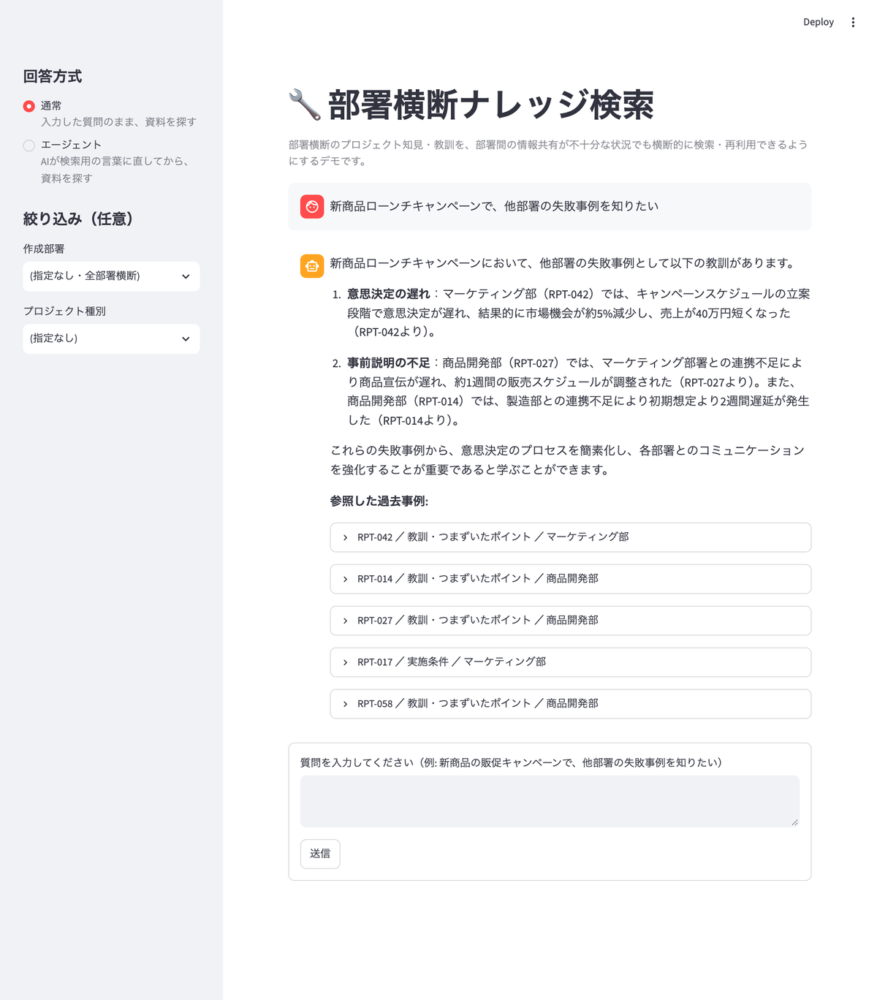
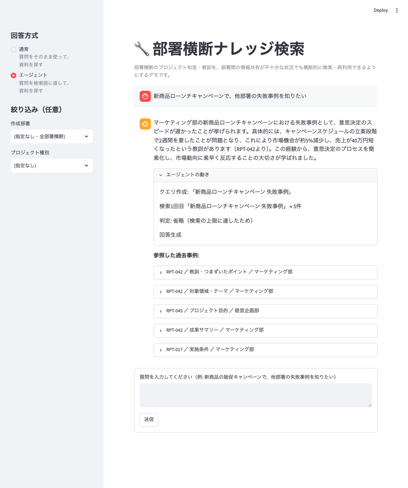
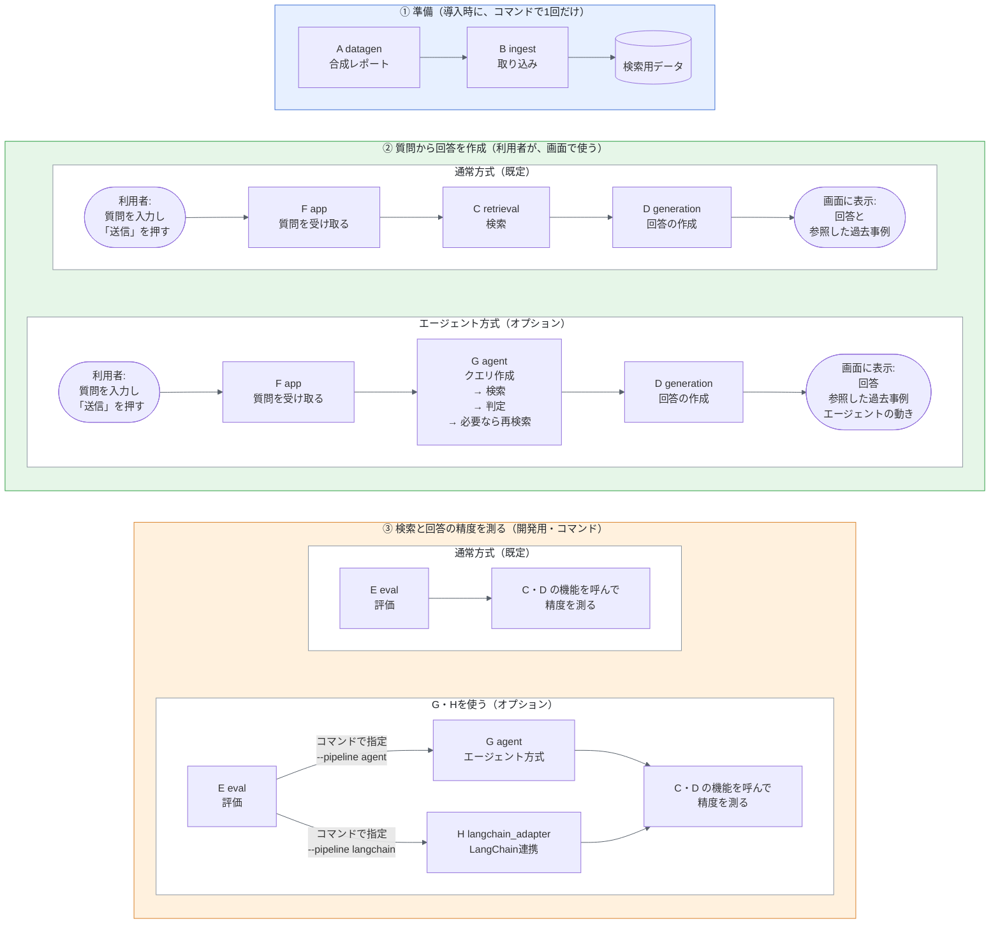
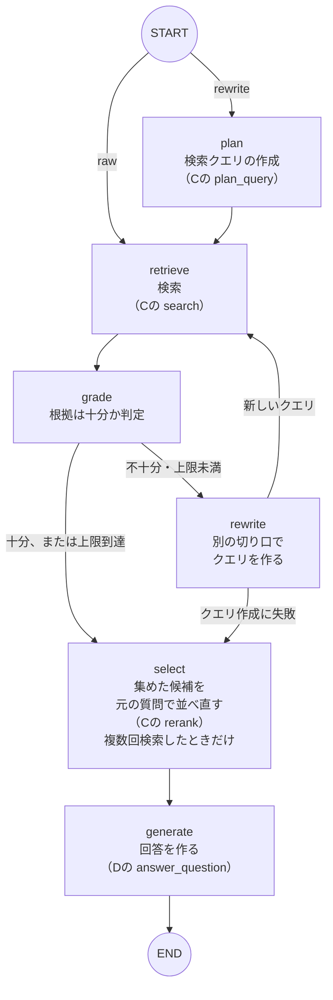
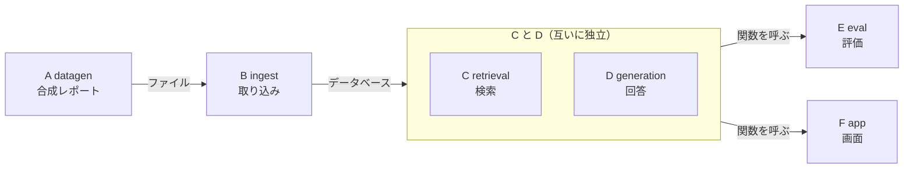

# 部署横断ナレッジ検索アシスタント

日本語 | [English](README_en.md)

**部署横断のプロジェクト知見・教訓を検索・再利用できる、社内ナレッジ検索RAGのポートフォリオ実装。処理はすべてローカルLLMで完結し、外部への送信は一切行わない。**

> 🧭 **要件は作者によるもの。技術的な実現方法の多くはAIが提案し、作者が承認・レビューした。**
>
> - **作者の要件**: 部署横断の知見検索（動機は「部署間の連携が弱く、知見が共有されない」という課題意識）／5形式（Markdown/Word/Excel/PowerPoint/PDF）の混在／全処理をローカルLLMで完結し外部送信ゼロ／開発プロセスへの「グラフエンジニアリング」の導入
> - **AIが具体化したもの**: DAGへのノード分解、依存のないノードの並列実装、各ノード完了ごとの別ベンダーAI（codex CLI）による独立レビューの必須化
> - **AI（Claude Code）が提案し、独立レビューを経て作者が承認したもの**: ハイブリッド検索の設計、`BM25Okapi`→`BM25Plus`のバグ修正（[BM25とは](#用語bm25とベクトル検索)）、出典付与、評価分割の設計
> - AIをペアプログラミング相手として使い、commitの`Co-Authored-By`に残している
> - 作者がUIを動かして不具合・改善点を見つけ、原因調査・修正はAIが行った

---

## 背景・課題設定

- **課題**: 新プロジェクトの着手時に、過去の似た取り組みを探したいが、部署間で用語・フォーマットが揃わず、他部署の教訓が埋もれる
- **価値提案**: 資料を所定の場所に残しておけば、部署間の情報共有が不十分でも、RAGが横断的に検索・再引用できる
- **データは合成**: 一般的な社内5部署（マーケティング／営業／商品開発／カスタマーサポート／経営企画）の振り返りレポートを合成した。企業名は登場しない。5形式が混在し、各レポートの成果画像（KPI推移グラフ等）は、ingest時にローカルのVLMでキャプション化して検索対象にする

## 画面

サイドバーの「回答方式」で、通常方式とエージェント方式を、質問ごとに切り替えられる（どちらも、合成データに同じ質問をしたところ）。

<table>
<tr>
<td width="50%"><br><b>通常方式</b>: 質問をほぼそのまま検索して、回答と、参照した過去事例（出典）を出す</td>
<td width="50%"><br><b>エージェント方式</b>（オプション）: 検索クエリを作ってから検索する。回答の下に、「エージェントの動き」の記録が出る</td>
</tr>
</table>

## セットアップ

### 前提

- Python 3.11 以上
- [LM Studio](https://lmstudio.ai/) 等、OpenAI互換APIのローカルLLMサーバー
  - ロードするモデル: チャット用、埋め込み用、**画像説明用のvisionモデル（VLM）**（例: Qwen2.5-VL/Qwen3-VL系）。VLMが未ロードでも、画像キャプションだけがスキップされ、他は動く
  - 既定の接続先は`http://localhost:1234/v1`。別のサーバー（例: Ollamaの`http://localhost:11434/v1`）は、`config.toml`の`[ai] base_url`か、環境変数`SILORAG_AI_BASE_URL`で変える（優先順位: 環境変数 > `config.toml` > コード内の既定値）

### インストール

```bash
python3 -m venv .venv
source .venv/bin/activate
pip install -e .
# 開発（テスト・lint）も行う場合
pip install -e ".[dev]"
```

以降のコマンドは、仮想環境を有効化した状態で実行する。

### 設定

```bash
cp config.example.toml config.toml
```

`config.toml`でベースURL・モデル名を調整する（環境変数`SILORAG_AI_LLM_MODEL`等でも上書きできる。詳細は`src/silo_rag/config.py`）。

## 使い方

使い方は、3つの手順。**手順1**でデータを用意し、**手順2**でUIを起動して質問する。**手順3**は、エージェント方式を使いたいときだけ。

### 手順1: データを用意する（A・Bのどちらか1つ）

#### A. デモデータを使う

```bash
bash scripts/prepare_demo_data.sh
```

内部では、次の3つを順に実行している。個別にやり直す場合は、直接実行する。

```bash
python -m silo_rag.datagen   # 合成データ生成（既定は60件のレポート＋15件の評価QAペア）
python -m silo_rag.ingest    # チャンキング・埋め込み・ChromaDBへの格納
python -m silo_rag.eval      # 検索精度・回答品質の評価（結果は data/eval/eval_results.json）
```

- `datagen`中の「生成に失敗しました」は、小さなローカルLLMが見出し構成を守れないために出る。自動でリトライするので、通常は待てば成功する。続く場合は、モデルを変えるか、時間を置いて再実行する

#### B. 自前のレポートを使う

- `datagen`・`eval`は実行しない（`eval`は合成データ専用のQAペアが前提）。`ingest`だけ実行する

```bash
python -m silo_rag.ingest --reports-dir <レポートが入っているディレクトリ>
```

- パーサーは汎用的で、`---`フロントマター＋`## 見出し`で区切られたMarkdown/Word/Excel/PowerPoint/PDFなら、フィールド名・見出し名が自由でも読み込める

> [!WARNING]
> **自前のレポートで使うときの注意**（READMEの数字は、すべて合成データでの結果）
>
> - **精度は測れない。** `eval`（検索精度・回答品質の測定）は、合成データ専用の「質問と正解」が前提。自前のレポートで測るには、正解つきの質問を、自分で用意する必要がある
> - **READMEの精度の数字は、当てにならない。** hit_rateなどは、合成データ（レポート60件）での結果。自前のレポートで同じ精度が出るとは言えない
> - **画面の絞り込み（部署・プロジェクト種別）は、デモ用の固定の分類語を使う。** 自前データの分類と合わないことがある。絞り込みを使わなければ、横断検索は動く
> - **試していないこと。** 試したのは、合成データ60件だけ。大量のデータ、書式のばらつきが大きい資料、体裁の崩れたPDF、ローカルの小さなモデル（7Bなど）での実務の文書は、確認していない

### 手順2: UIを起動する

手順1が終わってから実行する。起動すると、ブラウザにチャット形式の画面が開く（見た目は、[画面](#画面)のスクリーンショットのとおり）。質問は、ここで入力する。ブラウザが開いたままになる、フォアグラウンドのプロセスなので、データの用意とは別に実行する。

```bash
streamlit run src/silo_rag/app.py
```

### 手順3（オプション）: エージェント方式を使う

通常方式（質問をほぼそのまま検索して回答）に加えて、LLMが検索クエリを作ってから検索する、エージェント方式も使える。設定を変えると、結果が足りないときに検索し直すこともできる（初期設定では、検索し直さない）。設計と評価は[ノードG](#ノードglanggraphエージェント)・[ノードH](#ノードhlangchain連携)。LangGraph・LangChainは、エージェント方式でだけ使う追加のライブラリで、入れなくても、通常方式は動く。

```bash
pip install -e ".[agent]"        # LangGraphエージェント（ノードG）
pip install -e ".[langchain]"    # LangChain連携（ノードH）。langgraphも入る
```

- **UI**: 上のどちらかを入れると、画面のサイドバーの「回答方式」に、「エージェント」が選択肢として出る（入れていないと、通常方式だけ）。どちらで答えるかは、**画面で、質問ごとに切り替えられる**（入れ直す必要はない）。ノードH（`.[langchain]`）は、画面には出ず、評価のコマンド専用。回答の下に、検索クエリの作成・検索・（検索し直したときは）判定と再検索の記録が出る
- **評価**: `python -m silo_rag.eval --pipeline agent`（`--grade-mode strict|lenient`、`--first-query raw|rewrite`）。LangChain既製との比較は`--pipeline langchain`。まとめて比べる: `bash scripts/compare_pipelines.sh <モデル名> [--rewrite-first]`
- **設定**: `config.toml`の`[agent]`（`max_attempts`、`grade_mode`、`first_query`）。既定は`first_query = "rewrite"`・`max_attempts = 1`（クエリを作って1回検索）で、7Bの15問の測定で最も良かった組み合わせ（45問では、通常方式との差を確認できなかった。下の「評価」）

## 制約・スコープ

- 合成データのため、実務の数値・事例そのものではない。企業名は使っていない
- **プログラム本体（UI・生成データ・LLMプロンプト）は日本語のみ。** READMEが日英併記なのは可読性のためで、アプリの多言語対応とは別
- **会話履歴は、フォローアップの検索質問（例:「それについてもう少し詳しく」）の解釈にだけ使う。** 「さっき何て言った？」のような会話そのものへの質問は、意図的に「該当する事例が見つかりません」と答える

> [!TIP]
> **動かすだけなら、ここまで読めば十分です。**
> この先は、設計と開発プロセスの解説です。気になるところだけ読んでください。
>
> - 全体の構成を知りたい: [アーキテクチャ](#アーキテクチャ)
> - 1つの質問が回答になるまでを見たい: [具体例](#具体例1つの質問が回答になるまで)
> - エージェントの設計と測定結果を見たい: [ノードG](#ノードglanggraphエージェント)・[ノードH](#ノードhlangchain連携)（測定の詳しい表は[評価の詳細](docs/agent_evaluation_ja.md)）
> - 開発のやり方を知りたい: [開発プロセス](#開発プロセスグラフエンジニアリング--独立レビュー)

---

## アーキテクチャ

システムは、6つの**ノード**（処理のまとまり。A〜Fが、それぞれ1ファイル）でできている。動く時期と、使う人は、3つに分かれる。**利用者が使うのは、②だけ**（手順2で起動するブラウザの画面で、質問する。見た目は[画面](#画面)）。①は、導入する人が、最初にコマンドで1回だけ実行する準備。③は、開発者だけが使う、精度の測定。質問に答える流れ（②）は、**画面のサイドバーの「回答方式」で、通常方式とエージェント方式を切り替えられる**。


```mermaid
%%{init: {"flowchart": {"padding": 24, "wrappingWidth": 400}, "themeVariables": {"lineColor": "#57606a"}}}%%
graph TB
    subgraph g1["① 準備（導入時に、コマンドで1回だけ）"]
        direction LR
        A["A datagen<br/>合成レポート"] --> B["B ingest<br/>取り込み"] --> DB[("検索用データ")]
    end
    subgraph g2["② 質問から回答を作成（利用者が、画面で使う）"]
        direction TB
        subgraph plain["通常方式（既定）"]
            direction LR
            U1(["利用者:<br/>質問を入力し<br/>「送信」を押す"]) --> F1["F app<br/>質問を受け取る"] --> C1["C retrieval<br/>検索"] --> D1["D generation<br/>回答の作成"] --> R1(["画面に表示:<br/>回答と<br/>参照した過去事例"])
        end
        subgraph agent["エージェント方式（オプション）"]
            direction LR
            U2(["利用者:<br/>質問を入力し<br/>「送信」を押す"]) --> F2["F app<br/>質問を受け取る"] --> G["G agent<br/>クエリ作成<br/>→ 検索<br/>→ 判定<br/>→ 必要なら再検索"] --> D2["D generation<br/>回答の作成"] --> R2(["画面に表示:<br/>回答<br/>参照した過去事例<br/>エージェントの動き"])
        end
        plain ~~~ agent
    end
    subgraph g3["③ 検索と回答の精度を測る（開発用・コマンド）"]
        direction TB
        subgraph ev["通常方式（既定）"]
            direction LR
            E1["E eval<br/>評価"] --> CD1["C・D の機能を呼んで<br/>精度を測る"]
        end
        subgraph ev2["G・Hを使う（オプション）"]
            direction LR
            E2["E eval<br/>評価"] -->|"コマンドで指定<br/>--pipeline agent"| G2["G agent<br/>エージェント方式"] --> CD2["C・D の機能を呼んで<br/>精度を測る"]
            E2 -->|"コマンドで指定<br/>--pipeline langchain"| H["H langchain_adapter<br/>LangChain連携"] --> CD2
        end
        ev ~~~ ev2
    end
    g1 ~~~ g2
    g2 ~~~ g3
    style g1 fill:#e7f0ff,stroke:#3b6fd4,color:#1f2328
    style g2 fill:#e6f6e8,stroke:#2f9e44,color:#1f2328
    style g3 fill:#fff1de,stroke:#d9822b,color:#1f2328
    style plain fill:#ffffff,stroke:#8c959f,color:#1f2328
    style agent fill:#ffffff,stroke:#8c959f,color:#1f2328
    style ev fill:#ffffff,stroke:#8c959f,color:#1f2328
    style ev2 fill:#ffffff,stroke:#8c959f,color:#1f2328
```

- **① 準備**（導入する人が、最初にコマンドで1回だけ実行する）: Aが合成レポートを作り、Bが取り込んで、検索用データ（ChromaDB）にする
- **② 質問から回答を作成**（利用者が、手順2で起動したブラウザの画面で、テキスト欄に質問を入力して「送信」を押すと動く。回答方式は、サイドバーで切り替える）。Fは、画面（テキスト欄・「送信」ボタン・サイドバー）を受け持ち、処理の結果を表示する。画面には、回答と、参照した過去事例（出典）が出る
  - **通常方式**（既定）: Fが、Cの検索の機能（`search`）を呼び、その結果を、Dの回答生成の機能（`answer_question`）に渡す
  - **エージェント方式**（オプション）: Fは、CとDを直接呼ぶ代わりに、Gを呼ぶ。Gは、Cの機能（クエリの作成`plan_query`・検索`search`・並べ直し`rerank`）と、Dの機能（回答の作成`answer_question`）を呼びながら、判定と再検索を行う。初期設定では、検索は1回で、判定と再検索は動かない。画面には、「エージェントの動き」の記録も出る
- **③ 検索と回答の精度を測る**（評価。開発者向け）: 通常方式とG・Hなどを、数字で比べて決めるために、開発者が、正解の分かっている質問で、精度を測るときに、コマンドで実行する（利用者は使わない。質問に答える流れの一部ではない）
  - **通常方式**（既定）: Eが、Cの検索の機能とDの回答生成の機能を、直接呼んで測る
  - **G・Hを使う方式**（オプション）: Eが、GまたはHを経由して、C・Dの機能を呼んで測る。切り替え方は、下の表

オプションのノードG・Hは、次のように切り替える。

| | ② 質問に答える（画面） | ③ 精度を測る（コマンド） | 事前に入れるもの |
| --- | --- | --- | --- |
| 通常方式（既定） | サイドバーの「回答方式」で「通常」 | `python -m silo_rag.eval` | 不要 |
| **G** エージェント方式 | サイドバーの「回答方式」で「エージェント」 | `python -m silo_rag.eval --pipeline agent` | `pip install -e ".[agent]"` |
| **H** LangChain連携 | **使えない**（画面には出ない） | `python -m silo_rag.eval --pipeline langchain` | `pip install -e ".[langchain]"` |

G・Hの役割は、次のとおり。

- **G**（`agent.py`）: C・Dの関数（`search`・`rerank`・`answer_question`）を呼ぶ
- **H**（`langchain_adapter.py`）: Cの`search`と、Dの`Answer`・`build_citations`を呼ぶ
- どちらも、使うときだけ`import`する。LangGraph・LangChainが入っていなくても、通常方式は動く

| ノード | モジュール | 役割 | 使用モデル（`config.toml`の`[ai]`） |
| --- | --- | --- | --- |
| A | `src/silo_rag/datagen.py` | - ダミーの振り返りレポートを生成（部署ごとにハウススタイル・ファイル形式がランダム、成果画像も埋め込む）<br>- 評価用QAペアを生成 | `llm_model`（レポート本文生成） |
| B | `src/silo_rag/ingest.py` | - 見出し単位にチャンキング（5形式対応）<br>- 埋め込み画像をVLMでキャプション化<br>- ベクトル化しChromaDBに格納 | - `embed_model`（チャンクのベクトル化）<br>- `vlm_model`（成果画像のキャプション化） |
| C | `src/silo_rag/retrieval.py` | - [BM25](#用語bm25とベクトル検索)＋ベクトル類似度のハイブリッド検索<br>- LLMによるリランキング<br>- 会話履歴を踏まえた指示語の解決（検索用に質問を書き換える）<br>- （オプション）検索前に、質問から検索クエリを作る（`[retrieval] rewrite_query`。既定はオフ） | - `embed_model`（クエリのベクトル化）<br>- `llm_model`（リランキング・指示語の解決・検索クエリの作成） |
| D | `src/silo_rag/generation.py` | - 検索チャンクを根拠に回答生成<br>- 出典（レポートID・セクション・**部署**）を付与<br>- 会話履歴を踏まえた指示語の解決 | `llm_model`（回答生成） |
| E | `src/silo_rag/eval.py` | - 検索精度（Recall@k, MRR）を測定<br>- 回答品質（LLM-as-judge, 引用網羅率）を測定 | - C・Dが使う全モデル<br>- `llm_model`（LLM-as-judge採点） |
| F | `src/silo_rag/app.py` | - Streamlitチャット UI<br>- 部署・種別での絞り込み、引用元表示 | C・Dが使う全モデル（質問のたびに呼び出す） |
| G（オプション） | `src/silo_rag/agent.py` | - LangGraphで「検索クエリ作成 → 検索 → 判定 → 別の切り口でクエリ作成 → 再検索」を回す<br>- 詳細は[ノードG](#ノードglanggraphエージェント) | C・Dが使う全モデル |
| H（オプション） | `src/silo_rag/langchain_adapter.py` | - 自前の検索をLangChainのRetrieverとして公開<br>- LangChain既製エージェントとの比較<br>- 詳細は[ノードH](#ノードhlangchain連携) | C・Dが使う全モデル |

`vlm_model`が未ロードなら、Bの画像キャプション化だけがスキップされる（警告ログのみ）。

### 用語：BM25とベクトル検索

Cは、性質の違う2つの検索を組み合わせている。

- **BM25（キーワード検索）**: 「質問の言葉が、どの文書に、どれだけ出てくるか」で点数を付ける**計算式**。AIモデルではなく、学習もしない
  - 言葉が文書に多く出るほど高い（頭打ちあり）。どの文書にも出る言葉（「です」「ます」）はほとんど効かず、珍しい言葉（「予算策定」）は大きく効く。長い文書は少し割り引く
  - 得意: 型番・固有名詞・専門用語のように、**言葉そのものが一致する**探し方
  - 苦手: 言い換え（「予算」と「費用の見積もり」）を同じものと見なせない。検索と関係の無い言葉が質問に混ざると、その言葉を含む文書の点数が上がり、順位に影響することがある（索引に1つも無い言葉は0点で、何も変えない）
- **ベクトル検索（意味検索）**: 埋め込みモデル（AIモデル）で文を数値の並びに変え、**意味が近いか**を距離で測る。言い換えに強い
- **点数の統合**: 両方の点数を、それぞれ0〜1に**正規化**してから、`vector_weight`（既定0.5）の割合で合算し、上位の候補をLLMが並べ直す
  - 正規化: 最高点を1、最低点を0として、間を比例して直す。例外: 最高点と最低点の差がほぼ0なら全員1。キーワード検索は、最高点が0以下なら全員0（こちらを先に判定）
  - 計算例は[具体例](docs/worked_example_ja.md)
- **このプロジェクトでの扱い**: 前処理は簡単な方法にした（形態素解析は使わない）。日本語は、重なりを許して**2文字ずつ**に区切り（「予算策定」→「予算」「算策」「策定」）、英数字の語・ID（`RPT-014`など）は、**1語のまま小文字にする**（`rpt-014`）。`rank_bm25`の`BM25Plus`を使う。`BM25Okapi`は、半数を超える文書に出る言葉の重み（IDF）が負になることがあり、小さなデータで実際に起こるため替えた

### 具体例：1つの質問が回答になるまで

質問が各段階（取り込み・クエリ作成・BM25・ベクトル検索・点数の統合・並べ直し・回答生成）でどう加工されるかを、実際の値で追った文書がある: [docs/worked_example_ja.md](docs/worked_example_ja.md)。うまくいく質問と、うまくいかない質問（候補に正解は入っていたが、並べ直しで落ちる）の2例と、「検索クエリの作成がどの段階で効くか」の切り分けが載っている（切り分けは、15問での結果。45問では、検索クエリの作成の効果を確認できなかった）。

## ノードG：LangGraphエージェント

ノードC・Dの**公開関数だけを呼ぶ**、オプションのノード（`src/silo_rag/agent.py`）。**Gは、C・Dに依存する**（C・Dが先にあり、Gがその関数を使う）。逆に、C・Dは、Gを知らない（Gに依存しない）。C・Dどうしは、互いに依存しない。そのため、依存関係に循環はできない。「どのノードがどのノードを使うか」を表す設計図（[ノードの依存関係（DAG）](#ノードの依存関係dag)）は、循環のない形（DAG）の**まま**。ループがあるのは、Gの内側（実行時の流れ）だけ。


```mermaid
%%{init: {"flowchart": {"padding": 24, "wrappingWidth": 400}}}%%
graph TD
    S((START)) -->|raw| R["retrieve<br/>検索<br/>（Cの search）"]
    S -->|rewrite| P["plan<br/>検索クエリの作成<br/>（Cの plan_query）"]
    P --> R
    R --> J["grade<br/>根拠は十分か判定"]
    J -->|十分、または上限到達| SEL["select<br/>集めた候補を<br/>元の質問で並べ直す<br/>（Cの rerank）<br/>複数回検索したときだけ"]
    J -->|不十分・上限未満| W["rewrite<br/>別の切り口で<br/>クエリを作る"]
    W -->|新しいクエリ| R
    W -->|クエリ作成に失敗| SEL
    SEL --> G["generate<br/>回答を作る<br/>（Dの answer_question）"]
    G --> X((END))
```

図の中の「（Cの …）」「（Dの …）」は、そのノードの関数を呼ぶ処理。印のない処理（判定と、別の切り口でのクエリ作成）は、Gの中だけの処理。**GはC・Dの中にあるのではなく、C・Dの関数を呼ぶ、別のノード**。

**クエリに関する処理は、3種類ある。** 名前が似ているので、区別しておく。

| | 処理 | どこにあるか | いつ動くか |
| --- | --- | --- | --- |
| ア | 指示語の解決（会話履歴を見て、「それ」などを具体的な言葉に直す） | Cの機能 | 会話履歴があるとき。通常方式・エージェント方式のどちらでも |
| イ | 検索クエリの作成（質問から、検索に向いた言葉だけの文を作る） | Cの`plan_query` | エージェント方式では、初期設定でオン（`first_query = "rewrite"`）。通常方式では、設定でオンにしたときだけ（`rewrite_query`。初期設定はオフ） |
| ウ | 別の切り口でのクエリ作成（結果が足りないとき、別の言葉で探し直す） | Gの`rewrite`ノード | 検索を複数回にしたときだけ（初期設定では動かない） |

設定名の`rewrite`（`first_query = "rewrite"`、`rewrite_query`）は、どちらも「検索クエリの作成」（イ）をオンにする設定で、Gの`rewrite`ノード（ウ）とは別。

- 「根拠が十分か」「次のクエリ」はLLMが判断し、「何回まで繰り返すか」は`[agent] max_attempts`（既定1回＝再検索しない）でコードが決める
- 1回目のクエリは、`[agent] first_query`で選ぶ（`raw`＝質問そのまま、`rewrite`＝LLMが質問から検索クエリを作る。既定は`rewrite`）

### 設計判断

- **LangGraphを直接使い、LangChainの`create_agent`は使っていない。** `create_agent`はLLMのツール呼び出し（function calling）を前提にした決まった形のループで、7B程度のローカルモデルでは安定しないことが多い。そのため、「検索→判定→別の切り口でクエリ作成」の独自の形を組んだ（`create_agent`は[ノードH](#ノードhlangchain連携)で比較対象として動かした）
- **LLMには決まった形式でしか答えさせない。** 判定は`SUFFICIENT`／`INSUFFICIENT`の1語、クエリ作成（検索クエリの作成と、別の切り口でのクエリ作成）は、検索クエリ1行。コードで厳密に解釈する
- **補助的な判断の失敗では止まらない。** 判定・クエリ作成での接続失敗・形式の崩れ・同じクエリの繰り返しは、手元のチャンクで回答生成に進む
- **外部送信ゼロは変わらない。** LLM呼び出しはすべて既存の`LLMClient`（ローカル）経由。LangGraphは、LangSmith用の環境変数を設定しない限り、外部へ送信しない
- **判定の厳しさを2段階（`strict`／`lenient`）で切り替えられる。** 判定するLLMは「まだ見ていない、もっと良い資料があるか」を知りようがなく、プロンプトの言い回しだけでは決まらない。strictは多くの質問で上限まで再検索し（9回中8回が「不十分」）、lenientはすぐ「十分」と判定する。両方を残して比べた
- **1回目のクエリを、質問から作るか選べる（`first_query`）。** 質問文には、名乗りや依頼の言い回しなど、検索と関係の無い言葉が多い。検索が散ると考えて（[BM25](#用語bm25とベクトル検索)）、質問から検索クエリを作る`plan`ノードを足した（失敗したら質問のまま検索）。15問の評価では、これが最も効いた（ただし、45問で測り直すと、差が見えなかった。下の「評価」）。クエリを作る処理そのものは、ノードC（`retrieval.plan_query`）にあり、通常方式でも`[retrieval] rewrite_query`でオンにできる（既定はオフ。通常方式で45問を測ったが、効果は確認できなかった）
- **上限に達したら、判定のLLM呼び出しを省く。** もう再検索できず、判定が何も変えないため

### 評価

エージェント方式を、通常方式と同じ質問セットで測った。表・質問セット・測り方などの詳細は、[docs/agent_evaluation_ja.md](docs/agent_evaluation_ja.md)に載せた。ここには、概要だけを書く。

- **15問（うち部署横断5問）**: 7Bのhit_rateは、通常方式0.60、エージェントの既定（クエリ作成＋1検索）0.93。32Bは0.87と0.93（1問差）。ただし、この15問は、設計を決めるときに見ていた質問で、設計がこの15問に合っていた可能性が高い
- **45問での測り直し**: 効果を確認できなかった。7Bは、通常方式0.71、検索クエリの作成あり0.76、エージェントの既定0.76。32Bは、0.76と0.80（検索クエリの作成なし・あり）。質問ごとに、良くなった数と悪くなった数を数えると、差は偶然の範囲（符号検定でp=0.75〜0.77）
- **結論**: 回答方式の既定は、通常方式のまま。`[retrieval] rewrite_query`も、オフのまま。エージェントの既定は、15問で最も良かった`first_query = "rewrite"`＋`max_attempts = 1`。再検索のループは、`max_attempts`を増やせば使えるが、効果は確認できなかった。大きいモデルでは、通常方式を使う
- **評価で分かった、設計の誤り**: 最初の仮説「再検索が効く」は、半分しか合っていなかった（効いて見えたのは、質問から検索クエリを作ること）。さらに、「検索クエリの作成が効く」という結論も、15問に合わせた調整のせいで、強すぎた
- 開発中に見つけた問題（独立レビューの指摘3件、実LLM（7B）での動作確認で見つけた3件）も、同じ文書に載せた

> ⚠️ **どの結果も、各条件1回の測定。差が1問分（15問では0.07、45問では0.02）の比較は、断定できない。この質問セットでの「傾向」として読んでほしい。**

## ノードH：LangChain連携

`src/silo_rag/langchain_adapter.py`（オプション。`pip install -e ".[langchain]"`）。Gと同じく、C・Dの公開関数だけを呼ぶ。

- **`SiloRetriever`**: 自前のハイブリッド検索（`search()`）を、LangChainのRetriever（`BaseRetriever`）の規格に合わせて公開する。検索の中身はそのままで、LangChainのチェーンやエージェントから部品として使える
- **`run_langchain_agent`**: 上のRetrieverを検索ツールにして、LangChain既製の`create_agent`で回答する。自作のGとの比較対象。検索の上限は3回で、Gの`max_attempts`とは独立した定数
- LLM呼び出しは、すべてローカルのLM Studio（`config.ai.base_url`）に向かう。外部送信ゼロは変わらない
- 評価は`python -m silo_rag.eval --pipeline langchain`。結果は、[評価の詳細](docs/agent_evaluation_ja.md)の7Bの表のとおり（hit_rate 0.93、引用率0.87）。検索の指標は、ツールが返した全チャンクで計算するため、検索回数が多いほど有利になる。引用率とjudgeは、公平に比べられる

### 既製エージェントを小さなモデルで動かして分かったこと

どちらも、モックのテストでは見つからず、実際に7Bを動かして初めて分かった。

- **並列ツール呼び出しで、検索が壊れた。** LLMが1回の応答で検索ツールを複数同時に呼ぶと、LangGraphが別スレッドで同時に実行する。`search()`は1スレッド前提で、ChromaDBとLM Studio（HTTP 500）の両方で失敗した。`SiloRetriever`で、検索を1つずつ順番に実行するようにした
- **1回の応答が、検索ツールを約50回同時に呼ぼうとした（282秒）。** LangGraphのステップ数の上限（`recursion_limit`）は、並列呼び出しには効かない。`SiloRetriever`に、実行回数の上限を入れた

## 開発プロセス（グラフエンジニアリング + 独立レビュー）

要件の「グラフエンジニアリングを取り入れる」（🧭）を、AIが次のように具体化した。グラフエンジニアリングとは、処理をDAGとして設計し、依存を明示する手法。

- **並列実装**: 互いに依存しないノード（C、D）を、2つのAgent（サブエージェント）に同時に実装させた
- **独立テスト**: フェイク（`_FakeVLMClient`・`_ScriptedClient`）で依存先を差し替えられ、実LLMなしで全ノードを個別にテストできる
- **バグの局所化**: 各ノード完了ごとに、ローカルの`codex` CLI（別ベンダーのAI）による独立レビューを必須ゲートにし、指摘は修正→再レビューしてから次へ進んだ。`BM25Okapi`のIDF負転バグ（`retrieval.py`）と、評価QA生成でのデータリーク（`datagen.py`。`tests/test_datagen.py`に回帰テストを残した）を、レビュー中に検出・修正した
- **書き換えやすさ**: 各ノードは、入口の関数だけを公開しているので、内部を書き換えても、そのノードを呼ぶ側には影響しない
- 作る順番を決められること自体は、グラフエンジニアリングでなくても得られる利点。効いたのは、「並列化できる箇所（C・D）」と「狭い範囲でレビューできる境界」の2点

### ノードの依存関係（DAG）

処理を、ノード間の依存関係が明確なDAG（directed acyclic graph、有向非巡回グラフ）として設計した。**この図は、実行時の流れではなく、「どのノードが、どのノードの成果を使うか」を表す設計図**。開発のときに、作る順番と、並列にできる部分を決めるために使った。


```mermaid
%%{init: {"flowchart": {"padding": 24, "wrappingWidth": 400}}}%%
graph LR
    A["A datagen<br/>合成レポート"] -->|ファイル| B["B ingest<br/>取り込み"]
    B -->|データベース| cd
    subgraph cd["C と D（互いに独立）"]
        C["C retrieval<br/>検索"]
        D["D generation<br/>回答"]
    end
    cd -->|関数を呼ぶ| E["E eval<br/>評価"]
    cd -->|関数を呼ぶ| F["F app<br/>画面"]
```

- **接続**: A→Bはファイル経由（`data/synth_reports/`。importの結合はゼロ）。B→C・DはChromaDB経由（importするのは`Chunk`型だけ）。E・Fは、C・Dの関数を直接呼ぶ（EとFの間に、依存はない。FはAの定数`DEPARTMENTS`・`PROJECT_TYPES`も使う）
- 各ノードは、内部実装を隠し、公開するのは`search()`・`answer_question()`のような入口だけ
- オプションのG・Hは、この図に含めていない（[ノードG](#ノードglanggraphエージェント)・[ノードH](#ノードhlangchain連携)で説明した）。**G・Hは、C・Dに依存する**（C・Dの関数を呼ぶ）。E・Fが、必要なときだけ、G（EはHも）を使う。依存の向きは、C・D → G・H → E・F で、循環はない
- **独立なペアはC・Dだけ。** 両方Bに依存するが、互いには依存しない。ほかのペアは、依存先の完成を待つため、並列実装できない。**C・Dは、実際に2つのAgentへ並列実装できた**
- 「非巡回」は、構築順序が矛盾なく決まる保証であって、独立性とは別。一直線の依存（A→B→C→D→E→F）なら、非巡回でも並列化の余地はゼロになる。並列にできたのは、C・D間にたまたま矢印がなかった、というグラフの形による

> ⚠️ **ここでいう「並列」は、開発時（実装作業）の並列化で、実行時の処理の並列化ではない。**
>
> - DAGの矢印は、どのモジュールがどのモジュールに依存するかを表す。実行時の処理順とは別物
> - 実行時は、1つの質問に対して、C（検索）→D（回答生成）の順に逐次実行する（Dは、Cが返したチャンクを入力に受け取る。受け渡しは、通常方式ではE・Fが、エージェント方式ではGが行う）
> - C・Dが互いに依存しないので、2つのAgentに**同時に書かせることができた**、という意味

## ライセンス

MIT License。全文は [LICENSE](LICENSE) を参照。
