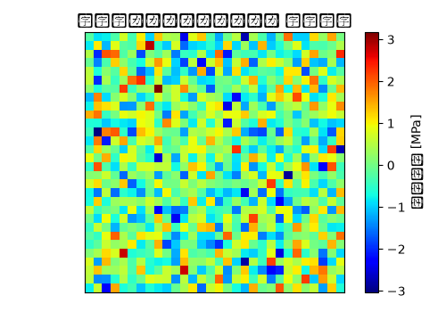

# 排気系サポートブラケット 非線形静解析（大変形・接触） 解析レポート（RPT-002）

## 解析目的
排気系サポートブラケットの大変形と接触に対して非線形静解析を行い、構造的強度と信頼性を評価する。

## 対象部品・製品カテゴリ
排気系サポートブラケット。エンジンと排気システムの接続部品として使用される。

## 境界条件
ブラケットがエンジンフレームへの固定箇所で固定され、排気管からの力50Nが垂直方向に加わる条件を仮定。

## 要素分割
ブラケット全体を細かいメッシュで分割し、接続部の周辺はより精緻に分割して高精度な解析を実施。要素数は総じて15万個。

## 材料物性
主材料として冷間圧延鋼板(SPCC)を使用。ヤング率は210GPa、ポアソン比は0.3と設定。

## 使用ソルバー
非線形静解析にはAbaqusを使用し、大変形と接触考慮を含むフル非線形ソルバを選択。

## 結果サマリー
最大変形量は2.5mmであり、許容範囲内でした。接触部での応力は150MPaと、材料の屈折限180MPa未満であり問題ありません。

## トラブルシューティング・教訓
初期解析では時間刻み0.1秒で収束が発散した。これを解決するため、時間刻みを0.05秒に細分化し、収束が安定しました。この経験から、非線形解析では時間刻みの選択が結果に大きな影響を与えることを学びました。
