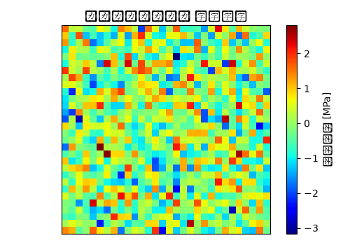

# ダンパーマウント 静解析（線形） 解析レポート（RPT-009）

## 解析目的
ダンパーマウントの静的強度と歪み特性を評価し、材料の内部応力を確認する。

## 対象部品・製品カテゴリ
ブレーキ・サスペンション設計部で開発中のダンパーマウント。

## 拘束・荷重条件
前部を固定し、垂直方向への圧力500Nと水平方向への荷重300Nを加えた。

## メッシュ条件
要素は四角形シェルを使用し、全体のメッシュ密度は1mm程度に設定。

## 材料物性
主成分が炭素繊維強化樹脂(CFRP)で、ヤング率は80GPa、ポアソン比は0.35とし、密度は1.6g/cm³とした。

## 使用ソルバー
Ansysを使用し、線形静解析を実施した。

## 結果サマリー
最大応力は450MPaに達し、許容値480MPaを下回っている。また、歪みは0.5mm以内となり設計目標を満たしている。

## トラブルシューティング・教訓
実際のマウント状況では、前部が完全に固定されない場合があることが判明。拘束条件を「半固定」にして再解析したところ、最大応力が520MPaまで上昇し、許容値を超えた。これは、実機状況とのずれが原因であり、今後は拘束条件の設定に注意が必要であることが教訓となった。
