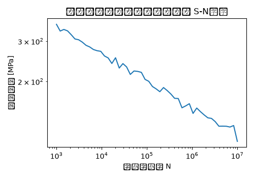

# トランスミッションマウント 疲労解析 解析レポート（RPT-018）

## 解析目的
トランスミッションマウントの耐用性を評価し、設計上の問題点を見つけること。

## 対象部品・製品カテゴリ
自動車用トランスミッションマウント。

## 入力条件
ランダム振動解析を実施し、荷重最大値として±50N・mのトルクを、周波数範囲10～200Hzで適用。

## メッシュ仕様
トランスミッションマウント全体を要素サイズ5mm以内にし、接続部は2mm以下に細分化。

## 材料物性
冷間圧延鋼板(SPCC)を使用。ヤング率200GPa、ポアソン比0.3、密度7.8g/cm³。

## 使用ソルバー
Abaqusを使用して解析を行った。

## 結果サマリー
最大应力部位が接続部に集中し、250MPaを超えていることが確認された。

## トラブルシューティング・教訓
解析結果によると、共振点が想定荷重の周波数150Hzと近接しており、最大应力270MPaを記録した。この値は許容応力230MPaを上回るため、接続部に追加補強が不可欠であることが判明。今後は設計段階で此类の問題を事前に予防するため、モーメントと周波数特性の詳細な解析を行うべきである。
