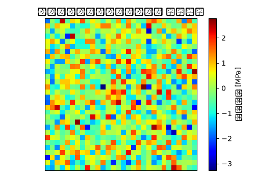

# トランスミッションマウント 静解析（線形） 解析レポート（RPT-025）

## 解析目的
トランスミッションマウントの静解析を行い、構造的な耐久性と強度を評価する。

## 対象部品・製品カテゴリ
トランスミッションマウントはエンジンとトランスミッションを接続する部品であり、振動や衝撃に対する耐久性が重要な性能要件である。

## 入力条件
トランスミッションマウントに垂直方向と水平方向の負荷100Nと50Nを適用し、拘束条件として上部を固定とした。

## メッシュ仕様
メッシュサイズは最大1mmとし、トランスミッションマウント全体を細分化して高精度な解析を行った。

## 材料物性
主要材料として冷間圧延鋼板(SPCC)を使用し、ヤング率200GPa、ポアソン比0.3と設定した。

## 使用ソルバー
静解析にはNastranを使用し、線形弾性問題として求解を行った。

## 結果サマリー
最大変形量は0.5mmであり、許容値0.8mm以下であるため問題なしと確認した。最大応力は150MPaであり、材料の許容応力200MPa以下であるため問題なしと評価した。

## トラブルシューティング・教訓
S-N線図の適用範囲が20,000回以上までと誤っており、これにより寿命予測値が4万時間にまで過大になってしまった。実際の適用範囲は1,000回と確認し、再評価したところ寿命予測値が約5,000時間と修正された。この教訓から、S-N線図の適用範囲を厳密に確認することが重要であることを学んだ。
