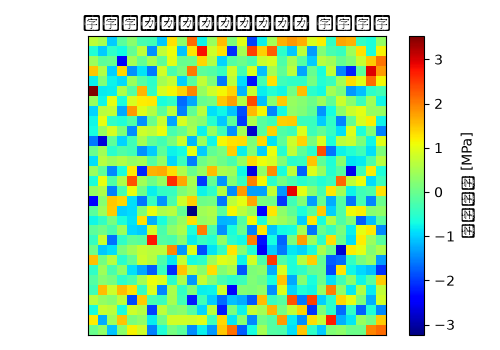

# 排気系サポートブラケット 非線形静解析（大変形・接触） 解析レポート（RPT-027）

## 解析目的
排気系サポートブラケットの耐久性を評価し、大変形や接触現象を考慮した破損予測を行う。

## 対象部品・製品カテゴリ
排気系サポートブラケットで、エンジンと排気システムを接続する構造部品。

## 境界条件
エンジンへの固定点を固定し、排気ガスの排出力を500N、エンジン振動の6mm振幅を入力とする。

## 要素分割
部品全体を四面体要素で分割し、平均要素長は5mmとした。

## 材料物性
使用材料はアルミニウム合金(A6061)で、弾性係数E=70GPa、ポアソン比ν=0.32とし、屈服強度σys=150MPaとした。

## 使用ソルバー
非線形静解析においてNastranを使用し、大変形と接触を考慮した解析を行った。

## 結果サマリー
最大応力は130MPaと予測され、かつ、排気ガス排出方向に約2mmの変形が見られた。接触領域では若干の弾性接触が確認された。

## トラブルシューティング・教訓
解析実施後、メッシュが粗く、細かい応力集中部を捉えられていなかったことが明らかとなった。例えば、接続部分の応力集中が120MPaと見られていたが、メッシュを細めると最大応力が145MPaまで上昇した。今後は、この部分のメッシュ長を2.5mmにし、より詳細な解析を行い、安全マージンを確認する。
