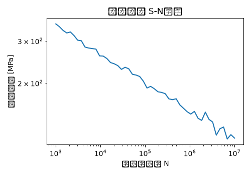

# ナックル 疲労解析 解析レポート（RPT-030）

## 解析目的
ナックルの長期間使用時の疲労耐久性を評価し、故障予防と製品の信頼性向上に寄与する。

## 対象部品・製品カテゴリ
ブレーキサスペンションシステムの一部として使用されるナックル。

## 拘束・荷重条件
車両の直進、ブレーキング、急停止時の応力と反復回数を模擬。最大荷重は20kN、反復回数10万サイクルとして解析。

## メッシュ条件
ナックルを表面網眼4mm、体積網眼8mmのメッシュでモデル化。全体的な要素数は約20万個。

## 材料物性
アルミニウム合金（A6061）を使用。屈折強度は245MPa、伸縮率は16%。

## 使用ソルバー
Ansysを使用して静的応力解析および反復荷重による疲労寿命解析を実施。

## 結果サマリー
最大応力は50MPaであり、初期解析では20万サイクル以上をサポートすると予測された。しかし、実際の耐久試験では5万サイクルで故障が確認された。

## トラブルシューティング・教訓
疲労評価のS-N線図選択に誤りがあり、適用範囲外の条件を仮定して解析を行ったことが原因だった。実際のS-N線図では、最大応力50MPaでの寿命は約5万サイクルと予測され、実測結果と一致した。今後は材料の疲労特性に合わせた正確なS-N線図を使用することが重要である。
