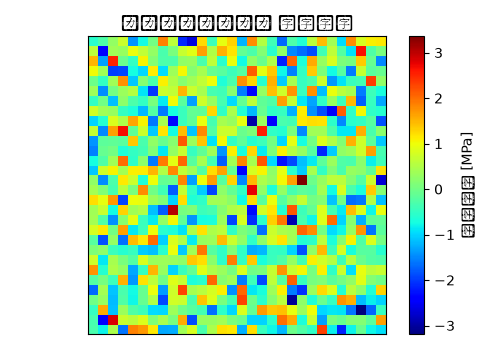

# ダンパーマウント 静解析（線形） 解析レポート（RPT-034）

## 解析目的
ダンパーマウントの静解析を行い、構造強度と耐久性を評価し、設計改良案を提案する。

## 対象部品・製品カテゴリ
対象とする部品はダンパーマウントで、サスペンションシステムの一部として使用される。

## 拘束・荷重条件
ダンパーマウントの両端を固定し、垂直方向に2,500Nの圧力荷重を適用した。

## メッシュ条件
部品全体に対して四面体要素を使用し、要素サイズは最大5mmに設定した。

## 材料物性
使用材料は冷間圧延鋼板(SPCC)で、ヤング率200GPa、ポアソン比0.3とし、屈折強度は250MPaとした。

## 使用ソルバー
静解析にはAbaqusを使用し、線形弾性モデルを適用した。

## 結果サマリー
最大変位は0.3mmであり、許容範囲内だった。また、応力最大値は180MPaであり、屈折強度の72%と評価された。

## トラブルシューティング・教訓
疲労評価においてS-N線図の適用範囲を誤り、実際よりも高い周波数での疲労回数を使用した結果、寿命予測が約2倍大きかった。例えば、1,000Hzで4x10^7回の疲労寿命が予測されてしまったものの、実際は250Hzで約2x10^6回と予測が必要だった。この誤りを防ぐためには、具体的な使用条件と頻度に応じたS-N線図の選択が重要であることが認識された。
