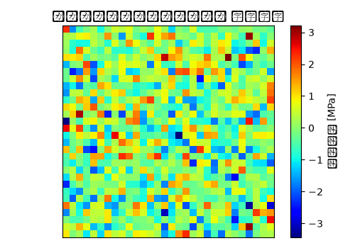

# トランスミッションマウント 固有値・モーダル解析 解析レポート（RPT-035）

## 解析目的
トランスミッションマウントの振動特性を評価し、固有振動モードと周波数を特定することで、耐久性の向上と異音の抑制に寄与すること。

## 対象部品・製品カテゴリ
トランスミッションマウント。自動車用構造部品として設計され、エンジンとトランスミッションの間での振動緩和を目的としています。

## 入力条件
解析モデルは静止状態で考慮し、トランスミッションマウントの支点部を固定拘束として設定しました。負荷は、振動モード形状の振幅から導出された擬似力として適用しました。

## メッシュ仕様
トランスミッションマウントのメッシュは、平均要素サイズ2mmで設定しました。複雑な形状部分には細分化し、全体的に約50万要素で構成しました。

## 材料物性
主材料は高張力鋼板(980MPa級)を採用し、ポアソン比は0.3、密度は7850kg/m³としました。

## 使用ソルバー
解析ソフトウェアとしてNastranを使用し、モーダル分析のためのLanczos法を適用しました。

## 結果サマリー
1番目のモードが約50Hzで、最も振幅の大きい振動形状はマウントの中心部を基点とした傾きモードとなりました。2番目のモードでは約80Hzで、トランスミッションマウントの周囲部の伸縮モードが観察されました。

## トラブルシューティング・教訓
メッシュサイズが2mmであり、特に接合部や穴付近の細部構造を十分に捉えられていませんでした。これにより、実際の製品では104Hz付近で応力集中が発生していたことが後から判明しました。今後の解析では、これらの部分のメッシュ要素サイズを1mm程度まで細分化し、より詳しい形状解析を行うことが重要だと認識しました。
