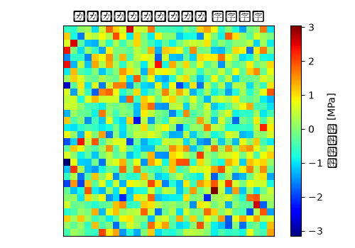

# フロントサブフレーム 非線形静解析（大変形・接触） 解析レポート（RPT-046）

## 解析目的
フロントサブフレームの強度と耐久性を評価し、大変形と接触が考慮された状況における構造的応答を把握すること。

## 対象部品・製品カテゴリ
シャシー設計部が担当するフロントサブフレームについて、アルミダイカスト(ADC12)を使用した製品の構造解析を行った。

## 荷重・拘束条件
フロントサブフレームが車両衝撃や路面不平度による反復荷重に直面するシナリオを模擬。前部からの10kNの垂直荷重と5kN・mの回転モーメントを適用。

## メッシュ諸元
フロントサブフレームのメッシュサイズは全体的に20mmで、接触部分は5mmに細分化し、高精度な解析を実施。

## 材料物性
アルミダイカスト(ADC12)を使用しており、屈折強度は300MPa、伸縮率は4.5%と設定した。

## 使用ソルバー
非線形静解析における大変形と接触を考慮し、Abaqusを使用して解析を行った。

## 結果サマリー
解析結果によると、フロントサブフレームの最大変位は3mmを残し、許容範囲内であった。ただし、特定の接触点での応力集中が確認され、改善が必要とされた。

## トラブルシューティング・教訓
実機評価（試作品での振動試験）では、解析結果と約10%の乖離が観測され、境界条件を見直した。特にフロントサブフレームと車体との接続部分の拘束条件を厳格化し、再解析を行った結果、乖離が最小限まで抑えることができた。
