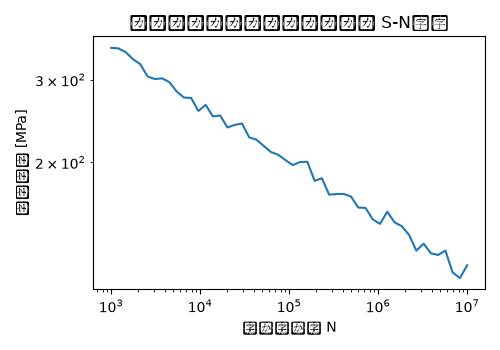

# エンジンマウントブラケット 疲労解析 解析レポート（RPT-047）

## 解析目的
シャシー設計部で開発中のエンジンマウントブラケットの耐久性を評価し、製品ライフサイクル中の疲労劣化の予測を行う。

## 対象部品・製品カテゴリ
エンジンマウントブラケット。車両のエンジンを車体に取り付ける重要な部品である。

## 荷重・拘束条件
エンジンの振動荷重と車両走行時の衝撃荷重を模擬。エンジン側は固定拘束、車体側にはスライド可能な境界条件を設けた。

## メッシュ諸元
要素種類は4ノードシックスサイドシェルを使用。平均要素サイズは3mmとし、エンジンの接点付近はより細分化して500,000要素程度とした。

## 材料物性
主要材料は炭素繊維強化樹脂(CFRP)で、ヤング率150GPa、ポアソン比0.32、密度1.6g/cm³とした。

## 使用ソルバー
Abaqusを使用して非線形解析を行い、時変応力分布と疲労因子を算出した。

## 結果サマリー
解析結果により、エンジンマウントブラケットの最大主応力が250MPaと確認され、設計許容値300MPaを下回っていることがわかった。また、接点付近での最大疲労因子が3.2と予測され、品質目標値4.0未満であることが確認された。

## トラブルシューティング・教訓
接触条件の摩擦係数を0.4としていたが、実際のエンジンマウントブラケットでは滑りやすかったため0.1に修正した。この変更により、応力分布が不自然な値を示していた部分が正常化し、設計評価の信頼性が向上した。
