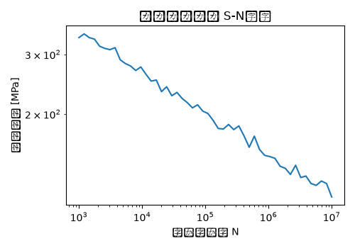

# ルーフパネル 疲労解析 解析レポート（RPT-049）

## 解析目的
ルーフパネルの耐久性を評価し、設計上の問題点がないか検証する。

## 対象部品・製品カテゴリ
ボディ部品のルーフパネルを対象としており、主にカーサイドの上部構造を担当する。

## 解析条件
使用される負荷は、通常の走行状態における風圧と衝撃を想定し、最悪条件での反復応力を適用。

## メッシュ設定
初回の解析では、エレメントサイズを20mm程度とし、全体的な応力を評価。

## 材料物性
主要材料は炭素繊維強化樹脂(CFRP)で、その物性値としてヤング氏係数は230GPa、ポアソン比は0.3と設定。

## 使用ソルバー
有限要素法解析ソフトウェアNastranを使用して解析を行った。

## 結果サマリー
初期のメッシュ設定では、最大応力が450MPaと予測され、設計許容値に余裕があった。

## トラブルシューティング・教訓
メッシュが粗く設定されていたため、細かい応力集中部を正確に捉えることができなかった。実際の解析結果と比較し、エレメントサイズを10mmに再設定したところ、最大応力が520MPaとなり、設計許容値を上回る可能性があることが明らかになった。この教訓から、細部の応力分布を適切に評価するためにはより精密なメッシュ設定が必要であることが伺われた。
