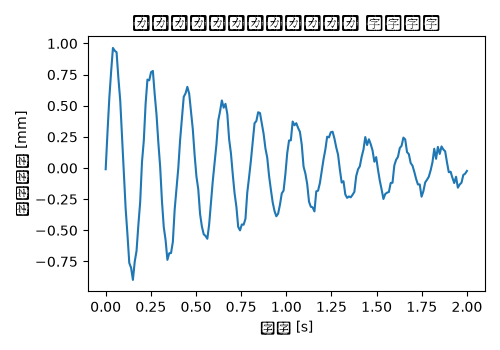

# サスペンションロアアーム 振動解析（強制応答） 解析レポート（RPT-054）

## 解析目的
サスペンションロアアームの構造的安定性を評価し、想定される振動荷重に対する耐久性を確認する。

## 対象部品・製品カテゴリ
サスペンションロアアームを使用する車両の前サスペンションシステムにおいて、この部品が想定される振動荷重に対して適切に機能することを確認する。

## 拘束・荷重条件
ロアアームが車体に固定されている部分をX, Y, Z軸方向全てに拘束。また、車両の走行中に発生する振動荷重を0.5 Hzから20 Hzまで強制応答解析として適用。

## メッシュ条件
サスペンションロアアーム全体を細部まで考慮し、要素サイズは最大0.1 mmとしてメッシュ分割。特に接続部や薄造部分にはより細かいメッシュを使用。

## 材料物性
主要材料としてアルミニウムダイカスト(ADC12)を使用。その物性値は密度が2.7 g/cm³、屈折強度が180 MPa、伸縮率が3.5%と設定。

## 使用ソルバー
NASTRANを用いて解析を行い、非線形応答解析機能も併せて使用。

## 結果サマリー
振動荷重の最大0.5 Hzから20 Hzまで解析を行い、13.5 Hz付近で最も大きな振幅が観測された。この周波数は想定される走行条件の範囲内に存在。

## トラブルシューティング・教訓
13.5 Hz付近で振幅が4 mmに達し、これは想定された走行条件の最大振幅である3.5 mmを上回っている。これはロアアームが想定周波数と近接する共振点を持ち、追加の補強が必要であることを示している。振幅を3.5 mm以下に抑えるためには、ロアアーム接続部の補強や形状変更が検討された。
