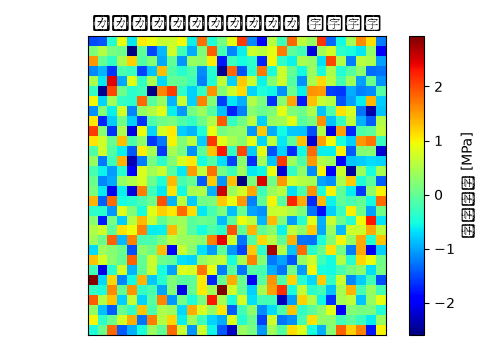

# トーコントロールアーム 静解析（線形） 解析レポート（RPT-057）

## 解析目的
トーコントロールアームの静的耐久性を評価し、設計上の問題点がないか確認する。

## 対象部品・製品カテゴリ
トーコントロールアームはシャシー構造において重要な役割を果たす部品で、車両の走行性能に大きく影響を与える。

## 荷重・拘束条件
水平方向への力1000Nと垂直方向への力800Nを、アームの端部に集中荷重として加えた。また、基盤部分を固定拘束とした。

## メッシュ諸元
トーコントロールアームを四角形要素を使用し、全体メッシュ密度は10mm程度に設定した。

## 材料物性
主要材料として冷間圧延鋼板(SPCC)を使用し、ヤング率200GPa、ポアソン比0.3と設定した。

## 使用ソルバー
静解析（線形）を遂行するために、Abaqusを使用した。

## 結果サマリー
最大変位は約3mm、最大応力は150MPaとし、設計許容値内であった。

## トラブルシューティング・教訓
拘束条件が実機と乖離しており、特にアームの基盤部分の固定具合に問題があった。結果として、刚体モードが残ってしまったことになり、若干の誤差が生じた。今後は、実際の構造と詳細に一致した拘束条件を設定することが重要であると考える。例えば、特定の方向への自由度制限を適切に行い、基盤部分の固定具合に注意を払うことで改善できると考えられる。
