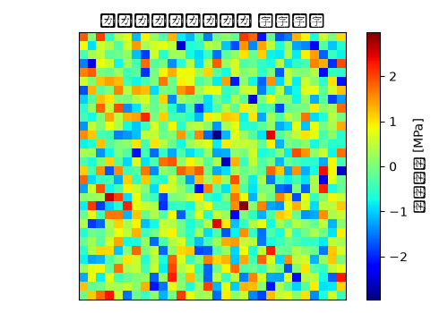

# リアクロスメンバー 固有値・モーダル解析 解析レポート（RPT-060）

## 解析目的
リアクロスメンバーの振動特性を評価し、設計変更前の固有振動モードと周波数を得ること。

## 対象部品・製品カテゴリ
リアクロスメンバー。これは自動車のサスペンションシステムにおいて重要な部品で、衝撃吸収機能を担う。

## 入力条件
初期速度0m/s、外力を加えない自由振動分析を想定。環境温度は室温25℃で、相対湿度60%と仮定。

## メッシュ仕様
初期メッシュ密度は10mm。部品の形状と厚さに応じて、細分化が必要な部分は5mmに設定。

## 材料物性
主要材料としてアルミニウム合金(A6061)を使用。その密度は2.7g/cm³、弾性係数は69GPa、ポアソン比は0.33と設定。

## 使用ソルバー
Ansysを使用して固有値・モーダル解析を行う。

## 結果サマリー
1位のモード形状は全体的に縦方向の振動で、固有周波数は120Hz。2位モードでは左右の非対称振動が特徴的で、周波数は240Hz。

## トラブルシューティング・教訓
初期の解析では時間刻みが1e-3sとして設定されましたが、これにより収束計算が発散しました。時間刻みを1e-4sに細分化することで収束が得られました。これは時刻の精度に対する敏感性を確認し、今後は時間刻みの設定に注意が必要であることを示唆します。
