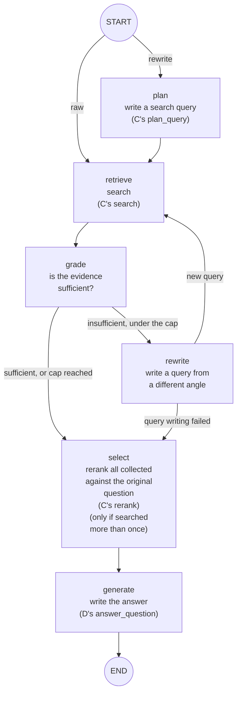

# The agent mode's design (nodes G and H)

[日本語](agent_ja.md) | English

This document describes how the agent mode (node G) and the LangChain integration used for comparison (node H) are built, their settings, and the design decisions behind them. The measured results are in [the agent mode's evaluation](agent_evaluation_en.md).

What this document covers:

- How the plain mode and the agent mode differ
- Node G's flow and its settings
- Three kinds of "query" processing with similar names, and how to tell them apart
- The design decisions and why they were made
- How node H (LangChain's stock agent) is built, and what running it on a small model showed

## Plain mode and agent mode

- **Plain mode** (default): searches the documents once with the question as typed, and answers from what it finds
- **Agent mode** (optional): an LLM first writes search-friendly words (a search query) from the question, then searches. A setting makes it search again with other words when the evidence falls short (by default it does not)

How to install it and switch modes on the screen is in steps 3 and 4 of [Usage](../README_en.md#usage) in the README.

## Node G: the LangGraph agent

An optional node (`src/silo_rag/agent.py`) that **only calls the public functions** of nodes C and D. **G depends on C and D** (C and D exist first, and G uses their functions). C and D, in turn, know nothing about G. So the dependencies between nodes contain no cycle ([Node dependencies (DAG)](development_process_en.md#node-dependencies-dag)). The only loop is inside G's own flow.

How to read the diagram:

- "(C's ...)" and "(D's ...)" are steps that call a function of that node. The steps without a mark (grading and writing a query from a different angle) live only in G
- The edge labels (`raw`, `rewrite`) choose what the first search uses: the question as is (`raw`) or a search query written by the LLM (`rewrite`). This is the `[agent] first_query` setting (`rewrite` by default)
- The LLM decides "is the evidence sufficient?" and "what query next"; the code decides "how many searches at most" through `[agent] max_attempts` (1 by default, i.e., no second search)

### Three kinds of "query" processing

The names are similar, so the table below tells them apart.

| | Processing | Where | When it runs |
| --- | --- | --- | --- |
| (a) | Resolving references (look at the conversation history and turn "that" into concrete words) | A function of C | When there is a history, in both modes |
| (b) | Writing a search query (from the question, write a sentence of search-friendly words only) | C's `plan_query` | In agent mode, on by default (`first_query = "rewrite"`). In plain mode, only when turned on (`rewrite_query`, off by default) |
| (c) | Writing a query from a different angle (when the results fall short, search again with other words) | G's `rewrite` node | Only when searching more than once (does not run by default) |

The `rewrite` in the setting names (`first_query = "rewrite"`, `rewrite_query`) turns on "writing a search query" (b); it is not G's `rewrite` node (c).

## Settings, and how to measure

- **Settings**: `[agent]` in `config.toml`
  - `max_attempts`: the maximum number of searches (1 by default)
  - `grade_mode`: how strict grading is (`strict` or `lenient`)
  - `first_query`: what the first search uses (`raw` or `rewrite`; `rewrite` by default)
  - The defaults `first_query = "rewrite"` and `max_attempts = 1` are the combination that measured best on a 7B model with 15 questions (on 45 questions no difference from plain mode could be confirmed; see the [evaluation](agent_evaluation_en.md))
- **Measuring**: `python -m silo_rag.eval --pipeline agent`. The settings can be overridden for one run (`--grade-mode strict|lenient`, `--first-query raw|rewrite`)
- **Comparing with H (LangChain's stock agent)**: `python -m silo_rag.eval --pipeline langchain`
- **Comparing them all at once**: `bash scripts/compare_pipelines.sh <model name> [--rewrite-first]`

## Design decisions

- **LangGraph used directly, not LangChain's `create_agent`.** `create_agent` is a fixed loop built on the LLM's tool calling (function calling), which is often unreliable on ~7B local models. So I built the "search → grade → write a query from a different angle" graph myself (`create_agent` was run as a comparison target in [node H](#node-h-langchain-integration))
- **The LLM answers only in fixed formats.** Grading is the single word `SUFFICIENT` / `INSUFFICIENT`; query writing (the search query and the different-angle query) is one query line. The code parses them strictly
- **Auxiliary decisions never stop the run.** A connection error, malformed output, or repeated query in grading or query writing moves on to generation with the chunks in hand
- **Zero external transmission is unchanged.** Every LLM call goes through the existing local `LLMClient`. LangGraph sends nothing externally unless you set LangSmith environment variables
- **Grading strictness has two levels (`strict` / `lenient`).** The grading LLM can't know whether a better document exists that it hasn't seen, so prompt wording alone doesn't settle which level is better. `strict` retried up to the cap on most questions (8 of 9 gradings said "insufficient"); `lenient` says "sufficient" quickly. I kept both and compared them
- **You can choose whether the first query is written from the question (`first_query`).** A question contains a lot unrelated to search (a self-introduction, request phrasing), which I expected to scatter the search ([BM25](architecture_en.md#how-the-search-works-bm25-and-vector-search)). So I added a `plan` node that has the LLM write a search query from the question (falling back to the question itself on failure). On the 15-question evaluation this mattered most (but re-measured on 45 questions, no difference showed). The query-writing itself lives in node C (`retrieval.plan_query`), and plain mode can turn it on with `[retrieval] rewrite_query` (off by default; I measured plain mode on 45 questions and could not confirm any effect)
- **Grading is skipped once the search cap is reached.** No further search is possible, so the verdict can't change anything

## Node H: LangChain integration

`src/silo_rag/langchain_adapter.py` (optional; `pip install -e ".[langchain]"`). Like G, it only calls the public functions of C and D. It does not appear on the screen; it is used only when measuring accuracy, to compare with G.

- **`SiloRetriever`**: exposes the existing hybrid search (`search()`) as a LangChain Retriever (`BaseRetriever`). The search internals are unchanged, and it can be used as a component in LangChain chains and agents
- **`run_langchain_agent`**: uses that Retriever as a search tool for LangChain's stock `create_agent` and answers with it. It is the comparison target for the hand-built node G. The search cap is 3, a constant independent of G's `max_attempts`
- Every LLM call goes to the local LM Studio (`config.ai.base_url`). Zero external transmission is unchanged
- The measured result is in the 7B table of the [evaluation](agent_evaluation_en.md) (hit_rate 0.93, citation rate 0.87). Its retrieval metrics are computed over every chunk the tool returned, so more searches favor it; citation rate and judge compare fairly

### What running the stock agent on a small model showed

Neither problem appeared in mock-based tests; both showed up only when I ran a real 7B model.

- **Parallel tool calls broke search.** When the LLM calls the search tool several times in one response, LangGraph runs them concurrently on threads. `search()` assumes a single thread, and failed on both ChromaDB and LM Studio (HTTP 500). `SiloRetriever` now runs searches one at a time
- **One response tried to call the search tool about 50 times at once (282 s).** LangGraph's step limit (`recursion_limit`) doesn't cover parallel calls within one response. `SiloRetriever` now caps how many searches it actually runs

## Related documents

- [The agent mode's evaluation](agent_evaluation_en.md): the tables comparing plain mode, G and H, and the 45-question re-measurement
- [How it works](architecture_en.md): what each node does, and how the search works
- [Worked example](worked_example_en.md): at which step of the search writing the search query helps
