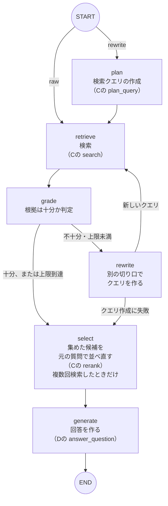

# エージェント方式の設計（ノードG・H）

日本語 | [English](agent_en.md)

エージェント方式（ノードG）と、比べるためのLangChain連携（ノードH）の、作りと設定と設計判断をまとめた文書。測った結果は、[エージェント方式の評価](agent_evaluation_ja.md)にある。

この文書で分かること:

- 通常方式と、エージェント方式の違い
- ノードGの処理の流れと、設定
- 「クエリ」に関する、名前の似た3つの処理の区別
- 設計で決めたことと、その理由
- ノードH（LangChain既製のエージェント）の作りと、小さなモデルで動かして分かったこと

## 通常方式と、エージェント方式の違い

- **通常方式**（既定）: 質問を、ほぼそのまま1回検索して、見つけた資料を根拠に答える
- **エージェント方式**（オプション）: LLMが、質問から検索用の言葉（検索クエリ）を作ってから検索する。設定を変えると、根拠が足りないときに、別の言葉で検索し直すこともできる（初期設定では、検索し直さない）

使い方（入れ方と、画面での切り替え方）は、READMEの[使い方](../README_ja.md#使い方)の手順3・手順4にある。

## ノードG：LangGraphエージェント

ノードC・Dの**公開されている関数だけを呼ぶ**、オプションのノード（`src/silo_rag/agent.py`）。**Gは、C・Dに依存する**（C・Dが先にあり、Gがその関数を使う）。逆に、C・Dは、Gを知らない。そのため、ノードどうしの依存関係に、循環はできない（[ノードの依存関係（DAG）](development_process_ja.md#ノードの依存関係dag)）。繰り返し（ループ）があるのは、Gの内側の処理の流れだけ。

図の読み方:

- 「（Cの …）」「（Dの …）」は、そのノードの関数を呼ぶ処理。印のない処理（判定と、別の切り口でのクエリ作成）は、Gの中だけの処理
- 矢印のラベル（`raw`・`rewrite`）は、1回目の検索に、質問をそのまま使うか（`raw`）、LLMが作った検索クエリを使うか（`rewrite`）。設定`[agent] first_query`で選ぶ（既定は`rewrite`）
- 「根拠が十分か」「次のクエリ」はLLMが判断し、「何回まで検索するか」は設定`[agent] max_attempts`でコードが決める（既定は1回＝検索し直さない）

### 「クエリ」に関する、3つの処理

名前が似ているので、区別しておく。

| | 処理 | どこにあるか | いつ動くか |
| --- | --- | --- | --- |
| ア | 指示語の解決（会話履歴を見て、「それ」などを具体的な言葉に直す） | Cの機能 | 会話履歴があるとき。通常方式・エージェント方式のどちらでも |
| イ | 検索クエリの作成（質問から、検索に向いた言葉だけの文を作る） | Cの`plan_query` | エージェント方式では、初期設定でオン（`first_query = "rewrite"`）。通常方式では、設定でオンにしたときだけ（`rewrite_query`。初期設定はオフ） |
| ウ | 別の切り口でのクエリ作成（結果が足りないとき、別の言葉で探し直す） | Gの`rewrite`ノード | 検索を複数回にしたときだけ（初期設定では動かない） |

設定名の`rewrite`（`first_query = "rewrite"`、`rewrite_query`）は、どちらも「検索クエリの作成」（イ）をオンにする設定で、Gの`rewrite`ノード（ウ）とは別。

## 設定と、精度の測り方

- **設定**: `config.toml`の`[agent]`
  - `max_attempts`: 検索する回数の上限（既定1）
  - `grade_mode`: 判定の厳しさ（`strict`か`lenient`）
  - `first_query`: 1回目の検索に使うもの（`raw`か`rewrite`。既定`rewrite`）
  - 既定の`first_query = "rewrite"`・`max_attempts = 1`は、7Bのモデルで15問を測ったとき、最も良かった組み合わせ（45問では、通常方式との差を確認できなかった。[評価](agent_evaluation_ja.md)）
- **精度の測り方**: `python -m silo_rag.eval --pipeline agent`。設定を、コマンドで一時的に変えられる（`--grade-mode strict|lenient`、`--first-query raw|rewrite`）
- **H（LangChain既製）との比較**: `python -m silo_rag.eval --pipeline langchain`
- **まとめて比べる**: `bash scripts/compare_pipelines.sh <モデル名> [--rewrite-first]`

## 設計判断

- **LangGraphを直接使い、LangChainの`create_agent`は使っていない。** `create_agent`はLLMのツール呼び出し（function calling）を前提にした決まった形のループで、7B程度のローカルモデルでは安定しないことが多い。そのため、「検索→判定→別の切り口でクエリ作成」の独自の形を組んだ（`create_agent`は、[ノードH](#ノードhlangchain連携)で比較対象として動かした）
- **LLMには決まった形式でしか答えさせない。** 判定は`SUFFICIENT`／`INSUFFICIENT`の1語、クエリ作成（検索クエリの作成と、別の切り口でのクエリ作成）は、検索クエリ1行。コードで厳密に解釈する
- **補助的な判断の失敗では止まらない。** 判定・クエリ作成での接続失敗・形式の崩れ・同じクエリの繰り返しは、手元のチャンクで回答生成に進む
- **外部送信ゼロは変わらない。** LLM呼び出しはすべて既存の`LLMClient`（ローカル）経由。LangGraphは、LangSmith用の環境変数を設定しない限り、外部へ送信しない
- **判定の厳しさを2段階（`strict`／`lenient`）で切り替えられる。** 判定するLLMは「まだ見ていない、もっと良い資料があるか」を知りようがなく、プロンプトの言い回しだけでは決まらない。strictは多くの質問で上限まで再検索し（9回中8回が「不十分」）、lenientはすぐ「十分」と判定する。両方を残して比べた
- **1回目のクエリを、質問から作るか選べる（`first_query`）。** 質問文には、名乗りや依頼の言い回しなど、検索と関係の無い言葉が多い。検索が散ると考えて（[BM25](architecture_ja.md#検索の仕組みbm25とベクトル検索)）、質問から検索クエリを作る`plan`ノードを足した（失敗したら質問のまま検索）。15問の評価では、これが最も効いた（ただし、45問で測り直すと、差が見えなかった）。クエリを作る処理そのものは、ノードC（`retrieval.plan_query`）にあり、通常方式でも`[retrieval] rewrite_query`でオンにできる（既定はオフ。通常方式で45問を測ったが、効果は確認できなかった）
- **上限に達したら、判定のLLM呼び出しを省く。** もう再検索できず、判定が何も変えないため

## ノードH：LangChain連携

`src/silo_rag/langchain_adapter.py`（オプション。`pip install -e ".[langchain]"`）。Gと同じく、C・Dの公開されている関数だけを呼ぶ。画面には出ず、精度の測定で、Gと比べるためだけに使う。

- **`SiloRetriever`**: 自前のハイブリッド検索（`search()`）を、LangChainのRetriever（`BaseRetriever`）の規格に合わせて公開する。検索の中身はそのままで、LangChainのチェーンやエージェントから部品として使える
- **`run_langchain_agent`**: 上のRetrieverを検索ツールにして、LangChain既製の`create_agent`で回答する。自作のGとの比較対象。検索の上限は3回で、Gの`max_attempts`とは独立した定数
- LLM呼び出しは、すべてローカルのLM Studio（`config.ai.base_url`）に向かう。外部送信ゼロは変わらない
- 測った結果は、[評価](agent_evaluation_ja.md)の7Bの表のとおり（hit_rate 0.93、引用率0.87）。検索の指標は、ツールが返した全チャンクで計算するため、検索回数が多いほど有利になる。引用率とjudgeは、公平に比べられる

### 既製エージェントを小さなモデルで動かして分かったこと

どちらも、モックのテストでは見つからず、実際に7Bを動かして初めて分かった。

- **並列ツール呼び出しで、検索が壊れた。** LLMが1回の応答で検索ツールを複数同時に呼ぶと、LangGraphが別スレッドで同時に実行する。`search()`は1スレッド前提で、ChromaDBとLM Studio（HTTP 500）の両方で失敗した。`SiloRetriever`で、検索を1つずつ順番に実行するようにした
- **1回の応答が、検索ツールを約50回同時に呼ぼうとした（282秒）。** LangGraphのステップ数の上限（`recursion_limit`）は、並列呼び出しには効かない。`SiloRetriever`に、実行回数の上限を入れた

## 関連する文書

- [エージェント方式の評価](agent_evaluation_ja.md): 通常方式・G・Hを比べた表と、45問での測り直し
- [仕組みの詳細](architecture_ja.md): 各ノードの役割と、検索の仕組み
- [具体例](worked_example_ja.md): 検索クエリの作成が、検索のどの段階で効くか
