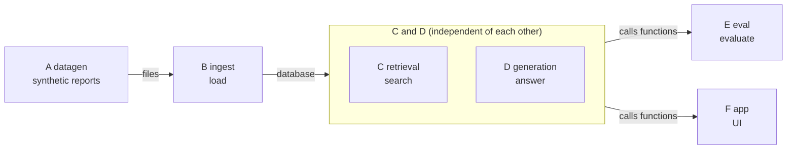

# How it was developed: graph engineering and independent review

[日本語](development_process_ja.md) | English

This document describes how the project was built: how the work was split between the author and AI, the approach of building the system as separate "nodes" (graph engineering), and the independent review by a second AI.

What this document covers:

- What the author decided and what AI proposed
- What splitting the work into nodes made easier
- The dependencies between nodes (the DAG) and how to read them

## How the work was split between the author and AI

**The requirements are the author's own. Most of the technical implementation was proposed by AI (Claude Code), then reviewed and approved by the author.**

- **The author's requirements**: cross-department knowledge search (motivated by weak collaboration between departments, so knowledge never gets shared) / five mixed file formats (Markdown/Word/Excel/PowerPoint/PDF) / all processing on a local LLM with zero external transmission / "graph engineering" in the development process
- **What AI turned those into**: a design map that splits the work into nodes (a DAG), implementing independent nodes in parallel, and making an independent review by a different vendor's AI (the `codex` CLI) a required gate after each node
- **Proposed by AI, approved by the author after independent review**: the hybrid retrieval design, the `BM25Okapi` → `BM25Plus` bug fix ([what BM25 is](architecture_en.md#how-the-search-works-bm25-and-vector-search)), how citations are attached, and the evaluation split (measuring cross-department and same-department questions separately)
- AI was used as a pair-programming partner throughout, credited via `Co-Authored-By` on commits
- The author ran the UI and found the bugs and rough edges; the AI diagnosed and fixed them

## What graph engineering made easier

Graph engineering means designing the system as a DAG with explicit dependencies (the diagram below). AI turned the requirement to "bring graph engineering into the development process" into the following.

- **Parallel implementation**: nodes that do not depend on each other (C and D) were handed to two AI agents (subagents) at the same time
- **Independent testing**: dependencies can be swapped for fakes (`_FakeVLMClient`, `_ScriptedClient`), so every node can be tested on its own with no live LLM
- **Bug localization**: after each node, an independent review by the local `codex` CLI (a different vendor's AI) was a required gate; findings were fixed and re-reviewed before moving on. It caught `BM25Okapi`'s negative-weight bug in `retrieval.py` and a data leak when generating the evaluation questions in `datagen.py` (kept as a regression test in `tests/test_datagen.py`)
- **Easy to change**: each node exposes only its entry functions, so rewriting a node's internals doesn't affect the nodes that call it
- Being able to decide a build order isn't unique to graph engineering. What paid off was "the part that can be parallelized (C and D)" and "boundaries narrow enough to review in isolation"

## Node dependencies (DAG)

The system is designed as a DAG (directed acyclic graph: a diagram whose arrows have a direction and never loop back to where they started) with clear dependencies between nodes. **This diagram is not the runtime flow; it is a design map of "which node uses the results of which node".** I used it during development to decide the build order and which parts could be built in parallel.

- **Connections**: A to B goes through files (`data/synth_reports/`; neither imports the other). B to C/D goes through ChromaDB (they import only the `Chunk` type). E and F call C's and D's functions directly (there is no dependency between E and F; F also uses A's constants `DEPARTMENTS` and `PROJECT_TYPES`)
- Each node hides its internals; only entry points such as `search()` and `answer_question()` are exposed
- The optional G and H are not in this picture (they are covered in [the agent mode's design](agent_en.md)). **G and H depend on C and D** (they call functions of C and D). E and F use G (and E also H) only when needed. The direction is C/D → G/H → E/F, with no cycle
- **The only independent pair is C and D.** Both depend on B, not on each other. Every other pair has a dependency and has to wait for it, so they can't be built in parallel. **C and D were actually implemented in parallel by two AI agents**
- "Acyclic" only guarantees a valid build order exists; it's separate from independence. A single straight chain (A→B→C→D→E→F) is acyclic yet offers zero parallelism. The payoff here came from the graph's shape: no arrow happens to connect C and D

> ⚠️ **"Parallel" here means parallel development (writing the code), not parallel execution at runtime.**
>
> - The DAG's arrows show which module depends on which; they are not the runtime order of operations
> - At runtime, each question runs C (retrieval) and then D (generation), one after the other. D takes the chunks C returned as its input, handed over by E/F in plain mode and by G in agent mode
> - Because C and D don't depend on each other, two AI agents **could write them at the same time**; that is all the claim means

## Related documents

- [How it works](architecture_en.md): what each node does, and how the search works
- [The agent mode's design](agent_en.md): how nodes G and H are built
