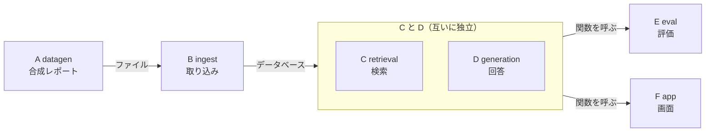

# 開発の進め方：グラフエンジニアリングと独立レビュー

日本語 | [English](development_process_en.md)

このプロジェクトを、どう作ったかをまとめた文書。作者とAIの役割分担、処理を「ノード」に分けて作る進め方（グラフエンジニアリング）、別のAIによる独立レビューを説明する。

この文書で分かること:

- 作者が決めたことと、AIが提案したこと
- ノードに分けたことで、開発の何が楽になったか
- ノードどうしの依存関係（DAG）と、その読み方

## 作者とAIの役割分担

**要件は作者が決めた。技術的な実現方法の多くは、AI（Claude Code）が提案し、作者がレビュー・承認した。**

- **作者の要件**: 部署横断の知見検索（動機は「部署間の連携が弱く、知見が共有されない」という課題意識）／5形式（Markdown/Word/Excel/PowerPoint/PDF）の混在／全処理をローカルLLMで完結し外部送信ゼロ／開発プロセスへの「グラフエンジニアリング」の導入
- **AIが具体化したもの**: 処理をノードに分けた設計図（DAG）、依存のないノードの並列実装、各ノード完了ごとの、別ベンダーのAI（`codex` CLI）による独立レビューの必須化
- **AIが提案し、独立レビューを経て作者が承認したもの**: ハイブリッド検索の設計、`BM25Okapi`→`BM25Plus`のバグ修正（[BM25とは](architecture_ja.md#検索の仕組みbm25とベクトル検索)）、出典の付け方、評価の設計
- AIをペアプログラミングの相手として使い、コミットの`Co-Authored-By`に残している
- 作者が画面を動かして不具合・改善点を見つけ、原因の調査と修正はAIが行った

## グラフエンジニアリングで、何が楽になったか

グラフエンジニアリングとは、処理を、依存関係の明確なDAG（下の図）として設計する手法。要件の「グラフエンジニアリングを取り入れる」を、AIが次のように具体化した。

- **並列実装**: 互いに依存しないノード（C、D）を、2つのAIエージェント（サブエージェント）に同時に実装させた
- **独立テスト**: 依存先を偽物（`_FakeVLMClient`・`_ScriptedClient`）に差し替えられるので、本物のLLMなしで、全ノードを1つずつテストできる
- **バグの局所化**: 各ノードの完了ごとに、ローカルの`codex` CLI（別ベンダーのAI）による独立レビューを必須にし、指摘は修正→再レビューしてから次へ進んだ。`BM25Okapi`の重みが負になるバグ（`retrieval.py`）と、評価用の質問を作るときのデータ漏れ（`datagen.py`。`tests/test_datagen.py`に、再発を防ぐテストを残した）を、レビュー中に見つけて直した
- **書き換えやすさ**: 各ノードは、入口の関数だけを公開しているので、内部を書き換えても、そのノードを呼ぶ側には影響しない
- 作る順番を決められること自体は、グラフエンジニアリングでなくても得られる利点。効いたのは、「並列化できる箇所（C・D）」と「狭い範囲でレビューできる境界」の2点

## ノードの依存関係（DAG）

処理を、ノード間の依存関係が明確なDAG（directed acyclic graph、有向非巡回グラフ。矢印の向きがあり、ぐるっと回って戻ってくる矢印が無い図）として設計した。**この図は、実行時の流れではなく、「どのノードが、どのノードの成果を使うか」を表す設計図**。開発のときに、作る順番と、並列にできる部分を決めるために使った。

- **つながり方**: A→Bはファイル経由（`data/synth_reports/`。プログラムどうしの読み込みは無い）。B→C・DはChromaDB経由（読み込むのは`Chunk`型だけ）。E・Fは、C・Dの関数を直接呼ぶ（EとFの間に、依存はない。FはAの定数`DEPARTMENTS`・`PROJECT_TYPES`も使う）
- 各ノードは、内部の作りを隠し、公開するのは`search()`・`answer_question()`のような入口だけ
- オプションのG・Hは、この図に含めていない（[エージェント方式の設計](agent_ja.md)で説明した）。**G・Hは、C・Dに依存する**（C・Dの関数を呼ぶ）。E・Fが、必要なときだけ、G（EはHも）を使う。依存の向きは、C・D → G・H → E・F で、循環はない
- **独立なペアはC・Dだけ。** 両方Bに依存するが、互いには依存しない。ほかのペアは、依存先の完成を待つため、並列実装できない。**C・Dは、実際に2つのAIエージェントへ並列実装できた**
- 「非巡回」は、作る順番が矛盾なく決まる保証であって、独立性とは別。一直線の依存（A→B→C→D→E→F）なら、非巡回でも並列化の余地はゼロになる。並列にできたのは、C・D間にたまたま矢印がなかった、というグラフの形による

> ⚠️ **ここでいう「並列」は、開発時（実装作業）の並列化で、実行時の処理の並列化ではない。**
>
> - DAGの矢印は、どのモジュールがどのモジュールに依存するかを表す。実行時の処理順とは別物
> - 実行時は、1つの質問に対して、C（検索）→D（回答生成）の順に逐次実行する（Dは、Cが返したチャンクを入力に受け取る。受け渡しは、通常方式ではE・Fが、エージェント方式ではGが行う）
> - C・Dが互いに依存しないので、2つのAIエージェントに**同時に書かせることができた**、という意味

## 関連する文書

- [仕組みの詳細](architecture_ja.md): 各ノードの役割と、検索の仕組み
- [エージェント方式の設計](agent_ja.md): ノードG・Hの作り
